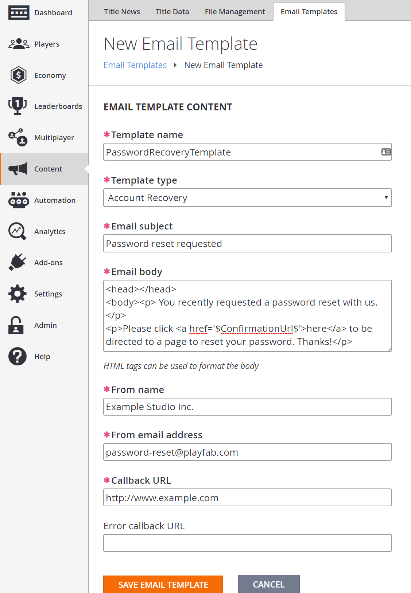
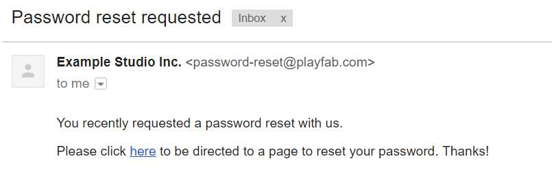

# Using email templates to send an account recovery email

This tutorial walks you through how to use the email template feature of PlayFab to send an account recovery player's contact email address, to let a player reset their password.

## Requirements

> [!IMPORTANT]
> This is an advanced tutorial. Please make sure that all requirements have been met, or you will not be able to complete this tutorial.

- To send custom emails with email templates, you will need to have your own SMTP server with a username and password. Please be sure that you have your own SMTP server *before* using our tutorial [Setting up an SMTP server with add-ons](../../engagement/emails/setting-up-an-smtp-server-with-add-ons.md).

> [!NOTE]
> You can use Gmail for testing, but Gmail limits you to 2,000 emails per day.

- Basic knowledge of how to create a player will be necessary, since there will need to be players with a usernames and passwords before calling account recovery logic.
- Read the [Game Manager quickstart](../../../gamemanager/quickstart.md) if you are unfamiliar with the Game Manager, as it is the place where email templates are created.
- Knowledge of how to work with player profiles will be required to confirm that emails will be necessary for checking that a contact email has been added to a player's profile. Please read up on how to get a player profile in the [Getting Player Profiles](../../data/playerdata/getting-player-profiles.md) tutorial, and make sure that under the **Client Profile Options** on your **Title** you allow **Contact email addresses**.

## Step 1 - Create an email template

The first thing we will do is create an account recovery email template.

- Go to **Content**.
- Select the **Email Templates** tab.
- Select the **NEW EMAIL TEMPLATE** button.

  

Now add a **New Email Template**, filling in the fields as follows leaving the **Error callback URL** empty:

- **Template name**: PasswordRecoveryTemplate
- **Template type**: Account Recovery
- **Email subject**: Password reset requested
- **Email body**: (enter as below)

```html
<head></head>
<body><p> You recently requested a password reset with us.</p>
<p>Please click <a href='$ConfirmationUrl$'>here</a> to be directed to a page to reset your password. Thanks!</p>
```

- **From Name**: The name you want to show in the **From** field in the email.
- **From Email Address**:  The email address you want to show in the **From** field in the email. This must be an email domain that the SMTP server enables you to send emails from.

> [!NOTE]
> Some email servers, like Gmail, will ignore this field and will send from the account set up with the SMTP server.

- **Callback URL**:  A callback URL to a password recovery form. At the minimum, the form must contain a **Password** field for the player to enter a new password.

### A few things to note

- The `$ConfirmationUrl$` in the email body generates a customized URL that, when selected, tracks that a user has chosen the URL, and then issues a redirect to the **Callback URL**. In this case, it is injected into an anchor tag.
- The **Callback URL** is the URL that PlayFab will redirect to after the player selects the confirmation URL link. It will need to be a hosted web form that contains at very minimum a **Password** field, in order to make a [ResetPassword](xref:titleid.playfabapi.com.admin.accountmanagement.resetpassword) API call later in this tutorial.

  

After filling the form out, select the **SAVE EMAIL TEMPLATE** button, and you will be redirected back to the page containing the list of your **Email Templates** showing. Make a note of the ID of the **Email Template** as it will be used in Step 4.

  

## Step 2 - Add username, password, login email, and contact email to a player

For this next step, you will need an existing player account.

We will add a username, password, and login email using [AddUsernamePassword](xref:titleid.playfabapi.com.client.accountmanagement.addusernamepassword). Additionally, we add a contact email to the player using [AddOrUpdateContactEmail](xref:titleid.playfabapi.com.client.accountmanagement.addorupdatecontactemail).

> [!NOTE]
> A contact email field on a player profile is different from the login email field on a player profile, even though they may *both* contain the same email address. Any time you send email to the player, it will go to the contact email address.

### C# code example

In the following example, we log in a player, then add a username, password, and login email using [AddUsernamePassword](xref:titleid.playfabapi.com.client.accountmanagement.addusernamepassword). We then add a contact email using [AddOrUpdateContactEmail](xref:titleid.playfabapi.com.client.accountmanagement.addorupdatecontactemail). Make sure the email address associated with the player is one that you can access.

```csharp
void CreatePlayer()
{
    var loginReq = new LoginWithCustomIDRequest
    {
        CustomId = "SomeCustomID", // replace with your own Custom ID
        CreateAccount = true // otherwise this will create an account with that ID
    };

    var username = "yourusername"; // Set this to your username
    var password = "yourpassword"; // Set this to your password
    var emailAddress = "testaddress@example.com"; // Set this to your own email

    PlayFabClientAPI.LoginWithCustomID(loginReq, loginRes =>
    {
        Debug.Log("Successfully logged in player with PlayFabId: " + loginRes.PlayFabId);
        AddUserNamePassword(username, password, emailAddress); // Add a username and password
        AddOrUpdateContactEmail(loginRes.PlayFabId, emailAddress);
    }, FailureCallback);
}

void AddUserNamePassword()
{
    var request = new AddUsernamePasswordRequest
    {
        Username = "yourusername",
        Password = "yourpassword",
        Email = "exampleemail@emaple.com" // Login email
    };
    PlayFabClientAPI.AddUsernamePassword(request, result =>
    {
        Debug.Log("The player's account now has username and password");
    }, FailureCallback);
}

void AddOrUpdateContactEmail(string playFabId, string emailAddress)
{
    var request = new AddOrUpdateContactEmailRequest
    {
        PlayFabId = playFabId,
        EmailAddress = emailAddress
    };
    PlayFabClientAPI.AddOrUpdateContactEmail(request, result =>
    {
        Debug.Log("The player's account has been updated with a contact email");
    }, FailureCallback);
}

void FailureCallback(PlayFabError error)
{
    Debug.LogWarning("Something went wrong with your API call. Here's some debug information:");
    Debug.LogError(error.GenerateErrorReport());
}
```

## Step 3 - Confirm that the contact email was added to the player's profile

Next, confirm that the contact email was added to the player's profile. Sign in to [Game Manager](https://developer.playfab.com), and visit the **Player's Profile** page. You should see a **Contact email** listed for that player.

  

You can also make a call to [GetPlayerProfile](xref:titleid.playfabapi.com.client.accountmanagement.getplayerprofile) with **ShowContactEmailAddresses** in the [PlayerProfileViewConstraints](xref:titleid.playfabapi.com.server.accountmanagement.getplayerprofile#playerprofileviewconstraints) set as *true*, to show that the player now has the contact email that we just added.

## Step 4 - Send an account recovery template email

Now we will send the verification email using **SendEmailFromTemplate** using the email template ID in Step 1 to the Player we created in Step 2.

### C# Code Example

In the following example, we send an account recovery email using [SendCustomAccountRecoveryEmail](xref:titleid.playfabapi.com.server.accountmanagement.sendcustomaccountrecoveryemail).

```csharp
void SendCustomAccountRecoveryEmail(string emailAddress, string emailTemplateId)
{
    var request = new SendCustomAccountRecoveryEmailRequest
    {
        Email = emailAddress,
        EmailTemplateId = emailTemplateId
    };

    PlayFabServerAPI.SendCustomAccountRecoveryEmail(request, res =>
    {
        Debug.Log("An account recovery email has been sent to the player's email address.");
    }, FailureCallback);
}

void FailureCallback(PlayFabError error)
{
    Debug.LogWarning("Something went wrong with your API call. Here's some debug information:");
    Debug.LogError(error.GenerateErrorReport());
}
```

## Step 5 - Check that the email was sent

Finally, we can check that the account recovery email was sent.

The first thing you can do is go to the player's PlayStream area. In **Game Manager**:

- Select **Player** from the menu on the left.
- Go to the **PlayStream** area of the screen.
- It should display a **Sent Email Event**.

  

Selecting the **Info** icon on the event should show JSON similar to what appears below.

```json
{
    "EventName": "sent_email",
    "EventNamespace": "com.playfab",
    "Source": "PlayFab",
    "EntityType": "player",
    "TitleId": "YourTitleId",
    "EventId": "655f14ac45b341b59c217dcf04d26ef9",
    "EntityId": "64647AA368D6448E",
    "SourceType": "BackEnd",
    "Timestamp": "2017-10-27T23:53:58.8717009Z",
    "History": null,
    "CustomTags": null,
    "Reserved": null,
    "emailTemplateId": "DC3E1B28881C6071",
    "emailTemplateName": "PasswordRecoveryTemplate",
    "emailTemplateType": "AccountRecovery",
    "success": true,
    "emailName": "Primary"
}
```

To check that you actually receive the email, go to the email of the player you created in Step 2. There should be an email that looks similar to what is shown below.

  

If you inspect the URL in that email, you will see that it looks something like this example.

```html
https://a5f3.playfabapi.com/EmailConfirmation/Confirm/?token=2346241B7C277796&titleId=A5F3&templateId=38017AAE7F494AB3
```

When the player selects that URL, three things happen:

1. PlayFab generates a new PlayStream event called **auth_token_validated**. This is how you know that the player selected that URL in the email. You can use that event to trigger actions, like granting coins or items to the player.
2. PlayFab will return a redirect URL, sending the player to the callback URL. In this case, it should be a website for the game with a form for the player to enter a new password.
3. The redirect URL will contain a token in the query string, and will look something like what appears below.

<https://www.example.com/?token=2346241B7C277796>.

## Step 6 - Reset the player's password

After the player is directed to the callback URL and fills out the form with a new password, you can use that information, in addition to the token in the query string, to issue a [ResetPassword](xref:titleid.playfabapi.com.admin.accountmanagement.resetpassword) call.

### C# code example

In the following example, we reset a player's password, based on a token and the new password the player specifies in a form using [ResetPassword](xref:titleid.playfabapi.com.admin.accountmanagement.resetpassword).

```csharp
void ResetPassword(string newPassword, string token)
{
    var request = new ResetPasswordRequest
    {
        Password = newPassword,
        Token = token
    };

    PlayFabAdminAPI.ResetPassword(request, result =>
    {
        Debug.Log("The player's password has been resetl");
    }, FailureCallback);

}

void FailureCallback(PlayFabError error)
{
    Debug.LogWarning("Something went wrong with your API call. Here's some debug information:");
    Debug.LogError(error.GenerateErrorReport());
}
```

## Step 7 - Check that the password was reset

Finally, verify that the player has reset their password successfully by logging in with [LoginWithPlayFab](xref:titleid.playfabapi.com.client.authentication.loginwithplayfab).

### C# Code Example

In the following **C#** example, we log in using [LoginWithPlayFab](xref:titleid.playfabapi.com.client.authentication.loginwithplayfab) and the new password the player reset to in Step 6.

```csharp
void LoginWithPlayFab(string username, string password)
{
    var request = new LoginWithPlayFabRequest
    {
        Username = username,
        Password = password
    };

    PlayFabClientAPI.LoginWithPlayFab(request, result =>
    {
        Debug.Log("Successfully logged in player with ID " + result.PlayFabId);
    }, FailureCallback);
}

void FailureCallback(PlayFabError error)
{
    Debug.LogWarning("Something went wrong with your API call. Here's some debug information:");
    Debug.LogError(error.GenerateErrorReport());
}
```

## Conclusion

That's it for this tutorial! You've seen how to set up your SMTP server, create an email template, send an account recovery email, and reset a player's password.

If you have any questions or feedback on this tutorial, please let us know in our [community forums](https://community.playfab.com/).
