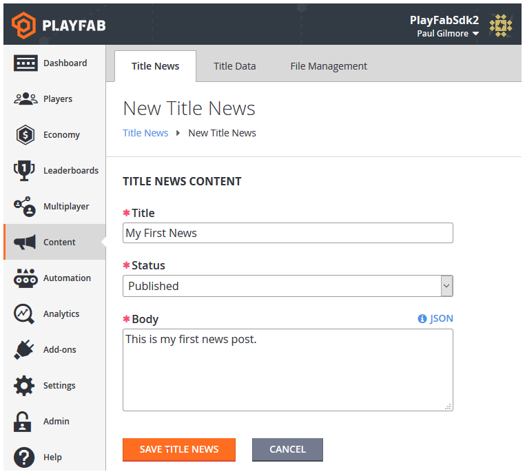

# Title News Quickstart

Title News is a mechanism for communicating with your players. It contains a few basic elements:

- Title
- Date
- Status
- Body (the body is a string, and can contain raw text or JSON).

## Create Title News

There are two ways to create Title News entries:

1. Via Game Manager
2. Using the admin API method [AddNews](xref:titleid.playfabapi.com.admin.title-widedatamanagement.addnews).

To create Title News entries with **Game Manager**, you will need to be familiar with [Game Manager](../../config/gamemanager/quickstart.md).

In **Game Manager**:

- Go to your menu and select **Content**.
- In the **Title News** tab enter your **Title News Content**.



Select the **Save Title News** button and your entry will be created. The date will be set to the date when you selected the **Save Title News** button.

Alternately, you can create Title News by calling [AddNews](xref:titleid.playfabapi.com.admin.title-widedatamanagement.addnews). Using the admin API allows you to specify a custom timestamp. News added this way is immediately published. Here's a code example:

```csharp


void CreateNews() {
    PlayFabAdminAPI.AddNews(new AddNewsRequest {
        Timestamp = new DateTime(2014, 1, 8, 12, 0, 0), // Any date - This one is the founding of PlayFab
        Title = "My Second News",
        Body = "This is my second news post."
    },
    result => Debug.Log("News post added!"),
    error => Debug.LogError(error.GenerateErrorReport()));
}

```

## Read Title News

Reading the Title News is very simple. The GetTitleNews method returns get all published Title News entries. 

> [!NOTE]
> Archived and Unpublished entries will not be returned.

```csharp


void ReadTitleNews() {
    PlayFabClientAPI.GetTitleNews(new GetTitleNewsRequest(), result => {
        Debug.Log("Got latest news!");
        // Process news using result.News
    }, error => Debug.LogError(error.GenerateErrorReport()));
}

```

## Update Title News

The content of a Title News entry can only be modified in Game Manager.  Locate the entry you wish to modify:

In **Game Manager**:

- Go to your menu and select **Content**.
- Go to your **Title News** tab.
- Select **Existing Entry**.
- Update the Title, Status, or Data for the entry.
- Select the **Save Title News** button.

If plan is to post unpublished entries for future release, this is the methodology to to use to transition them into published and archived states. It also allows the user to fix typos.

## Delete Title News

Once an entry is no longer needed, you can delete it in the **Game Manager**. Find the entry you wish to modify, then:

- Navigate to your title.
- In your menu, select **Content**.
- Go to Title News.
- Select the **Checkbox** for the **Existing Entry**.
- Select the Title News entries you wish to delete, and choose **X Delete Title New**s.
