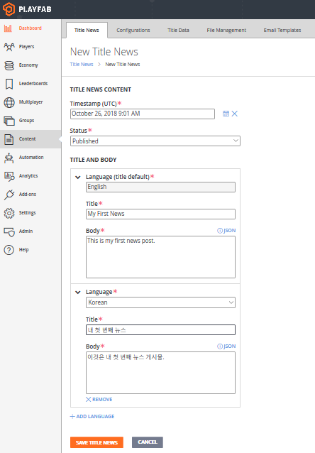

# Title News quickstart

Title news is a mechanism for communicating with your players for patch notes or big events your game may be hosting. It contains a few basic elements:

- **Date**
- **Status**
- **Title**
- **Body**
- **Language(s)**

> [!NOTE]
> The Body element is a string which can contain raw text or **JSON**.

## Requirements

This quickstart builds on information presented in other topics. Please refer to the following topics if you have questions.

- You should be familiar with the PlayFab [Game Manager](../../config/gamemanager/quickstart.md).
- Title news can now be localized, so please read up on how to work with default languages on your title and preferred languages for your players in the [Setting Default Languages](setting-default-languages.md) tutorial. You must have a **title default language** set to continue with localized title news.

## Creating title news

PlayFab supports storing localized strings on behalf of game developers by associating a title and body with a language for a title news entry.

We added the necessary logic to provide your players with the correct strings for the language they prefer. When the client queries for title news, they will receive different versions of title news, based on the players preferred language. You can add multiple translated versions to a single title news entry.

There are two ways to create title news entries:

1. Via Game Manager.
2. Using the Admin API method [AddNews](xref:titleid.playfabapi.com.admin.title-widedatamanagement.addnews).

### Creating title news with Game Manager

To create title news entries with **Game Manager**:

Navigate to your title -> **Content** -> **Title News** -> **New Title News** as shown in the following image.



For the purposes of this tutorial, we will assume your title’s default language is English. This means that you must add strings for your default language before you can save the title news.

Adding more languages is as simple as clicking on **ADD LANGUAGE**, choosing the language you want to add, and then typing in the localized strings. In the previous image, we added Korean strings to our title news entry.

Select the **Save Title News** button, and your entry will be created.

The date will be set to the date when you selected the **Save Title News** button. You can also edit the timestamp to your preference if you would like a timestamp different from the current time. The timestamp is the time that players will see along with the title news. After saving, you will be redirected back to the page containing the list of your title news entries.

### Creating title news using the PlayFab Admin API

You can create title news by calling [AddNews](xref:titleid.playfabapi.com.admin.title-widedatamanagement.addnews) method. Using this Admin **API** allows you to specify a custom timestamp. News added this way is *immediately* published. You can then add localized content to the item you just created by calling [AddLocalizedNews](xref:titleid.playfabapi.com.admin.title-widedatamanagement.addlocalizednews) with the news ID returned from the **AddNews** method.

The code example that follows demonstrates this.

```csharp
void CreateNews() {
    PlayFabAdminAPI.AddNews(new AddNewsRequest {
        Timestamp = new DateTime(2014, 1, 8, 12, 0, 0), // Any date - This one is the founding of PlayFab
        Title = "My Second News",
        Body = "This is my second news post."
    },
    result => Debug.Log("News post added!"),
    error => Debug.LogError(error.GenerateErrorReport()));
}
void CreateNews() {
    PlayFabAdminAPI.AddLocalizedNewsRequest(new AddLocalizedNewsRequest{
                   NewsId = "74623b12-6c80-ee4b-7c3b-58e638aa62bd",
                   Language = "de"
                   Title = " Meine zweite Nachricht",
                   Body = " Dies ist meine zweite Nachricht."
    },
    result => Debug.Log("Localized news post added!"),
    error => Debug.LogError(error.GenerateErrorReport()));
}
```

## Reading title news

Reading the title news is very simple. The **GetTitleNews** method returns all published title news entries, except for archived and unpublished entries which will *not* be returned.

- Calling [GetTitleNews](xref:titleid.playfabapi.com.client.title-widedatamanagement.gettitlenews) from the client **API** will return the news entries in the preferred language of the player, if the title news item has added localized content in that language, or in the title default language.

- Calling [GetTitleNews](xref:titleid.playfabapi.com.server.title-widedatamanagement.gettitlenews) from the server **API** will return the news entries in the title default language.

```csharp
void ReadTitleNews() {
    PlayFabClientAPI.GetTitleNews(new GetTitleNewsRequest(), result => {
        Debug.Log("Got latest news!");
        // Process news using result.News
    }, error => Debug.LogError(error.GenerateErrorReport()));
}
void ReadTitleNews() {
    PlayFabServerAPI.GetTitleNews(new GetTitleNewsRequest(), result => {
        Debug.Log("Got latest news!");
        // Process news using result.News
    }, error => Debug.LogError(error.GenerateErrorReport()));
}
```

## Updating an existing title news entry

The content of a title news entry can only be modified in Game Manager.

To locate and select the entry you wish to modify in **Game Manager**:

- Go to your menu and select **Content**.
- Go to your **Title News** tab.
- Select **Existing Entry**.

To make your updates, save them, and optionally add localized versions:

- Update the **Title**, **Status**, or **Data** for the entry.
- Select the **Save Title News** button.
- If you are updating a title news entry that only has a title and body in a single language, you can now add localized versions of this title news by selecting **Add Language**.

If you plan to post unpublished entries for a future release, this will be the way you transition them through a published and archived state. Updating title news also lets you fix typos.

## Deleting title news

Once an entry is no longer needed, you can delete it in the **Game Manager**.

Find the entry you wish to modify, then:

- Navigate to your **Title**.
- In your menu, select **Content**.
- Go to **Title News**.
- Put a check in the checkbox for the **Existing Entry**.
- Select the **Title News** entries you wish to delete and choose **X Delete Title News**.
