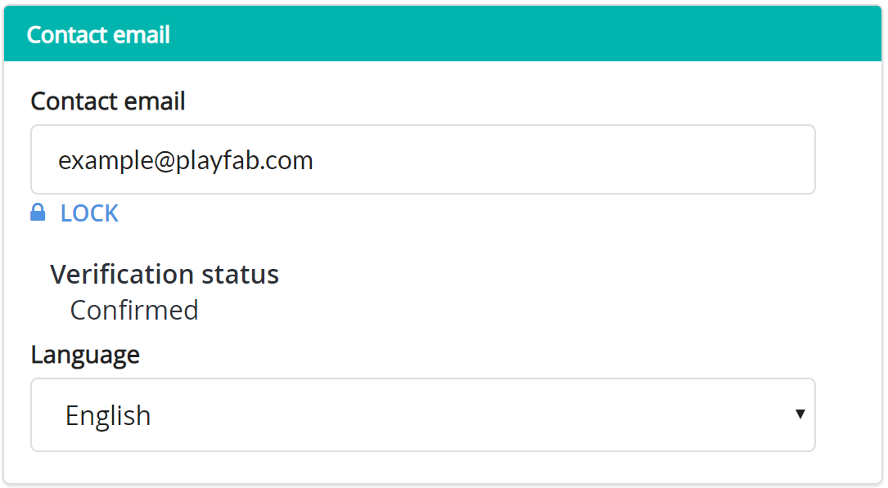
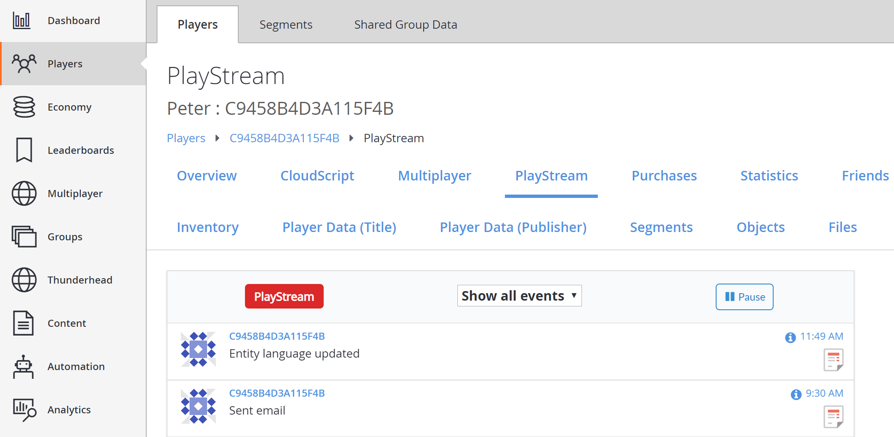
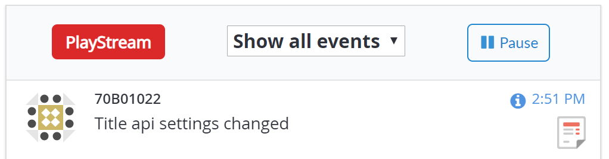
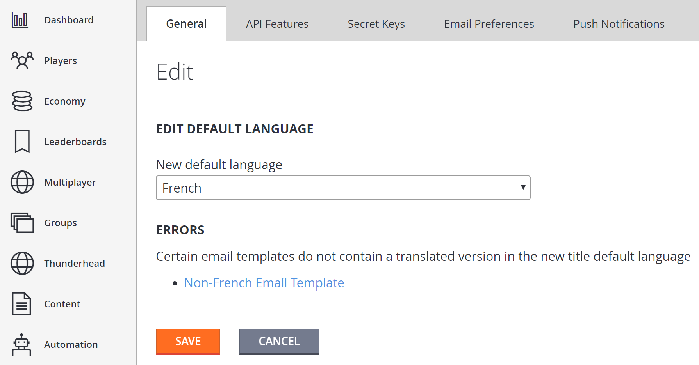

# Setting default languages

PlayFab is introducing support for storing localized strings on behalf of game developers. In addition, we're adding the necessary logic to provide your players with the correct strings for the language they prefer.

To accomplish this, we'll be leveraging two new language settings: one is associated with your title, and the other is stored on each of your players' entity profiles:

1. **Title default language**: Indicates your title's primary supported language. Once set, we'll require your title to support this language to be used at least for features using localized strings.
2. **Player language**: Indicates the player's preferred language. This can be set on a per-title basis.

Using these two settings, PlayFab logic matches up localized strings with the players who prefer that language. Players without a language preference receive strings in your title's specified default language.

> [!NOTE]
> Players with a preference for a language that your title *doesn't* support *also* receive strings, based on your title's default language.

This tutorial walks you through how to set the default language of your title and the preferred language of your players.

## Requirements

This tutorial assumes you have the following working knowledge about using PlayFab:

- A basic knowledge of how to create a player. This is necessary, because players must *already exist* with a username and password before calling preferred language logic.
- That you have read the [Game Manager quickstart](../../../gamemanager/quickstart.md). If you're unfamiliar with the Game Manager, this is the place where language information is viewed.

- That you have knowledge of how to work with player profiles, as it's necessary to confirm that a preferred language has been added to a player's profile.

- Take a moment to review the information provided on how to get a player's profile in the [Getting player profiles](../../data/playerdata/getting-player-profiles.md) tutorial.

## Section 1 – Player's preferred language

Before setting your player's preferred language, figure out how you want to collect it. You have a couple of options:

- Ask them: Add an option on your game's menu.
- Intuit their language: Use the language of the player's device by calling the provided platform API (for example, `Locale.getDefault.getLanguage()` for Android).

> [!NOTE]
> There are a lot of languages out there, and your title *may not* support them all. While not required, we recommend future-proofing your title, and storing the player's actual preference. If you come back and add support for that language later, PlayFab's logic will automatically start serving up the new strings (rather than the default).

### Step 1 – Set the language

PlayFab allows you to choose from a specific list of languages to support. You can make a call to the `GetLanguageList()` method to see the language codes.

> [!NOTE]
> When using the `SetProfileLanguage` API, the language string must be specified in the ISO 639-1 format (for example, "en", "es", or "ja"). At the current time, the code "zh" is not supported.

First, we'll update a player's profile to include the language in which they would prefer to get content from your title.

### C# Code Example

```csharp
void SetProfileLanguage(string language, int? profileExpectedVersion, EntityKey entity)
{
    var request = new SetProfileLanguageRequest
    {
        Language = language,
        ExpectedVersion = profileExpectedVersion,
        Entity = entity
    };
    PlayFabProfilesAPI.SetProfileLanguage(request, res =>
    {
        Debug.Log("The language on the entity's profile has been updated.");
    }, FailureCallback);
}

void FailureCallback(PlayFabError error)
{
    Debug.LogWarning("Something went wrong with your API call. Here's some debug information:");
    Debug.LogError(error.GenerateErrorReport());
}
```

### Step 2 – See that the language was updated

Go to the player's overview. In Game Manager, go to **Player** > **Overview**. Check that their contact info section is updated with their preferred language.

The language can also be updated with the **Language** dropdown menu displayed in the following image.



Next, navigate to the player's **PlayStream**, and it will show an **Entity language updated** event.



Select the info icon on the event and see a JSON similar to the example one below.

```json
{
    "EventName": "entity_language_updated",
    "Source": "PlayFab",
    "Language": "en",
    "EntityChain": "title_player_account!4CDA57A14A596E70/<YourTitleId>/C9458B4D3A115F4B/36163DA3783B0C8A/",
    "EntityLineage": {
        "NamespaceId": "4CDA57A14A596E70",
        "TitleId": "YourTitleId",
        "MasterPlayerAccountId": "C9458B4D3A115F4B",
        "TitlePlayerAccountId": "36163DA3783B0C8A",
        "CharacterId": null,
        "GroupId": null
    },
    "EventNamespace": "com.playfab",
    "EventId": "f643e22a2a76462aaeaa3469afa31434",
    "EntityType": "title_player_account",
    "EntityId": "36163DA3783B0C8A",
    "SourceType": "BackEnd",
    "Timestamp": "2018-08-24T18:49:47.8755292Z",
    "History": null,
    "CustomTags": null,
    "Reserved": null
}
```

## Section 2 – Set a title default language

Next, set a default language for your title. All localization features now associate a language with every translated version of the content.

The title requires a default language. This ensures that if any player's preferred language isn't set or supported, the player can still receive the default version of the content.

To begin, select **Settings** in the menu to the left, as shown below.


In the **General** tab under the new **TITLE DEFAULTS** header, locate the **Default language** dropdown. You must set a default language before you can use any of the add localization features.

When you're done, select the **SAVE** button. A message notification appears if the update was successful.

When you return to the dashboard, you'll see a **Title API settings changed** event in your **PlayStream** event list, as shown below.



Select the info icon on the event and see a JSON similar to the example one below.

```json
{
    "EventName": "title_api_settings_changed",
    "PreviousSettingsValues": {
        "DefaultLanguage": null
    },
    "SettingsValues": {
        "DefaultLanguage": "en"
    },
    "UserId": "EAF83D52E282C291",
    "DeveloperId": null,
    "EventNamespace": "com.playfab",
    "EntityType": "title",
    "Source": "PlayFab",
    "EventId": "108849a5e1424051b42256bc75b2e34b",
    "EntityId": "YourTitleId",
    "SourceType": "BackEnd",
    "Timestamp": "2018-08-24T21:51:02.2215614Z",
    "History": null,
    "CustomTags": null,
    "Reserved": null
}
```

## Section 3 – Updating a title default language

It's important to remember that setting a default for your title tells PlayFab to use that language when you issue communications to players who *don't* have a preferred language set or who have chosen a language, which doesn't match one you support.

Because the title's default is used as a *fallback* language, PlayFab expects that all your communications to support your default language.

> [!NOTE]
> You can *always* change your title default, but PlayFab requires that your current communications templates support the language you're changing to.
  
If you update your title's default language, you'll see that the interface now shows an **Edit** link.


Following this link, you'll see the same drop-down as before. However, if you try to save a default language that isn't fully supported by your email templates, you'll see one or more error messages like the one shown below.



If there are errors, you can follow the links provided to update your content to support the language, which is missing. When all errors have been addressed, the default language change will be accepted.

## Conclusion

In this tutorial, you've seen how to set and update your title's default language and your players' preferred language.

If you have any questions or feedback on this tutorial, please contact us through our [forums](https://community.playfab.com/questions/ask.html) or slack channel.
