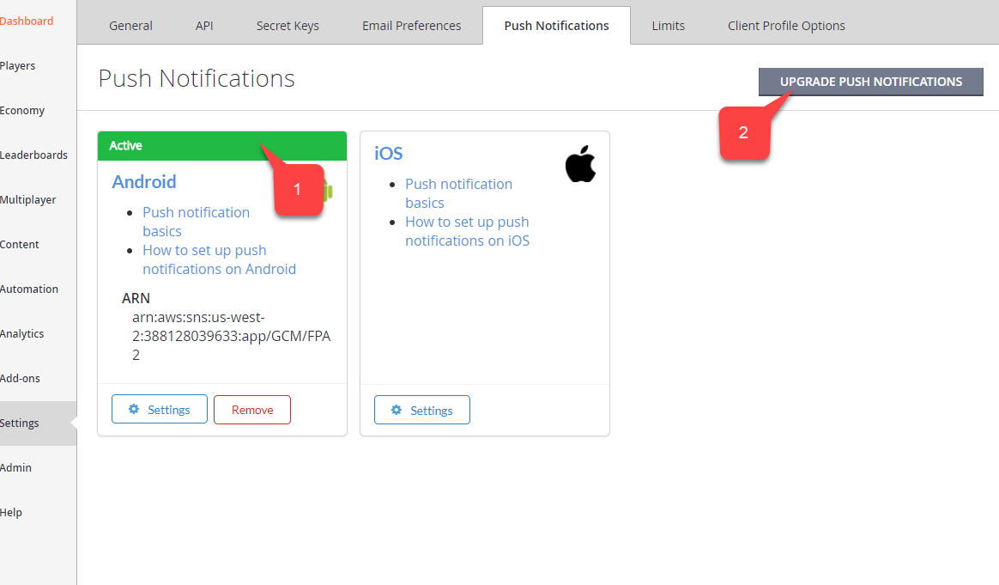
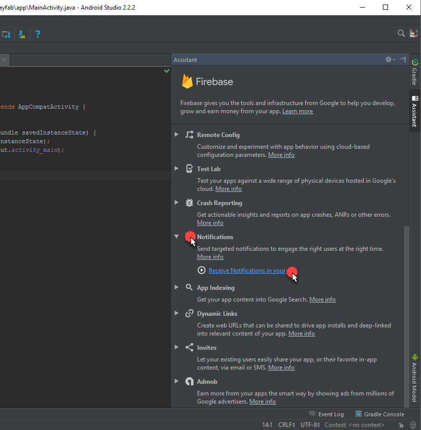
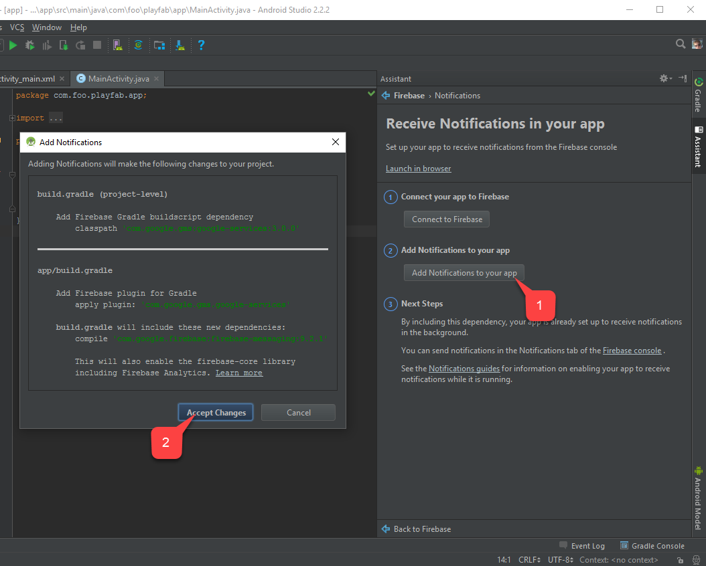

# Getting Started with Android Studio and Push Notifications

## Overview

This tutorial aims to help you get up and running with Android PlayFab Integration with Push Notifications. Push notifications require a configuration in several systems. Before getting our hands dirty, let's talk about how the infrastructure works. There are 4 entities participating in the process:

- Google Play Services
- Firebase Cloud Messaging Services (FCM, built on top of old Google Cloud Messaging)
- PlayFab Services
- Client Application

Google Play Services identifies your page on the play market using a **package name**. Ex. *com.bob.games.matchthree*. When registered in Google Play, the package name becomes a unique application ID and serves many purposes, from installing through Play Store to preventing impersonation.

Firebase and its Cloud Messaging Services (FCM) offer you a cloud-based system to send, direct, and deliver your push notifications. It also allows other services (like PlayFab) to send push notifications on your behalf using the **FCM Server Key**.

PlayFab Services then use the FCM Server Key to send Push Notifications to your clients.

Finally, your Client Application may receive notifications and process them as needed.

As a result, we need to set up 4 different systems. This tutorial is split into 4 chapters, covering the configuration for each piece. The order, in which you configure systems, matters.

## Prerequisites

- Have a Google account
- Have a PlayFab account
- A generated notification icon using the Android Asset Studio [Notification icon generator](https://romannurik.github.io/AndroidAssetStudio/icons-notification.html)

## Scenario

In this tutorial we will be assembling an application called "Foo PlayFab App". It is an Android app that has the following functions:

- Sign in to PlayFab using an Android Device ID
- Receive push notifications from PlayFab

Our **package name** will be *com.foo.playfab.app*.

> [!IMPORTANT]
> Make sure to use your own package name and title when following this tutorial.

### Chapter 1: Configuring Firebase

You start configuring Firebase by using its [official console page](https://console.firebase.google.com/). You will be presented with a page where you can add a new project. Do so, by clicking the "Add project" area, as shown in the following picture:


You will be asked to provide a project name. In this tutorial we use "Foo PlayFab App", but make sure to come up with your own name when following this tutorial. Click "Create Project" to advance to the next step:


You will be redirected to the new project dashboard. Add a new Android application to the project by clicking on the area as shown in the following picture.


A new application requires 3 steps to be added. First, you must provide an Android package name. We are using *com.foo.playfab.app*, but please, make sure to come up with your own package name when following this tutorial. Click "Register App" to move to the next step:


Step 2 allows you to download a settings file called **google-services.json**. It will be used later in the app to automatically configure Google services. After you download it, click "Continue" to move to the next step:


The final step offers information on how to set up your build process to wire up the Firebase and Google Play SDKs. You may ignore this information, as we will be using an automated tool built into the Android Studio that performs this setup automatically. Click "Finish" to proceed:


Once the application has been added, it will appear on the dashboard. At this point, configuration is complete and we need to extract the FCM Server Key, which we will use to wire up PlayFab Push Notifications. Navigate to the project settings as shown in the following picture:


When in settings, navigate to the Cloud Messaging tab and locate the "Server key" item (the red area in the following picture). Copy this key and store it in the notepad, or somewhere else, where you have quick access to it:


At this point, we have done everything we need in Firebase to enable Push Notifications.

### Chapter 2: Configuring Google Play Console

When your app is ready, you will, most likely, create a Google Console Project to maintain a product Play Store page. Let's go though the process of creating a GooglePlay project and linking it to the Firebase project. 

Start by visiting the [Google Play Console page](https://play.google.com/apps/publish) and creating a new project as shown in the following picture:


Assign the title. In this example, we use "Foo PlayFab App" but, please, make sure to come up with your own title and package name while following this tutorial. Click "Create" to continue:


The Google Play Console project page will open. Locate and select "Services & APIs" on the side navigation panel, as shown in the following picture:


The Services configuration page will open. Locate the "Firebase Cloud Messages" panel and click "Link a sender ID", as shown in the following picture:


To link the sender ID, use the FCM Server Key that you received (and saved) while using the Firebase console in the previous chapter. When done, click "Link", as shown in the following picture:


Ensure that the Sender ID displayed in the Google Play console matches the one from the Firebase console, as shown in the following picture:


At this point, the Google Play Console project is successfully linked to the Firebase project.

### Chapter 3: Configuring PlayFab Title

The purpose of this chapter is to show you how to configure PlayFab services so that it can send Push Notifications to the player on your behalf. First, you must go to Settings -> Push Notifications -> Android Settings, as shown in the following picture:


You will be asked for the FCM Server Key. Copy the one you received through the Firebase console, as shown in the following picture:


If everything is correct, you will be presented with a page that shows Push Notifications as wired and "Active" **(1)**. One last step is to make sure the title is using the newest FCM architecture. To do this, click "Upgrade Push Notifications" **(2)**:



This concludes configuring your PlayFab title.

### Chapter 4: Configuring Android Studio Project

In order to utilize the PlayFab JavaSDK, you will need the PlayFab Client JavaSDK and it's dependency, Google GSON.

- Download the PlayFab Client JavaSDK JAR library here. Look for client-sdk-*.jar and the corresponding Java Doc if you need it.

- Download the latest Google GSON here. Look for gson-*.jar. 

Have the aforementioned jar files nearby and start by creating a regular Android Studio project. Ensure that the package name matches the one you used throughout this tutorial (in Firebase, for instance). In this example, we are using *com.foo.playfab.app*, but, please, make sure to come up with your own package name and title while following this tutorial:


Select a Minimum SDK to your taste, and click "Next":


For this tutorial, we suggest using the "Empty Activity" template to begin with. Select the template you want to use, and click "Next" as shown in the following picture:


Finally, configure the template as you prefer and click "Finish" as shown in the following picture:


Once you open the newly created project, switch to the "Project" tab **(1)**. In the previous chapter, you downloaded the "google-services.json" configuration file from the Firebase console. Ensure that this file is placed under the "app" folder **(2)**. Then, navigate to Tools **(3)** and select "Firebase" **(4)**, as shown in the following picture:


The Firebase Assistant will open on the right side of the window. Locate the Notifications folder and select "Receive Notifications in your app", as shown in the following picture:



In the Firebase Notifications Assistant, select "Add Notifications to your app" **(1)**. A Project Changes Wizard will open. Select "Accept Changes" **(2)** as shown in the following picture:



Once the process finishes, ensure that the Firebase Notifications Assistant indicates that dependencies are set up correctly **(1)**. In the beginning of this chapter, we acquired the necessary JAR files. Normally, the gradle build file automatically fetches these files. However, ensure that these JAR files are listed under the "app/libs" folder **(2)**. Select all of them, right click on the selection, and choose "Add as library..." **(3)**, as shown in the following picture:


Using the Android Asset Studio [Notification icon generator](https://romannurik.github.io/AndroidAssetStudio/icons-notification.html), prepare the icons and place them inside app/src/main/res. In the following picture, the icon is called "ic_stat_blur_on":


Finally, click Rebuild Project:


At this point, we can start implementing code for receiving and handling notifications. We are going to modify (and create if needed) 4 files:

- app/src/main/AndroidManifest.xml
- app/src/main/java/..packagePath../MainActivity.java
- app/src/main/java/..packagePath../FooAppFirebaseInstanceIdService.java
- app/src/main/java/..packagePath../FooAppFirebaseMessagingService.java

Please note that the current implementation is crafted to be as short as possible, just to quickly test the notifications. Consider [FCM Guides](https://firebase.google.com/docs/cloud-messaging/concept-options) for high-quality best practices and more complex implementation examples.

#### AndroidManifest.xml

In the following code, replace any **MY_PACKAGE_IDENTIFIER** placeholders with your own package identifier.

```xml
<?xml version="1.0" encoding="utf-8"?>
<manifest xmlns:android="http://schemas.android.com/apk/res/android"
    package="MY_PACKAGE_IDENTIFIER">
    <uses-permission android:name="android.permission.INTERNET" />

    <application
        android:allowBackup="true"
        android:icon="@mipmap/ic_launcher"
        android:label="@string/app_name"
        android:supportsRtl="true"
        android:theme="@style/AppTheme">
        <activity android:name=".MainActivity">
            <intent-filter>
                <action android:name="android.intent.action.MAIN" />
                <category android:name="android.intent.category.LAUNCHER" />
            </intent-filter>
        </activity>

        <!-- The following block enables our custom Firebase Instance ID Service-->
        <service android:name=".FooAppFirebaseInstanceIdService" android:exported="true">
            <intent-filter>
                <action android:name="com.google.firebase.INSTANCE_ID_EVENT"/>
            </intent-filter>
        </service>

        <service
            android:name=".FooAppFirebaseMessagingService" android:exported="true">
            <intent-filter>
                <action android:name="com.google.firebase.MESSAGING_EVENT"/>
            </intent-filter>
        </service>

    </application>

</manifest>
```

#### MainActivity.java

The following placeholders in the code should be replaced according to your scenario:

- PLAYFAB_TITLE_ID
  - The Id for your title that you received in PlayFab Game Manager.
- PACKAGE_IDENTIFIER
  - The Java package identifier that matches your setup.

```java
package PACKAGE_IDENTIFIER;

import android.os.AsyncTask;
import android.support.v7.app.AppCompatActivity;
import android.os.Bundle;
import android.util.Log;
import com.playfab.PlayFabClientAPI;
import com.playfab.PlayFabClientModels.*;
import com.playfab.PlayFabErrors;
import com.playfab.PlayFabSettings;
import java.util.List;
import java.util.Map;

public class MainActivity extends AppCompatActivity {

    // Invoked when activity is started
    @Override
    protected void onCreate(Bundle savedInstanceState) {
        super.onCreate(savedInstanceState);
        setContentView(R.layout.activity_main);

        // Set PlayFab title
        PlayFabSettings.TitleId = "PLAYFAB_TITLE_ID";

        // Start login operation
        AsyncTask.execute(new Runnable() {
            @Override
            public void run() {
                if(login()) FooAppFirebaseInstanceIdService.setAllowRegisterForPush(true); // Ready to register for push notifications
            }
        });
    }

    public boolean login(){
        LoginWithAndroidDeviceIDRequest request = new LoginWithAndroidDeviceIDRequest();
        request.CreateAccount = true;
        
        // There are several approaches on getting unique android device id.
        // https://stackoverflow.com/questions/2785485/is-there-a-unique-android-device-id
        request.AndroidDeviceId = "qwerty";

        PlayFabErrors.PlayFabResult<LoginResult> response = PlayFabClientAPI.LoginWithAndroidDeviceID(request);
        if(response.Error != null){
            Log.d("Foo PlayFab App",CompileErrorsFromResult(response.Error));
            return false;
        }
        return true;
    }

    // Utility method to compose an error message out of PlayFab result.
    private static String CompileErrorsFromResult(PlayFabErrors.PlayFabError error) {
        if (error == null)
            return null;

        String errorMessage = "";
        if (error.errorMessage != null)
            errorMessage += error.errorMessage;
        if (error.errorDetails != null)
            for (Map.Entry<String, List<String>> pair : error.errorDetails.entrySet())
                for (String msg : pair.getValue())
                    errorMessage += "\n" + pair.getKey() + ": " + msg;
        return errorMessage;
    }
}
```

#### FooAppFirebaseInstanceIdService.java

The following placeholder in the code should be replaced according to your scenario:

- PACKAGE_IDENTIFIER
  - The Java package identifier that matches your setup.

```java
package PACKAGE_IDENTIFIER;

import android.text.TextUtils;
import android.util.Log;
import com.google.firebase.iid.FirebaseInstanceId;
import com.google.firebase.iid.FirebaseInstanceIdService;
import com.playfab.PlayFabClientAPI;
import com.playfab.PlayFabClientModels;
import com.playfab.PlayFabErrors;
import java.util.List;
import java.util.Map;

public class FooAppFirebaseInstanceIdService extends FirebaseInstanceIdService {

    private static String _token;

    private static boolean _allowRegistration;

    // This is invoked from activity that performs authentication.
    // Once login is complete this method is invoked.
    // If we have a pending token, we use it to register for push notifications
    public static void setAllowRegisterForPush(boolean isAllowed) {
        _allowRegistration = isAllowed;
        if (_allowRegistration && !TextUtils.isEmpty(_token)) {
            registerForPush(_token);
        }
    }

    // Invoked when firebase has fetched a token
    // If we already have logged in, we use new token to register for push
    @Override
    public void onTokenRefresh() {
        _token = FirebaseInstanceId.getInstance().getToken();
        if (_allowRegistration && !TextUtils.isEmpty(_token)) {
            registerForPush(_token);
        }
    }


    private static void registerForPush(String token) {
        PlayFabClientModels.AndroidDevicePushNotificationRegistrationRequest request = new PlayFabClientModels.AndroidDevicePushNotificationRegistrationRequest();
        request.DeviceToken = token;

        PlayFabErrors.PlayFabResult<PlayFabClientModels.AndroidDevicePushNotificationRegistrationResult> response = PlayFabClientAPI.AndroidDevicePushNotificationRegistration(request);

        if (response.Error != null) {
            Log.d("Foo PlayFab App", CompileErrorsFromResult(response.Error));
        }
    }

    // Utility method to compose an error message out of PlayFab result.
    private static String CompileErrorsFromResult(PlayFabErrors.PlayFabError error) {
        if (error == null)
            return null;

        String errorMessage = "";
        if (error.errorMessage != null)
            errorMessage += error.errorMessage;
        if (error.errorDetails != null)
            for (Map.Entry<String, List<String>> pair : error.errorDetails.entrySet())
                for (String msg : pair.getValue())
                    errorMessage += "\n" + pair.getKey() + ": " + msg;
        return errorMessage;
    }

}
```

#### FooAppFirebaseMessagingService.java

The following placeholder in the code should be replaced according to your scenario:

- PACKAGE_IDENTIFIER
  - The Java package identifier that matches your setup.

```java
package com.foo.playfab.app;

import android.util.Log;
import com.google.firebase.messaging.FirebaseMessagingService;
import com.google.firebase.messaging.RemoteMessage;

public class FooAppFirebaseMessagingService extends FirebaseMessagingService {

    @Override
    public void onMessageReceived(RemoteMessage message) {
        // Intercept the message here
        Log.d("Foo PlayFab App","Message received: "+message.getNotification().getBody());
    }
}
```

## Testing

At this point, you should be able to deploy the application to the device. Once you start the application, It will automatically log in and register for push notifications. Press the home button on your device to **minimize the application**. This is important so that we can test the notification that arrives into the system tray. Next, go to your PlayFab title Game Manager page, use Dashboard to locate the latest push registration, and click the player ID **(1)**:


This will open a "Send push notification" page for that player. click the "Send Push Notification" button **(1).** Type in the title **(2)**, message body **(3)**, and commit by clicking the "Send Push Notification" button **(4)**:


Observe as the message arrives in your device:


If this is the case, messages are successfully being delivered into your application. At this point you have successfully integrated. You may use **FooAppFirebaseMessagingService** to handle the incoming message while your application is actually running.
