# Getting Started with Android Studio and push notifications

## Overview

This tutorial has been designed to help you get up and running with Android PlayFab integration with push notifications.

Push notifications require a configuration in several systems. Before getting started, let's talk about how the infrastructure works. There are 4 entities participating in the process:

1. **Google Play Services**
2. **Firebase Cloud Messaging Service**s (**FCM**, built on top of the old **Google Cloud Messaging**.)
3. **PlayFab Services**
4. **Client Applications**

### 1. Google Play Services

Google Play Services identifies your page on the play market using a package name.

An example of this would be: **com.bob.games.matchthree**.

When registered in Google Play, the package name becomes a unique application ID and serves many purposes, from installing through play store to preventing impersonation.

### 2. Firebase Cloud Messaging (FCM)

Firebase Cloud Messaging services offer you a cloud-based system to send, direct, and deliver your push notifications.

It also allows other services (like PlayFab) to send push notifications on your behalf using the FCM server key.

### 3. PlayFab Services

PlayFab Services then uses the FCM server key to send push notifications to your clients.

### 4. Client Services

Finally, your client application may receive notifications and process them as needed.

### Four -way split

As a result of this, we need to set up *4 different systems*. To do this, our tutorial is split into 4 chapters, covering the configuration for each piece.

> [!NOTE]
> The *order* that you use to configure the systems is important.

## Prerequisites

- You must have a Google account.
- You must have a PlayFab account.
- A generated notification icon using the Android Asset Studio [Notification icon generator](https://romannurik.github.io/AndroidAssetStudio/icons-notification.html).

## Scenario

In this section of our tutorial, we will be assembling an application called the Foo PlayFab App. It is an Android app that has the following functions:

- It signs into PlayFab using an Android Device ID.
- It receives push notifications from PlayFab.

Our package name will be com.foo.playfab.app.

> [!IMPORTANT]
> Make sure to use your own package name and title when following this tutorial.

### Chapter 1: Configuring Firebase

You start configuring Firebase by using its [official console page](https://console.firebase.google.com/). You will be presented with a page where you can add a new project.

- To do this, select the **Add project** area, as shown in the following picture.

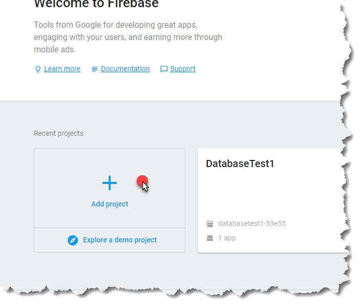

- You will be asked to provide a **Project Name** (in this tutorial we use our **Foo PlayFab App**, but *make sure* to come up with your *own* name when following this tutorial).

- Select the **Create Project** button to advance to the next step.

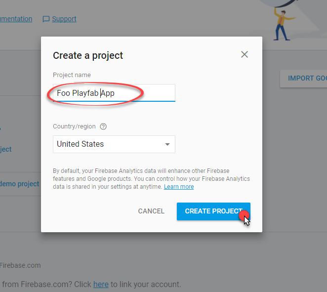

You will be redirected to the **New Project Dashboard**.

- Add a new **Android Application** to the project by selecting the area as shown in the following picture.

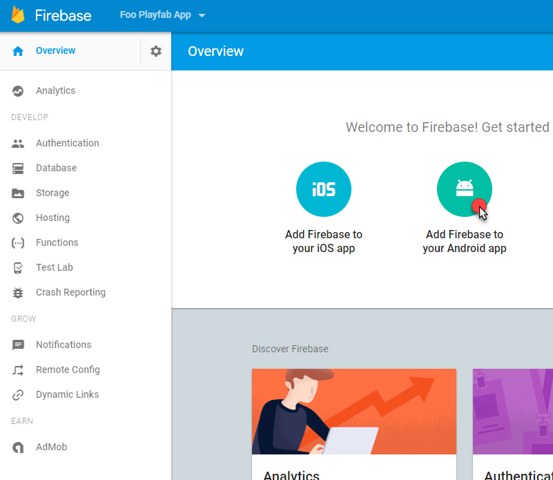

A new **Application** requires 3 steps to be added.

1. First, you must provide an **Android Package Name**. We are using **com.foo.playfab.app**, but make sure to come up with your *own* **Package Name** when following this tutorial.

2. Select the **Register App** button to move to the next step.

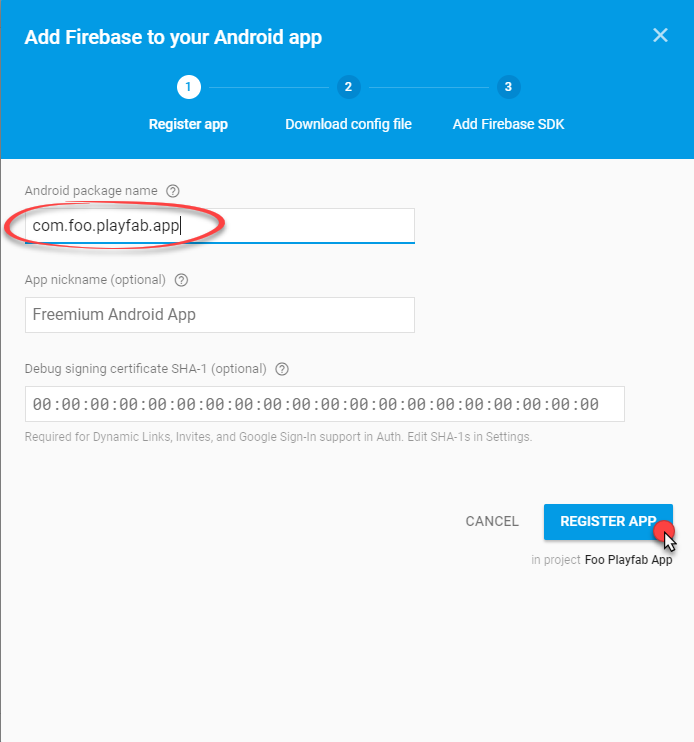

Step 2 allows you to download a settings file called **google-services.json**. It will be used later in the **App** to automatically configure **Google** services.

- After you download it, select the **Continue** button to move to the next step.

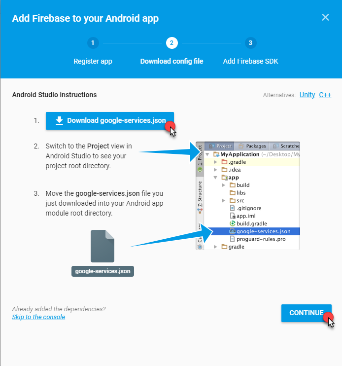

3. The final step offers information on how to set up your build process to wire up the Firebase and Google Play SDKs.

> [!Note]
> You may ignore this information, as we will be using an automated tool built into the Android studio that performs this setup automatically.

- Select the **Finish** button to proceed.

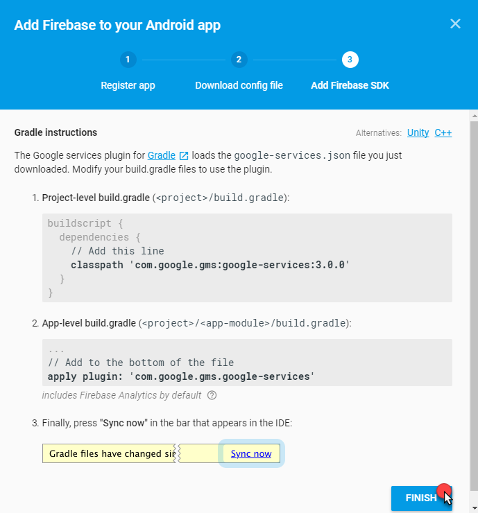

- Once the **Application** has been added, it will appear on the dashboard.

- At this point, configuration is complete, and we need to extract the FCM server key (which we will use to wire up PlayFab push notifications).
- Go to the **Project settings** as shown in the following picture.


- In **Project settings**, navigate to the **Cloud Messaging** tab.

- Locate the **Server Key** area (the red area in the  picture shown below).

- Copy this **Key** and store it in a safe and easily accessible place.

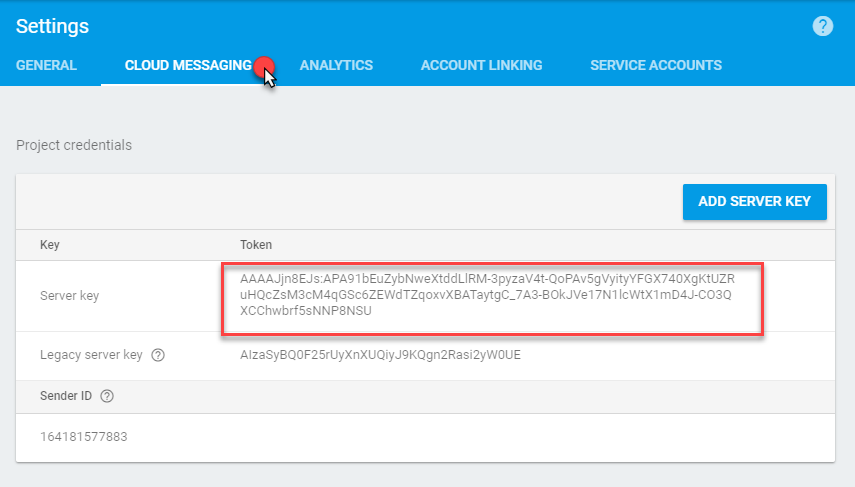

At this point, we have done everything we need in Firebase to enable push notifications.

### Chapter 2: Configuring the Google Play console

When your app is ready, you will most likely create a Google Console Project to maintain a product Play Store page. Let's go though the process of creating a GooglePlay Project, and linking it to the Firebase Project.

Start by visiting the [Google Play Console page](https://play.google.com/apps/publish) and creating a new project as shown in the following picture.

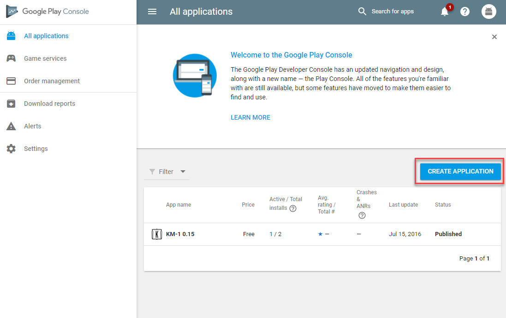

- Assign the **Title**.

> [!NOTE]
> In this example, we use **Foo PlayFab App**. Please make sure to come up with your *own* title and package name while following this tutorial.

- Select the **Create** button to continue.

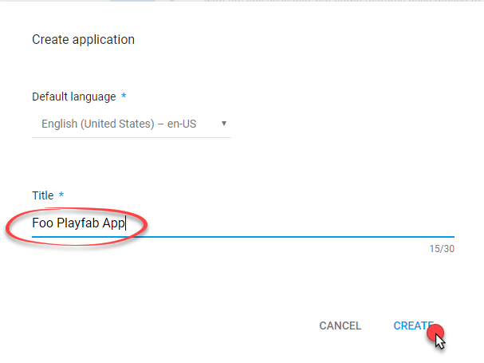

- The **Google Play Console Project** page will open.

- Select **Services & APIs** on the side menu.

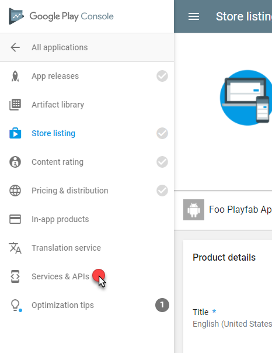

- The **Services configuration** page will open.
- Locate the **Firebase Cloud Messaging** panel.
- Select the **Link a Sender ID** button, as shown in the following picture.

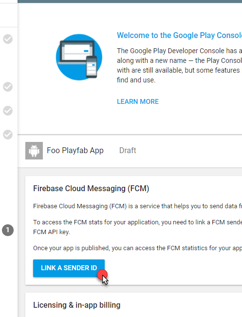

To link the **Sender ID**:

- Use the FCM server key that you received (and saved) while using the Firebase console in the previous Chapter.
- When done, select the **Link** button, as shown in our example.


- Take a moment to verify that the **Sender ID** displayed in the **Google Play Console** matches the one from the **Firebase Console**, as shown in the example below.

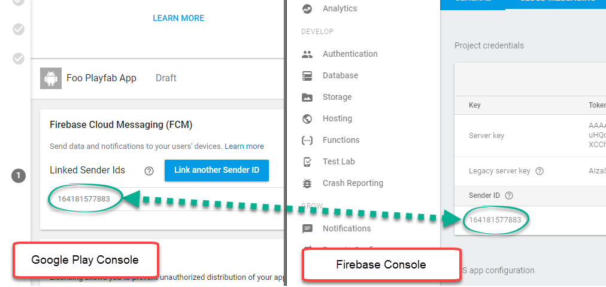

At this point, the **Google Play Console Project** is successfully linked to the **Firebase Project**.

### Chapter 3: Configuring the PlayFab title

The purpose of this chapter is to show you how to configure PlayFab Services, so that it can send push notifications to the player on your behalf.

- First, you must go to **Title settings** in your title's Settings menu.

- Select the  **Push Notifications** tab.

- For the Android option, select the **Settings** icon.

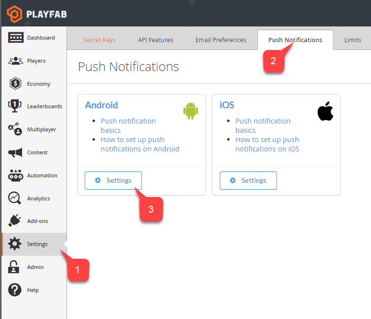

- You will be asked for your **Google server API key**.

- Copy the one you received through the Firebase console, as shown in the example provided below.

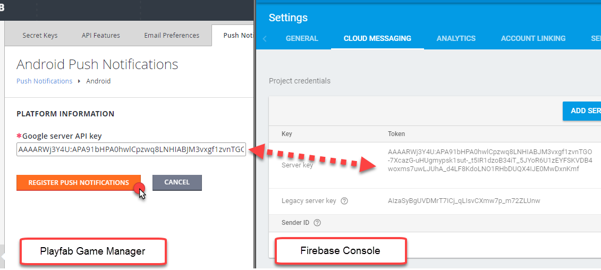

- If everything is correct, you will be presented with a page that shows **Push Notifications** as **Active**.

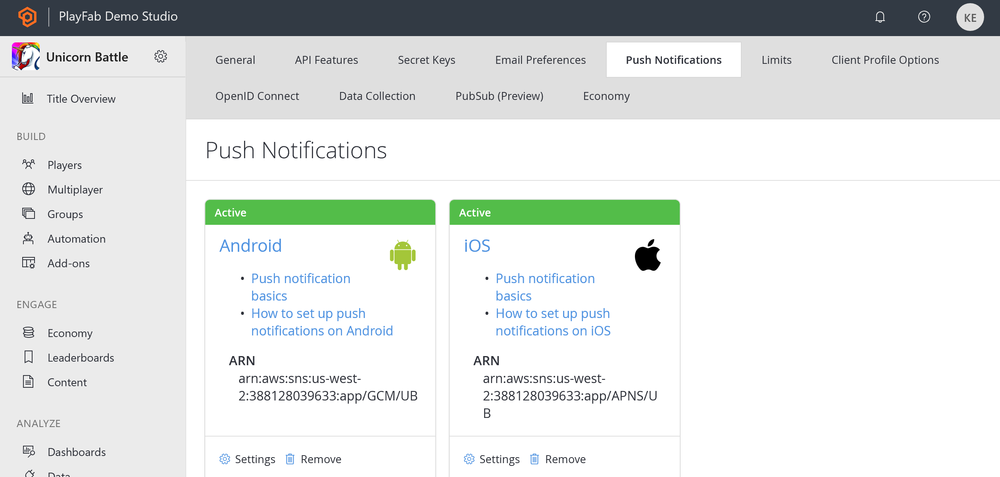

This concludes configuring your PlayFab title.

### Chapter 4: Configuring Android studio project

In order to utilize the PlayFab JavaSDK, you will need the PlayFab Client JavaSDK and its dependency, Google GSON.

- Download the PlayFab client JavaSDK JAR library here.

- Look for `client-sdk-*.jar`, and the corresponding Java Doc if you need it.

- Download the latest Google GSON.

- Look for `gson-*.jar`.

- Have the previously mentioned .jar files nearby.

Start by creating a regular Android studio project.

- Verify that the **Package name** matches the one you used throughout this tutorial (in Firebase, for instance).

  > [!NOTE]
  > For our purposes in *this* example, we are using **com.foo.playfab.app**, but please remember to come up with your own package name and title while following this tutorial.

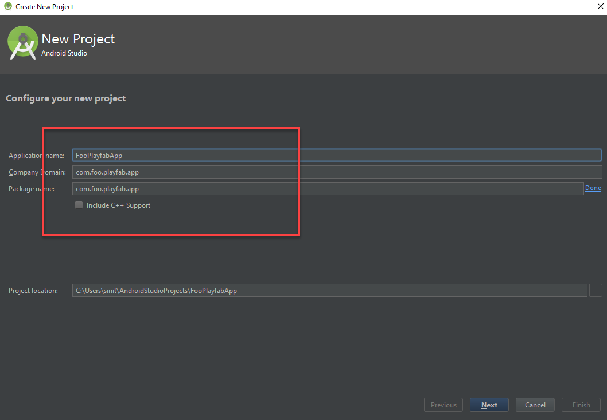

- Select a **Minimum SDK** to your choice.

- Then select the **Next** button.

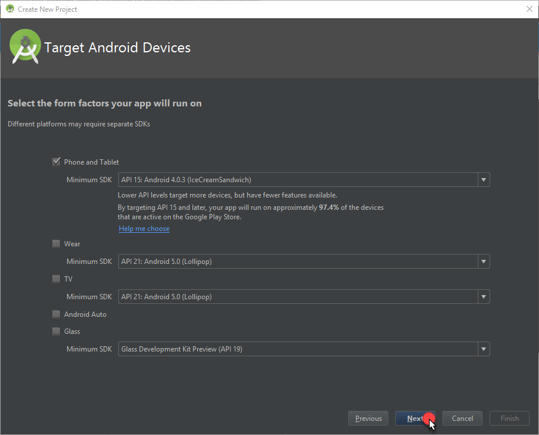

For this tutorial, we suggest using the **Empty Activity** template to begin with.

- Select the template you want to use.

- Then select the **Next** button.

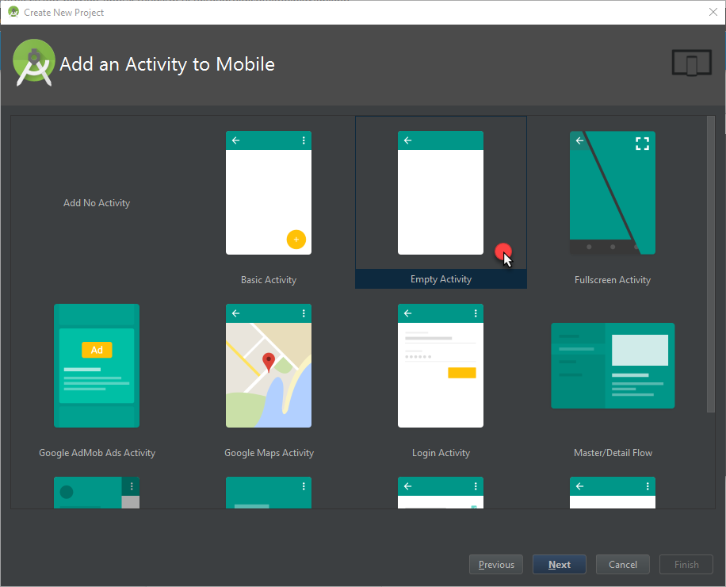

- Configure the template as you want.

- Select the **Finish** button.

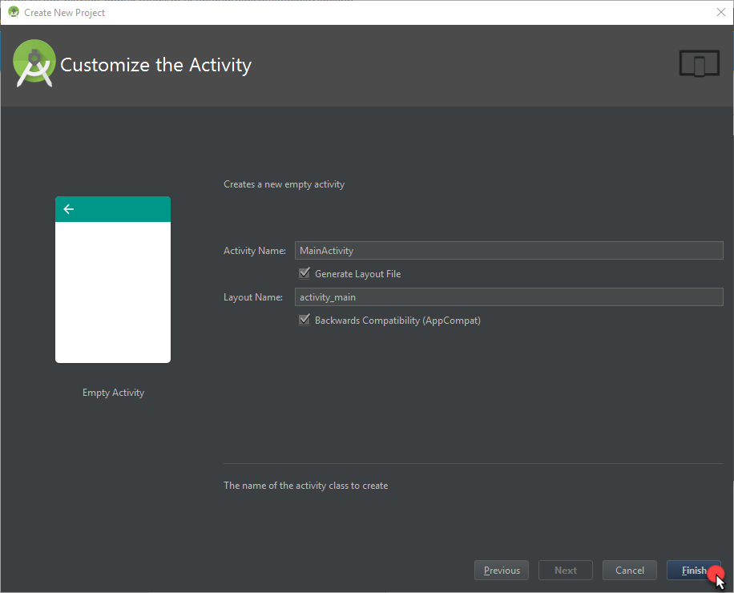

Once you open the newly created project:

- Switch to the **Project** tab **(1)**.

> [!NOTE]
> In the previous Chapter, you downloaded the `google-services.json` configuration file from the Firebase console. Use this for your next step.

- Verify that this file is placed under the **App** folder **(2)**.
- Then, navigate to **Tools (3)**.
- Select **Firebase (4)**, as shown in the example provided below.

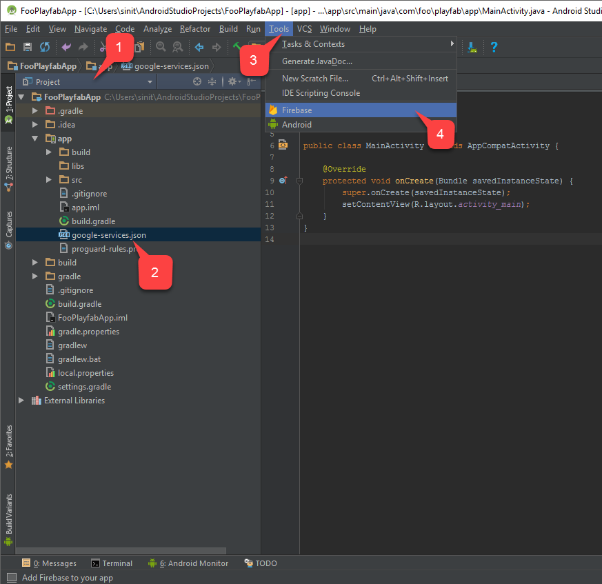

The **Firebase Assistant** will open on the right side of the window.

- Locate the **Cloud Messaging** folder, and select **Set up Firebase Cloud Messaging**, as shown below.

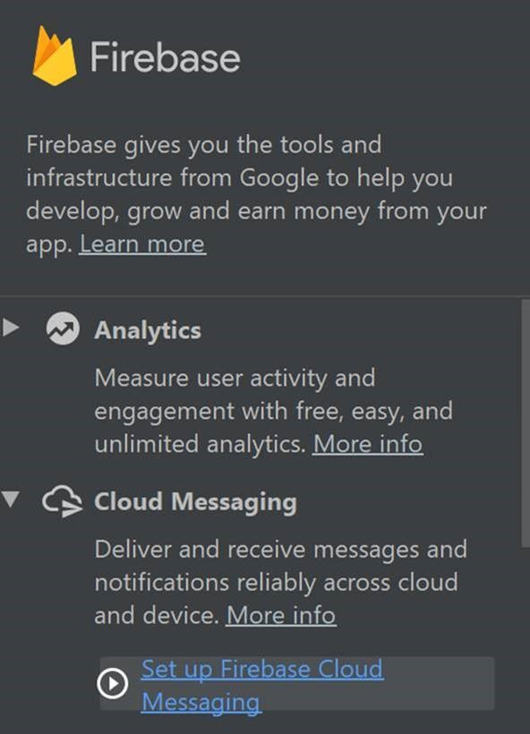

- In the **Firebase Notifications Assistant**, select the **Add FCM to your app (1)** button as shown in the following image.
- A dialog will open indicating that new dependencies will be added via **Gradle**.
- Select **Accept Changes (2)** to grant the changes.

  > [!NOTE]
  > Unfortunately, the dependencies that are added automatically by the **Gradle** sync process (**3**) are incorrect and will report failure!

- To set up the dependencies correctly, replace the auto-added sentences with the following:

    `implementation 'com.google.firebase:firebase-core:16.0.3`  
    `implementation 'com.google.firebase:firebase-messaging:17.0.0`  

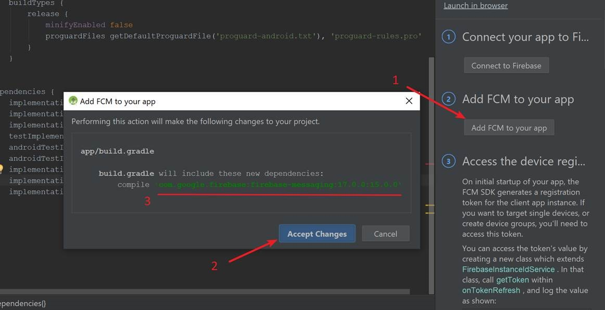

Once that process is complete:

- Verify that the **Firebase Notifications Assistant** indicates that dependencies are now set up correctly **(1)**.

> [!NOTE]
> In the beginning of this chapter, we acquired the necessary JAR files. Normally, the build file automatically fetches these files.

- To ensure that these JAR files are listed under the **app/libs** folder **(2)**, select all of the files and right-click them.
- Then choose **Add as library... (3)**, as shown in the example provided below.

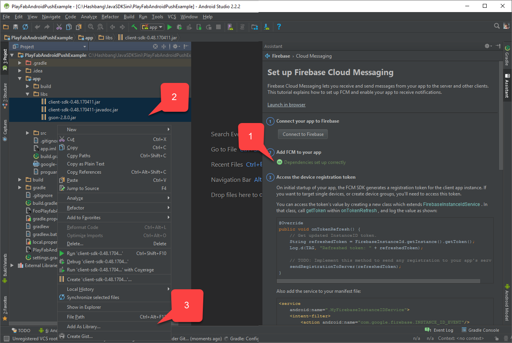

- Using the Android asset studio [Notification icon generator](https://romannurik.github.io/AndroidAssetStudio/icons-notification.html), prepare the icons and place them inside **app/src/main/res**.

- In the example shown below, the icon is called **ic_stat_blur_on**.

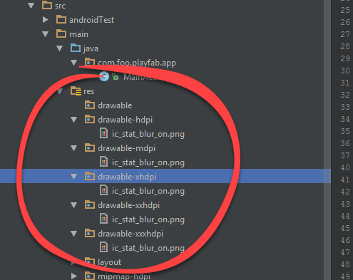

- Finally, select **Rebuild Project**.

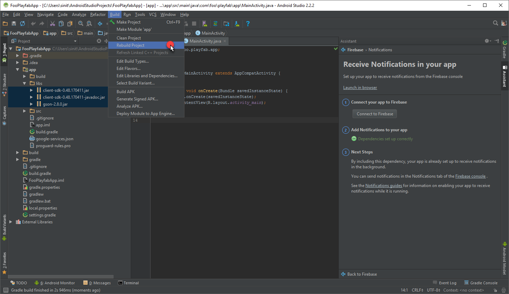

Now we can start implementing code for receiving and handling notifications. We are going to modify (and create if needed) 4 files:

1. **app/src/main/AndroidManifest.xml**
2. **app/src/main/java/..packagePath../MainActivity.java**
3. **app/src/main/java/..packagePath../FooAppFirebaseInstanceIdService.java**
4. **app/src/main/java/..packagePath../FooAppFirebaseMessagingService.java**

> [!NOTE]
> The current implementation is crafted to be as short as possible, just to quickly test the notifications. Consider [FCM Guides](https://firebase.google.com/docs/cloud-messaging/concept-options) for high-quality best practices and more complex implementation examples.

#### AndroidManifest.xml

In the following code, replace any `MY_PACKAGE_IDENTIFIER` placeholders with your *own* package identifier.

```xml
<?xml version="1.0" encoding="utf-8"?>
<manifest xmlns:android="http://schemas.android.com/apk/res/android"
    package="MY_PACKAGE_IDENTIFIER">
    <uses-permission android:name="android.permission.INTERNET" />

    <application
        android:allowBackup="true"
        android:icon="@mipmap/ic_launcher"
        android:label="@string/app_name"
        android:supportsRtl="true"
        android:theme="@style/AppTheme">
        <activity android:name=".MainActivity">
            <intent-filter>
                <action android:name="android.intent.action.MAIN" />
                <category android:name="android.intent.category.LAUNCHER" />
            </intent-filter>
        </activity>

        <!-- The following block enables our custom Firebase Instance ID Service-->
        <service android:name=".FooAppFirebaseInstanceIdService" android:exported="true">
            <intent-filter>
                <action android:name="com.google.firebase.INSTANCE_ID_EVENT"/>
            </intent-filter>
        </service>

        <service
            android:name=".FooAppFirebaseMessagingService" android:exported="true">
            <intent-filter>
                <action android:name="com.google.firebase.MESSAGING_EVENT"/>
            </intent-filter>
        </service>

    </application>

</manifest>
```

#### MainActivity.java

The following placeholders in the code should be replaced according to your scenario.

- `PLAYFAB_TITLE_ID`
  - Use the ID for your title that you received in PlayFab Game Manager.

- `PACKAGE_IDENTIFIER`
  - Use the Java package identifier that matches your setup.

```java
package PACKAGE_IDENTIFIER;

import android.os.AsyncTask;
import android.support.v7.app.AppCompatActivity;
import android.os.Bundle;
import android.util.Log;
import com.playfab.PlayFabClientAPI;
import com.playfab.PlayFabClientModels.*;
import com.playfab.PlayFabErrors;
import com.playfab.PlayFabSettings;
import java.util.List;
import java.util.Map;

public class MainActivity extends AppCompatActivity {

    // Invoked when activity is started
    @Override
    protected void onCreate(Bundle savedInstanceState) {
        super.onCreate(savedInstanceState);
        setContentView(R.layout.activity_main);

        // Set PlayFab title
        PlayFabSettings.TitleId = "PLAYFAB_TITLE_ID";

        // Start login operation
        AsyncTask.execute(new Runnable() {
            @Override
            public void run() {
                if(login()) FooAppFirebaseInstanceIdService.setAllowRegisterForPush(true); // Ready to register for push notifications
            }
        });
    }

    public boolean login(){
        LoginWithAndroidDeviceIDRequest request = new LoginWithAndroidDeviceIDRequest();
        request.CreateAccount = true;

        // There are several approaches on getting unique android device id.
        // https://stackoverflow.com/questions/2785485/is-there-a-unique-android-device-id
        request.AndroidDeviceId = "qwerty";

        PlayFabErrors.PlayFabResult<LoginResult> response = PlayFabClientAPI.LoginWithAndroidDeviceID(request);
        if(response.Error != null){
            Log.d("Foo PlayFab App",CompileErrorsFromResult(response.Error));
            return false;
        }
        return true;
    }

    // Utility method to compose an error message out of PlayFab result.
    private static String CompileErrorsFromResult(PlayFabErrors.PlayFabError error) {
        if (error == null)
            return null;

        String errorMessage = "";
        if (error.errorMessage != null)
            errorMessage += error.errorMessage;
        if (error.errorDetails != null)
            for (Map.Entry<String, List<String>> pair : error.errorDetails.entrySet())
                for (String msg : pair.getValue())
                    errorMessage += "\n" + pair.getKey() + ": " + msg;
        return errorMessage;
    }
}
```

#### FooAppFirebaseInstanceIdService.java

The placeholder in the code displayed below should be replaced according to your scenario.

- `PACKAGE_IDENTIFIER`
  - The Java package identifier that matches your setup.

```java
package PACKAGE_IDENTIFIER;

import android.text.TextUtils;
import android.util.Log;
import com.google.firebase.iid.FirebaseInstanceId;
import com.google.firebase.iid.FirebaseInstanceIdService;
import com.playfab.PlayFabClientAPI;
import com.playfab.PlayFabClientModels;
import com.playfab.PlayFabErrors;
import java.util.List;
import java.util.Map;

public class FooAppFirebaseInstanceIdService extends FirebaseInstanceIdService {

    private static String _token;

    private static boolean _allowRegistration;

    // This is invoked from activity that performs authentication.
    // Once login is complete this method is invoked.
    // If we have a pending token, we use it to register for push notifications
    public static void setAllowRegisterForPush(boolean isAllowed) {
        _allowRegistration = isAllowed;
        if (_allowRegistration && !TextUtils.isEmpty(_token)) {
            registerForPush(_token);
        }
    }

    // Invoked when firebase has fetched a token
    // If we already have logged in, we use new token to register for push
    @Override
    public void onTokenRefresh() {
        _token = FirebaseInstanceId.getInstance().getToken();
        if (_allowRegistration && !TextUtils.isEmpty(_token)) {
            registerForPush(_token);
        }
    }


    private static void registerForPush(String token) {
        PlayFabClientModels.AndroidDevicePushNotificationRegistrationRequest request = new PlayFabClientModels.AndroidDevicePushNotificationRegistrationRequest();
        request.DeviceToken = token;

        PlayFabErrors.PlayFabResult<PlayFabClientModels.AndroidDevicePushNotificationRegistrationResult> response = PlayFabClientAPI.AndroidDevicePushNotificationRegistration(request);

        if (response.Error != null) {
            Log.d("Foo PlayFab App", CompileErrorsFromResult(response.Error));
        }
    }

    // Utility method to compose an error message out of PlayFab result.
    private static String CompileErrorsFromResult(PlayFabErrors.PlayFabError error) {
        if (error == null)
            return null;

        String errorMessage = "";
        if (error.errorMessage != null)
            errorMessage += error.errorMessage;
        if (error.errorDetails != null)
            for (Map.Entry<String, List<String>> pair : error.errorDetails.entrySet())
                for (String msg : pair.getValue())
                    errorMessage += "\n" + pair.getKey() + ": " + msg;
        return errorMessage;
    }

}
```

#### FooAppFirebaseMessagingService.java

The placeholder in the code shown below should be replaced according to your scenario.

- `PACKAGE_IDENTIFIER`
  - The Java package identifier that matches your setup.

```java
package com.foo.playfab.app;

import android.util.Log;
import com.google.firebase.messaging.FirebaseMessagingService;
import com.google.firebase.messaging.RemoteMessage;

public class FooAppFirebaseMessagingService extends FirebaseMessagingService {

    @Override
    public void onMessageReceived(RemoteMessage message) {
        // Intercept the message here
        Log.d("Foo PlayFab App","Message received: "+message.getNotification().getBody());
    }
}
```

## Testing

At this point, you should be able to deploy the application to the device.

- Once you start the application, it will automatically log in and register for push notifications.

- Select the **Home** button on your device to minimize the Application. *This is important*, as it allows us to test the Notification that arrives into the system tray.
- Next, go to your PlayFab title Game Manager page, and use the Dashboard to locate the latest **Push Registration**.
- Select the **Player ID (1)**.

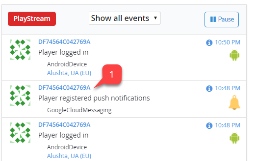

This will open a **Send Push Notification** page for that player.

- Select the **Send Push Notification** button **(1)**.

- Type in the **Title (2)**.
- Enter the body of your message **(3)**.
- Commit your changes by selecting the **Send Push Notification** button **(4)**.

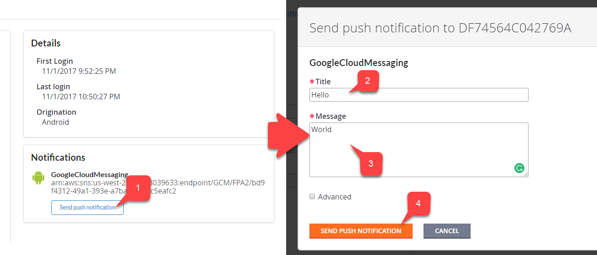

- Verify that the message arrives in your device.

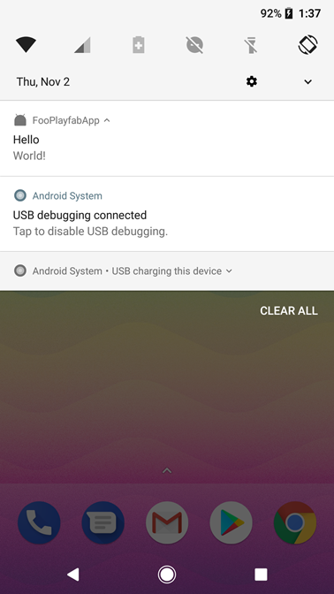

If your message arrives, messages are successfully being delivered into your application.

At this point you have successfully integrated. You may use the **FooAppFirebaseMessagingService** to handle the incoming message while your application is actually running.
