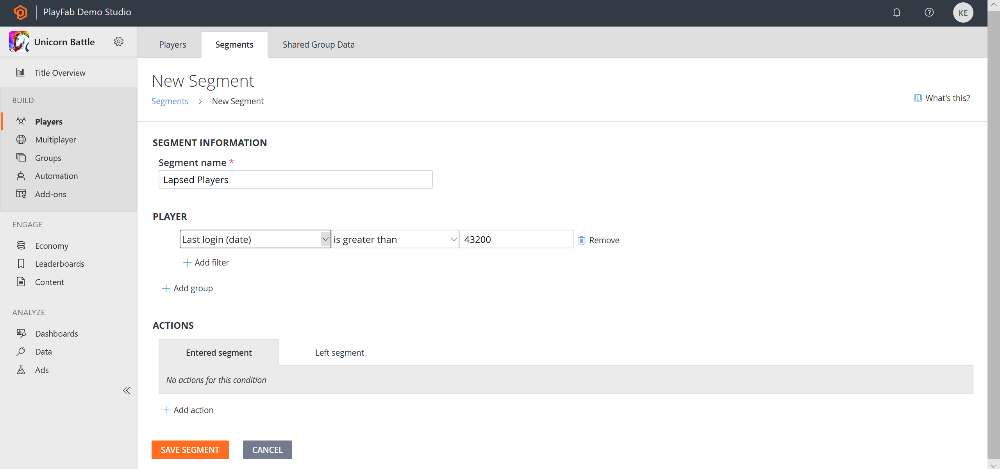
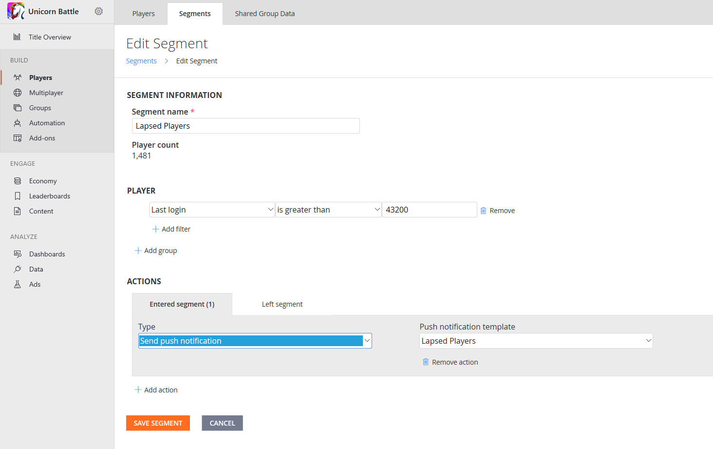

# Push notification templates

Do you have a player base which prefers different languages? PlayFab simplifies localized push notifications by allowing multiple languages to be stored against a single template ID. You provide the strings - and we’ll provide the smarts to send the *right* localized versions to your players.

> [!NOTE]
> Before we added support for push notification templates, developers were able to explicitly define their push notifications inside the rules or scheduled tasks that triggered them. These will continue to behave as they have before - however, in order to add additional languages, you must use templates.

This tutorial walks you through the steps required to create a basic localized push notification template, and then discusses how to configure PlayFab to automatically send it, when one of your players meets the specified criteria.

## Requirements

This is an advanced tutorial. It focuses on how to create a push notification template with localized strings, and then configure logic to trigger the sending of that template to your players.

Please make sure that all requirements have been met or you will not be able to complete this tutorial. This tutorial assumes your title has *already been configured* to send push notifications.

> [!NOTE]
> For an introduction to push notifications and instructions for how to enable them on your title, please refer to the [Push notifications quickstart](quickstart.md). It includes pointers for both [iOS](push-notifications-for-ios.md) and [Android](push-notifications-for-android.md) (including configuring advanced payloads), as well as how to use Postman to validate behavior.

Please become familiar with how to leverage our title default language and preferred player language support in the [Setting Default Languages](../news/setting-default-languages.md) tutorial. You must have a title default language set to continue with push notification templates.

## Create a push notification template

For the purpose of this tutorial, we’ll create a basic push notification to send to lapsed players, in the hopes that they return to our title.

In the PlayFab Game Manager:

1. Select the Content section.
2. Select the **Push Notifications Templates** tab.
3. Click the **New Push Notification Template** button.
4. Add a new language using the drop-down menu in the **Language (Title default)** field. 
5. Choose the language you want to add to the template, and type in the localized strings as shown below.

Subject:

```html
어서 돌아오세요
```

Message:

```html
<Profile.DisplayName>, 보고싶습니다. 다시돌아오시면 서프라이즈 선물을 받으실수있도록 준비했습니다. 다시한번 오셔서 들러보시겠습니까!
```

The following example displays what it should look like.


Select the **SAVE PUSH NOTIFICATION TEMPLATE** button and you’re ready to go!

Sending this template to players who prefer Korean will get the localized version of the notification, all other players will receive your default language message in English.

## Trigger push notifications via rules, tasks, and player segments

The next step for our scenario is to leverage PlayFab triggered actions to send push notifications when a player meets our specified criteria.  We want to entice players to return if they haven’t visited our game in over 30 days.

This kind of criteria makes using player segmentation logic a natural fit for our lapsed player scenario, but please note that you can trigger these same kinds of actions on rules and scheduled tasks. Both of those are under the **Automation** menu in Game Manager. You can also use CloudScript, or our APIs to send a push notification.

Let’s continue with the player segmentation example. First, we’ll set up a player segment for lapsed players:

1. Select the **Players** area.
2. Choose the **Segments** tab, and **New Segment**.

> [!NOTE]
> We’re defining “lapsed” as not logging into the game for over 30 days (43200 minutes).



If you were to select the **SAVE SEGMENT** button at this point, you’d be able to use this segment to identify and analyze players who haven’t visited your title for a while. When a player goes from 29 days without logging in to 30 days, PlayFab will automatically add that player to this **Lapsed Players** segment.

Then, if a lapsed player logs in again, PlayFab will automatically remove them from this segment. Let’s have PlayFab send our push notification when a player enters this segment:

- With the entered **Segment** tab selected, select **ADD ACTION** that appears just above the **Save Segment** button.
- Then go to the **Type** field, and use the drop-down menu to select **Send push notification**.
- Go to the **Push notification template** field next to it, and select **Lapsed Players** template from the second drop-down menu.

 Below is an example of how your screen should appear.



Now, when a player enters the **Lapsed Players** segment, PlayFab will send your localized push notification to them. That’s all it takes to configure your push notification going out to your players.

While we’re here, let’s quickly discuss how you might make good on the promise of the “Welcome Back” goodies we mention in the notification itself. Configuring actions to fire when the player leaves the segment is an easy way (but not the only way) to make sure the player gets the gift you promised.

For this game, we have a CloudScript function which triggers an in-game experience welcoming the player back, so we want to execute that for the player and grant them a special item from our catalog.


