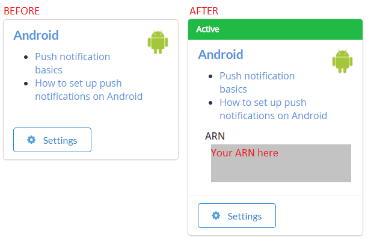

# Push notifications for Android

## Prerequisites

- [Push Notifications quickstart](quickstart.md)
- [Unity3D quickstart](../../../sdks/unity3d/quickstart.md)
- [Optional] [Unity Editor Extensions](https://blog.playfab.com/blog/new-unity-editor-extensions-beta)
- [Optional] [Postman Quickstart](../../../sdks/postman/postman-quickstart.md)

## Configuring the Android notification channel

### Firebase setup

There are three Google websites that you must use and synchronize. In Google/Firebase, there are both Projects and Apps:

- **Project**:
  - Import your project into the [Firebase Console](https://console.firebase.google.com/) if it's not already there.

- **App**:
  - [Firebase](https://console.firebase.google.com/) Projects contain apps.
  - Make sure your app exists in both locations, with the same name and identifier (for example, [Unicorn Battle and com.playfab.unicornbattle2](https://play.google.com/store/apps/details?id=com.playfab.unicornbattle2)).

### PlayFab requires a server private key file

- You can get this private key file from the [Firebase Console](https://console.firebase.google.com/)
- **Firebase Console**:
  - Select your **Project** or **App**, and find the **Settings** option (there are many ways to do this, all of which lead you to the same place).
  - In the **Service accounts** tab, select the **Generate new private key** button to download the JSON file.

## Using the private key file

- Provide your private key file in one of two ways:
  1. Upload the private key file directly into the **Game Manager UI**: **Settings** (for your **Title**) > **Push Notifications** > **Android**.
  2. Or call [SetupPushNotification](xref:titleid.playfabapi.com.admin.title-widedatamanagement.setuppushnotification) using Postman or a Unity project with Server API methods enabled.
  
  - Name: **your_game_name**
  - Platform: **GCM**
  - Credential: (**private key file contents as a string**): `{ ... }`
  - Overwrite OldARN: `true`
  - You should receive an **HTTP 200 OK** response with data similar to the following.

      ```json
      // Postman JSON result output
      {
          "code": 200,
          "status": "OK",
          "data": { "ARN" : "arn:*******/GCM/your_game_name" }
      }
      ```

- Once set up properly (using either method), you should see this in the **Game Manager UI** **Settings (for your title) > Push Notifications > Android**.

  

## Getting started: push notifications for Android + Unity

To set up your Unity project:

- Create a new Unity project.
- [OPTIONAL] Import the [PlayFab Unity Editor Extensions](https://aka.ms/playfabunityextension) package.
- Import the [Unity PlayFab SDK](https://aka.ms/playfabunitysdkdownload) package.
- Follow the [FCM Unity](https://firebase.google.com/docs/cloud-messaging/unity/client) guide to install FCM messaging, and set up a project for push notifications.
  - Once finished, you can continue with this guide to receive messages from PlayFab.
  - We'll give you a complete FCM-ready monoBehaviour script in the following example, which combines FCM and PlayFab.

- In the FCM guide, you created a monobehavior script that set up the Firebase plugin.
  - You can continue using that monobehavior script, or replace it with the one in the example that follows.

### Setting up your first Push Notification

In Unity, open the script you created in the FCM tutorial, and replace the contents.

```csharp
using PlayFab;
using PlayFab.ClientModels;
using PlayFab.Json;
using UnityEngine;

public class MsgCatcher : MonoBehaviour
{
    public string pushToken;
    public string playFabId;
    public string lastMsg;

    // OnGUI should be deleted/replaced with your own gui - This is only provided for debugging
    public void OnGUI()
    {
        GUI.Label(new Rect(0, 0, Screen.width, 200), pushToken);
        GUI.Label(new Rect(0, 200, Screen.width, Screen.height - 200), lastMsg);
    }

    private void OnPfFail(PlayFabError error)
    {
        Debug.Log("PlayFab: api error: " + error.GenerateErrorReport());
    }

    public void Start()
    {
        // PlayFabSettings.TitleId = "TITLE_ID";
        Firebase.Messaging.FirebaseMessaging.TokenReceived += OnTokenReceived;
        Firebase.Messaging.FirebaseMessaging.MessageReceived += OnMessageReceived;
        LoginToPlayFab();
    }

    private void LoginToPlayFab()
    {
#if UNITY_ANDROID
        var request = new LoginWithAndroidDeviceIDRequest { AndroidDeviceId = SystemInfo.deviceUniqueIdentifier, CreateAccount = true, };
        PlayFabClientAPI.LoginWithAndroidDeviceID(request, OnPfLogin, OnPfFail);
#endif
    }

    private void OnPfLogin(LoginResult result)
    {
        Debug.Log("PlayFab: login successful");
        playFabId = result.PlayFabId;
        RegisterForPush();
    }

    private void RegisterForPush()
    {
        if (string.IsNullOrEmpty(pushToken) || string.IsNullOrEmpty(playFabId))
            return;

#if UNITY_ANDROID
        var request = new AndroidDevicePushNotificationRegistrationRequest {
            DeviceToken = pushToken,
            SendPushNotificationConfirmation = true,
            ConfirmationMessage = "Push notifications registered successfully"
        };
        PlayFabClientAPI.AndroidDevicePushNotificationRegistration(request, OnPfAndroidReg, OnPfFail);
#endif
    }

    private void OnPfAndroidReg(AndroidDevicePushNotificationRegistrationResult result)
    {
        Debug.Log("PlayFab: Push Registration Successful");
    }

    private void OnTokenReceived(object sender, Firebase.Messaging.TokenReceivedEventArgs token)
    {
        Debug.Log("PlayFab: Received Registration Token: " + token.Token);
        pushToken = token.Token;
        RegisterForPush();
    }

    private void OnMessageReceived(object sender, Firebase.Messaging.MessageReceivedEventArgs e)
    {
        Debug.Log("PlayFab: Received a new message from: " + e.Message.From);
        lastMsg = "";
        if (e.Message.Data != null)
        {
            lastMsg += "DATA: " + JsonWrapper.SerializeObject(e.Message.Data) + "\n";
            Debug.Log("PlayFab: Received a message with data:");
            foreach (var pair in e.Message.Data)
                Debug.Log("PlayFab data element: " + pair.Key + "," + pair.Value);
        }
        if (e.Message.Notification != null)
        {
            Debug.Log("PlayFab: Received a notification:");
            lastMsg += "TITLE: " + e.Message.Notification.Title + "\n";
            lastMsg += "BODY: " + e.Message.Notification.Body + "\n";
        }
    }
}
```

Build and run your Unity project on a device. If you receive a push notification with the text, **Push notifications registered successfully**, then everything worked as expected.

> [!NOTE]
> `PlayFabSettings.TitleId = TITLE_ID`.
> You must set your own `TitleId`. This example will not work if you don't update this `TitleId`, because our title is registered with our Firebase Keys and settings, *not yours*. You can do so by un-commenting this line and replacing `TITLE_ID` with your `titleId`, or you can choose your title from the optional Editor Extensions plugin mentioned in the previous section.

### Troubleshooting Android

- Verify that you can send a test push notifications from the Firebase Console.
  - If you can't, then your Firebase plugin isn't set up correctly, and you should review the Firebase Documentation to find out why, or contact Firebase Support.

- Ensure your FCM client pushToken is set properly.
  - The `OnTokenReceived` function in the example should be called, and should have a valid token.
  - If it is *not* called, your Firebase plugin is *not* set up correctly, and you should review the Firebase Documentation to find out why, or contact Firebase Support.

- Ensure your `titleId` is set to a title that you own, and that it has been registered with the server API key from your Firebase project.

### Advanced Features

In **server.[SendPushNotification](xref:titleid.playfabapi.com.server.accountmanagement.sendpushnotification)**, you can use **[request.Package](xref:titleid.playfabapi.com.server.accountmanagement.sendpushnotification#pushnotificationpackage).CustomData** to deliver arbitrary data to the device. In the example previously, this is delivered to the section with the following comment.

```csharp
 Debug.Log("PlayFab: Received a message with data:");
```

You can customize your client receiver to utilize that data however you like. **CustomData** is not displayed to the player, so it can be used to deliver custom game information to your client, or to locally schedule another future notification using the **FCM** plugin.

You can also use **[request.Package](xref:titleid.playfabapi.com.server.accountmanagement.sendpushnotification#pushnotificationpackage).CustomData** or request **[AdvancedPlatformDelivery](xref:titleid.playfabapi.com.server.accountmanagement.sendpushnotification#advancedpushplatformmsg)** to deliver to many 3rd party plugins.

> [!NOTE]
> 3rd party plugin delivery is not supported or guaranteed, but is available for advanced users.

## Additional Support

For help, example bugs, and related questions, drop us a line in our [Forums](https://community.playfab.com/index.html).

Currently, we only support our services for the standard flow described in this document. If your team is looking for additional functionality with other common push services or plugins, please let us know! We love getting feedback from our developer community.

For documentation on the push payload via Amazon SNS:

- [Amazon SNS Message & JSON Formats](https://docs.aws.amazon.com/sns/latest/dg/json-formats.html)
