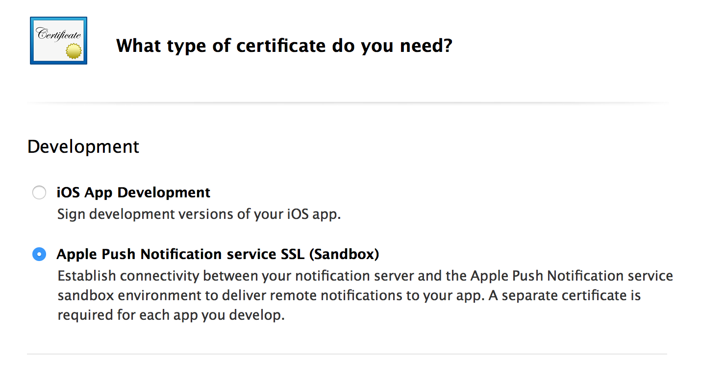
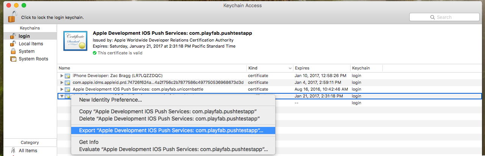

# Push notifications for iOS

## Prerequisites

This tutorial assumes that you are familiar with the concepts covered in our [Push Notifications quickstart](quickstart.md).

## Configuring the Apple notification channel

1. Ensure you have an active iO development (APNS_SANDBOX) or production (APNS) certificate. If you do not, create one from the **Apple Developer Portal** under **Certificates, Identities and Profiles**.



2. Export the certificate of your choosing (development or production):  
    - Begin by downloading a copy of your certificate from the **Apple Developer Portal** under **Certificates, Identities and Profiles**. This will create a **.cer** file.
    - Open and install the certificate into your **Keychain Access**.
    - View your installed certificate under the **Certificates** subcategory.
    - Export your **Keychain Access Certificate** to **.p12** format.

      

    - Convert the **.p12 file** to a **.pem file** using the following console command:
      - `openssl pkcs12 -in apns-dev-cert.p12 -out apns-dev-cert.pem -nodes -clcerts`
    - Once you have the **.pem file**, you can upload it directly through the PlayFab **Game Manager** under your **Title's settings** > **Push Notifications**.
    - Alternatively, use the generator below to craft a JSON request for `SetupPushNotification`.

### JSON Request generator for SetupPushNotification

The request generator uses the following pieces of information to create a JSON Request:

- **Platform** - Use one of the following values: APNS (iOS), APNS_SANDBOX (iOS), GCM (Android)
- **Application Name** - Enter the name of the application sending the message.

> [!NOTE]
> Application names must only be made up of uppercase and lowercase ASCII letters, numbers, underscores, hyphens, and periods, and must be between 1 and 256 characters long. They must *also* be must be *unique*.

- **PEM Certificate / API Key** -  For iOS (APNS or APNS_SANDBOX), use the complete contents of your PEM file.

Once the JSON is generated, use it to execute a call to `SetupPushNotification`. The response should look like the example that follows.

```json
{
    “code” : 200,
    “status” : “OK”,
    “data” :
        {
             “ARN” : “arn:*******/GCM/your_game_name”
        }
}
```

Congratulations! You have now configured your title’s iOS messaging channel.

## Registering your iOS Client for push

For iOS, you must rely on the default behavior of how iOS handles push notifications, as PlayFab does not offer a native implementation on Unity at this time.

By default, notifications received while the game is in the background will be routed to the **Notification** area.

Alternatively, notifications received while the game is the active app will be received silently, and will not be visible in the **Notification** area.

- The following code from the sample is run on `client Start()`.

```csharp
// must be called before trying to obtain the push token
// an asynchronous call with no callback into native iOS code that takes a moment or two before
// the token is available. (so spin and wait, or call this one early on)
// this will always return null if your app is not signed
UnityEngine.iOS.NotificationServices.RegisterForNotifications(UnityEngine.iOS.NotificationType.Alert | UnityEngine.iOS.NotificationType.Badge | UnityEngine.iOS.NotificationType.Sound, true);
```

- At this point, if the user has opted in for notifications, we can call the PlayFab API [RegisterForIOSPushNotification](xref:titleid.playfabapi.com.client.platformspecificmethods.registerforiospushnotification).

```csharp
byte[] token = UnityEngine.iOS.NotificationServices.deviceToken;
if(token != null)
{
    RegisterForIOSPushNotificationRequest request = new RegisterForIOSPushNotificationRequest();
    request.DeviceToken = System.BitConverter.ToString(token).Replace("-", "").ToLower();
    PlayFabClientAPI.RegisterForIOSPushNotification(request, (RegisterForIOSPushNotificationResult result) =>
    {
        Debug.Log("Push Registration Successful");
    }, OnPlayFabError);
}
else
{
    Debug.Log("Push Token was null!");
}
```

- If no errors occurred, congratulations! Your iOS client has been successfully linked to your title’s Apple Notification channel.

## Troubleshooting iOS

- [Verify that you have valid .pem files](https://docs.aws.amazon.com/sns/latest/dg/mobile-push-apns.html).
- Ensure that the same certificate used in `SetupPushNotification` is used by XCode to sign your App.
- Verify that the Push Notification API is enabled for your build in XCode.
- Verify that your signing certificate matches the PlayFab platform. When running **[SetupPushNotification](xref:titleid.playfabapi.com.admin.title-widedatamanagement.setuppushnotification)**, use `OverwriteOldARN = true` to rebind the channel to a new platform. Only *one* iOS environment (APNS or APNS_SANDBOX) can be active on a title at a given time.

## Additional Support

For help, example bugs, and related questions, drop us a line in our [Forums](https://community.playfab.com/index.html).

> [!NOTE]
> Currently, we only support our services for the standard flow described in this document. If your team is looking for additional functionality with other common push services or plugins, please let us know! We love getting feedback from our developer community.
