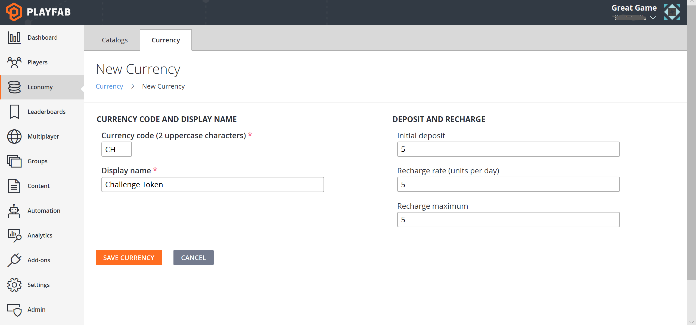
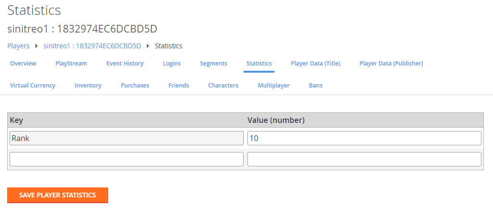

# Push notifications quickstart

Push notifications from PlayFab are enabled by a linkage of three major systems:

1. The player’s device OS (Android, iOS, etc.)
2. The vendor-specific channel (Google, Apple, etc.)
3. Cross-platform message routing (PlayFab via Amazon Simple Notification Service [SNS]).

> [!NOTE]
> If any of these systems are unlinked, clients will stop getting notifications. It is fairly simple to accidentally change one of the three systems, and wind up breaking the link. Furthermore, it is difficult to know at any individual point in the flow if all of the systems are configured properly.

## The PlayFab push routing system

Every PlayFab title can enable one Google (GCM), and one Apple Push (APNS, APNS_SANDBOX) notification channel at a given time. These can be configured in one of two ways:

1. Using the UI in **Game Manager** under **Settings -> Push Notifications**.
2. Using the **PlayFab Admin API** - [SetupPushNotification](xref:titleid.playfabapi.com.admin.title-widedatamanagement.setuppushnotification).

For more detailed setup information, read these tutorials:

- [Push notifications for Android](push-notifications-for-android.md)
- [Push notifications for iOS](push-notifications-for-ios.md)

## Push messages in-game

Push messages will vary based on the development engine/platform. However, the easiest way to receive push notifications is using a Unity project with our SDK and the Firebase Cloud Messaging (FCM) plugin for Android, or just Unity for iOS.

- **Receiving push on Android** - This requires a plugin. The best supported plugin is the native FCM plugin.
- **Receiving push on iOS** - This *does not* require a plugin for basic push messages.

> [!TIP]
> Please see the FCM documentation for instructions on how to set up the [FCM Unity plugin](https://firebase.google.com/docs/cloud-messaging/unity/client), or push on [Android Studio](https://firebase.google.com/docs/cloud-messaging/android/client).

## Testing the setup

After configuring your title and client, you can test your configuration using the PlayFab server API - [SendPushNotification](xref:titleid.playfabapi.com.server.accountmanagement.sendpushnotification). This API allows you to send as many push notifications as needed at no extra cost.

You can use the PlayFab CloudScript service as a quick and secure server API environment. From there, push notifications can be sent as needed.

To use this method to test your configuration, upload or append the code in the following example to your title’s CloudScript.

### Example

Consider the following scenario:

- Players in your title may access a leaderboard based on rank statistics.

- Each player may pay 1 CH currency, and challenge another player who is up to 5 positions away from the current player.

First, consider a virtual currency as shown in the example screenshot below (see the [Currencies](../../economy/tutorials/currencies.md) tutorial for information on how to define a virtual currency).



Now, consider the following statistics defined for each player (see the [Accessing Archived Tournament Results](../../social/tournaments-leaderboards/accessing-archived-tournament-results.md) tutorial for information on how to generate a test leaderboard).

  

Once you've set up these prerequisites, you can set up a push notification challenge system.

The following client code will call the CloudScript `ChallengePlayer`.

```csharp
public void ChallengeRandomClosePlayer(string currentPlayerId) {
    PlayFabClientAPI.GetLeaderboardAroundPlayer(new GetLeaderboardAroundPlayerRequest() {
        MaxResultsCount = 10,
        StatisticName = "Rank",
        PlayFabId = currentPlayerId,
    }, result => OnLeaderboardLoaded(result,currentPlayerId),OnPlayFabError);
}

private void OnLeaderboardLoaded(GetLeaderboardAroundPlayerResult leaderboard, string currentPlayerId) {
    var index = (int)(UnityEngine.Random.value * (leaderboard.Leaderboard.Count-1));
    if (leaderboard.Leaderboard[index].PlayFabId == currentPlayerId)
        index = (index + 1) % leaderboard.Leaderboard.Count;
    var targetId = leaderboard.Leaderboard[index].PlayFabId;

    PlayFabClientAPI.ExecuteCloudScript(new ExecuteCloudScriptRequest() {
        FunctionName = "ChallengePlayer",
        FunctionParameter = new Dictionary<string, object>() {
            { "TargetId", targetId }
        }
    }, null, OnPlayFabError);
}

public void OnPlayFabError(PlayFabError obj) {
    Debug.Log(obj.GenerateErrorReport());
}
```

The `ChallengePlayer` CloudScript code will handle the request, validate the leaderboard state, and send the challenge push notification to the target.

```javascript
handlers.ChallengePlayer = function (args) {
    var targetId = args.TargetId;
    var leaderboard = server.GetLeaderboardAroundUser({
        MaxResultsCount : 10,
        PlayFabId : currentPlayerId,
        StatisticName : "Rank"
    });

    for(var i = 0; i < leaderboard.Leaderboard.length; i++) {
        var target = leaderboard.Leaderboard[i];
        if(target.PlayFabId !== targetId) continue;

        // subtract virtual currency from current player
        server.SubtractUserVirtualCurrency({
            VirtualCurrency : "CH",
            PlayFabId : currentPlayerId,
            Amount : 1
        });

        // get current player profile
        var profile = server.GetPlayerProfile({
            PlayFabId : currentPlayerId
        }).PlayerProfile;

        // try to send push notification
        try {
            server.SendPushNotification({
                Recipient : targetId,
                Package : {
                    Message : `${profile.DisplayName} challenges you for a battle!`,
                    Title: "You have been challenged",
                }
            });
        } catch (ex) {
            // Target player has not registered for Push Notifications
        }
        return;
    }
}
```

## Push notification usage

Having the ability to use push notifications is an awesome power. When *abused*, however, it can cause users to opt out of future notifications - or even *leave a game entirely*.

If used judiciously, though, push notifications can be one of your best tools for building and maintaining your game community.

Push notifications are a *fire and forget* message protocol which does not guarantee delivery.

> [!NOTE]
> Remember that there is *no guarantee* that your players will receive, open, or engage with your message. Given that caveat, it is a good practice to use messages as *bonus* functionality, rather than as a critical part of your gameplay loop.

For iOS platforms, apps are given a one-time dialog prompt from the OS, allowing the user to determine the status of push notifications. After the user has made their initial selection, this setting will persist until:

- The App is updated or reinstalled.

- The user makes changes to the settings from their phone’s settings menu.

For Android apps, notifications are enabled by default, and can be turned on and off at will from the client.

> [!TIP]
> It is a good practice to re-initialize your notification listeners with every session.

## Resources

The following resources provide additional information about the topics in this quickstart:

- [Firebase Unity SDK](https://firebase.google.com/docs/unity/setup):  An all-in-one FCM solution for Unity. This SDK, among all other features, allows you to receive and process push notifications sent via FCM.
- [Push It Real Good: How to Get Players to Say Yes to Push Notifications](https://blog.playfab.com/blog/push-it-real-good-how-get-players-say-yes-push-notifications/): This blog post details additional strategies and techniques for using push notifications.
- [Push Notifications](https://blog.playfab.com/blog/push-sep-17): This blog post describes the most recent upgrade in Push functionality, and switching to FCM as the primary plugin for Android.
- [Postman Quickstart](../../../sdks/postman/postman-quickstart.md): This quickstart shows you how to test our APIs using Postman.
