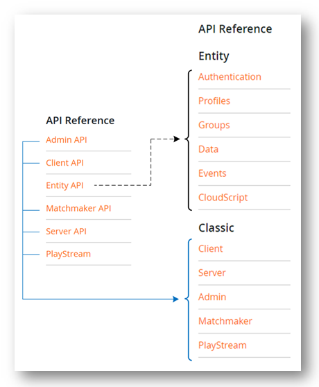

# Entity API restructure upgrade tutorial

## Introduction

We have restructured the APIs that were lumped under the Entity API group into coherent logical groups that make their consumption easier, both via the [documentation site](../../api-references/index.md), and the PlayFab SDKs.

The immediate impact is that if you have been using the entity-based APIs in your game, the code will need to be updated when you upgrade your SDKs.

## Prerequisites

The following conditions must be true for this upgrade guide to apply to you:

1. You're using the entity-based PlayFab APIs.
2. You have upgraded to a PlayFab SDK, published on 8/9/2018 or later.

> [!Note]
> There are *no* service level changes. For example, existing titles using old SDKs will work without requiring changes.

## How to upgrade

The fundamental impact of this change is that the `PlayFabEntityModel` API group has been separated out into six different API groups that are logically bound together, as shown in the following picture.



A full list of **Previous Entity API** -> **New API** mapping can be found in [APPENDIX 1](#appendix-1-old-to-new-api-mappings) of this tutorial.

> [!Note]
> The Classic API mapping has *not* been affected.

The next section will walk you through an example of upgrading a C# SDK using the `PlayFabEntityAPIGroup` to the new set of API groups.

## Upgrade example: C# SDK

Please follow these steps to upgrade your application.

**Step 1**: Change any `using` statements that reference `PlayFab.EntityModels` such as those shown below.

```csharp
using PlayFab.EntityModels;
using PlayFab.DataModels;
```

You can now be granular in your selection of which of these APIs you want to bring in, instead of importing the whole Entity API group.

**Step 2**: A more in-depth coding example of the New API, with comments in regard to how it looked before is provided below.

```csharp
public async void Example()
{
       var logrequest = new PlayFab.ClientModels.LoginWithCustomIDRequest
       {
           CustomId = "TestExample",
           CreateAccount = true,
       };

       var loginResult = await PlayFab.PlayFabClientAPI.LoginWithCustomIDAsync(logrequest);
       var playfabId = loginResult?.Result?.PlayFabId;

       // PlayFab EntityAPI has been replaced here with the PlayFabProfilesAPI
       // and PlayFab.EntityModels has been replaced with PlayFab.ProfileModels
       var getProfileResult = await PlayFab.PlayFabProfilesAPI.GetProfileAsync(new
       PlayFab.ProfilesModels.GetEntityProfileRequest());
       var profile = getProfileResult?.Result?.Profile;
}
```

Follow suit for other SDKs,
  using the mapping from [APPENDIX 1](#appendix-1-old-to-new-api-mappings) in this tutorial.

## Conclusion

We’re excited to expose the Entity APIs in a more intuitive way on our documentation site and in our code, based on your feedback.

If you have any questions and comments, please contact us via the [PlayFab Forums](https://community.playfab.com/index.html).

## APPENDIX 1: OLD to NEW API mappings

All of the APIs listed below were *previously* part of the `PlayFabEntityModel` API group. They're *now* categorized under the following new API groups.

### PlayFabProfilesApi

- GetGlobalPolicy
- GetProfile
- GetProfiles
- SetGlobalPolicy
- SetProfilePolicy  

### PlayFabAuthenticationApi

- GetEntityToken

### PlayFabDataApi

- AbortFileUploads
- DeleteFiles
- FinalizeFileUploads
- GetFiles
- InitiateFileUploads
- GetObjects
- SetObjects

### PlayFabGroupsApi

- AcceptGroupApplication
- AcceptGroupInvitation
- AddMembers
- ApplyToGroup
- BlockEntity
- ChangeMemberRole
- CreateGroup
- CreateRole
- DeleteGroup
- DeleteRole
- GetEntityToken
- GetGroup
- InviteToGroup
- IsMember
- ListGroupApplications
- ListGroupBlocks
- ListGroupInvitations
- ListGroupMembers
- ListMembershipOpportunities
- RemoveGroupApplication
- RemoveGroupInvitation
- RemoveMembers
- UnblockEntity
- UpdateGroup
- UpdateRole

### PlayFabEventsApi

- WriteEvents

### PlayFabCloudScriptApi

- ExecuteEntityCloudScript
