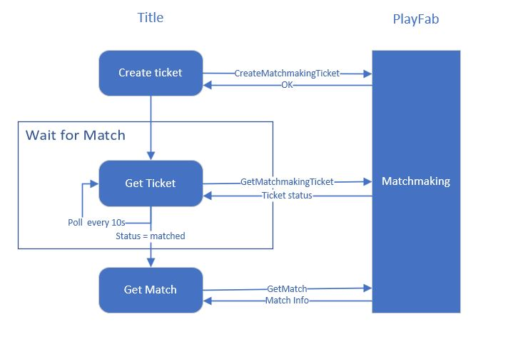

# Matchmaking REST API quickstart 

> [!NOTE]
> We highly recommend you consider using the Multiplayer SDKs as it includes real-time notification support that reduces the need for polling. This will improve the matchmaking experience and reduce delays. [Quickstart - Client SDK](quickstart-client-sdk.md)

This quickstart guide walks you through the entire process for integrating the matchmaking feature. All code examples within this quickstart are for Unity - however, the concepts and flow apply (in general) to other platforms as well.

Depending on your game design, consider the [single user](#single-user-ticket-matchmaking) and [multiple
user](#multiple-user-ticket-matchmaking) matchmaking section.

This tutorial illustrates how to submit a ticket to a specific queue in order to find a game. A queue likely maps to a game mode or multiple game modes (ex.: a capture the flag mode and a king of the hill mode in the same queue).

The matchmaking service handles finding a match amongst tickets in a queue. When a match is found, your title must handle connecting the players together for gameplay.

## Configure a matchmaking queue in Game Manager

The quickstart assumes that you have configured your queue(s) in Game Manager. For details on how to set one up, see [Configuring matchmaking queues](config-queues.md).

## Single user ticket matchmaking

If your game has a 1v1 game mode, or supports a single user entering matchmaking by themselves, consider single user matchmaking. Single user matchmaking follows the pattern illustrated below.



### Create a matchmaking ticket

A user creates a matchmaking ticket using [CreateMatchmakingTicket](xref:titleid.playfabapi.com.multiplayer.matchmaking.creatematchmakingticket). When ticket creation is successful, the service returns a `TicketId`.

The ticket creation requires you to specify the `Creator` (the user's identity and attributes), `GiveUpAfterSeconds` (the time in seconds before the service gives up on matching the ticket), and the `QueueName` in which to find a match.

The `Creator` field must contain the user attributes required by the queue configuration matching the `QueueName`. A good value for `GiveUpAfterSeconds` time is 120 seconds, to prevent users from giving up on their own.

```csharp
PlayFabMultiplayerAPI.CreateMatchmakingTicket(
    new CreateMatchmakingTicketRequest
    {
        // The ticket creator specifies their own player attributes.
        Creator = new MatchmakingPlayer
        {
            Entity = new EntityKey
            {
                Id = "<Entity ID goes here>",
                Type = "<Entity type goes here>",
            },

            // Here we specify the creator's attributes.
            Attributes = new MatchmakingPlayerAttributes
            {
                DataObject = new
                {
                    Skill = 24.4
                },
            },
        },

        // Cancel matchmaking if a match is not found after 120 seconds.
        GiveUpAfterSeconds = 120,

        // The name of the queue to submit the ticket into.
        QueueName = "myqueue",
    },

    // Callbacks for handling success and error.
    this.OnMatchmakingTicketCreated,
    this.OnMatchmakingError);
```

### Check the status of the matchmaking ticket

You must poll the service by `TicketId` to access the `Status` of the ticket in matchmaking. In order to do so, have your title call [GetMatchmakingTicket](xref:titleid.playfabapi.com.multiplayer.matchmaking.getmatchmakingticket). You can poll up to 10 times per minute. For instance, poll for the ticket status every 6 seconds. Polling can increase delays when retrieving the status of your ticket. It is for this reason we highly recommend you consider using the Multiplayer SDK method described here [Quickstart - Client SDK](quickstart-client-sdk.md). This avoids the need to poll by using the real-time notification functionality. 

When the status of
the ticket changes to `Matched`, your client can stop polling the ticket. From that point on, the ticket will include the `MatchId`.

```csharp
PlayFabMultiplayerAPI.GetMatchmakingTicket(
    new GetMatchmakingTicketRequest
    {
        TicketId = "<ticket ID goes here>",
        QueueName = "myqueue",
    },
    this.OnGetMatchmakingTicket,
    this.OnMatchmakingError);
```

### Get the match

From your client, call [GetMatch](xref:titleid.playfabapi.com.multiplayer.matchmaking.getmatch) with the `MatchId` provided in the response from
[GetMatchmakingTicket](xref:titleid.playfabapi.com.multiplayer.matchmaking.getmatchmakingticket). This match contains the list of users who are matched together.

```csharp
PlayFabMultiplayerAPI.GetMatch(
    new GetMatchRequest
    {
        MatchId = "<match ID goes here>",
        QueueName = "myqueue",
    },
    this.OnGetMatch,
    this.OnMatchmakingError);
```

### Cancelling a matchmaking ticket

If for some reason your client wants to cancel the matchmaking process prior to `GiveUpAfterSeconds` being reached, call [CancelMatchmakingTicket](xref:titleid.playfabapi.com.multiplayer.matchmaking.cancelmatchmakingticket) with the `TicketId`. If a match hasn’t already been found, the ticket is taken out of the matchmaking process and its status changes to `Canceled`.

```csharp
PlayFabMultiplayerAPI.CancelMatchmakingTicket(
    new CancelMatchmakingTicketRequest
    {
        QueueName = "myqueue",
        TicketId = "<ticket ID goes here>",
    },
    this.OnTicketCanceled,
    this.OnMatchmakingError);
```

## Multiple user ticket matchmaking

If your game allows groups of players to go into a matchmaking queue together, there are a few more things that need to be done to enter matchmaking. We advise that your title assigns a group leader (the creator), to avoid making unnecessary calls. The leader creates the ticket, but all members of the group must consent to join it.

### Create a matchmaking ticket (multiple users)

The group must elect a ticket creator in your title. The creator creates a matchmaking ticket using [CreateMatchmakingTicket](xref:titleid.playfabapi.com.multiplayer.matchmaking.creatematchmakingticket), which returns a `TicketId` upon success. The ticket creation requires you to specify the `Creator` (the user's identity and attributes), `GiveUpAfterSeconds` (the time in seconds before the service gives up on matching the ticket), `MembersToMatchWith` (the identities of the other group members) and the `QueueName` in which to find a match.

The `Creator` field must contain the user attributes required by the queue configuration matching the `QueueName`. A good value for `GiveUpAfterSeconds` time is 120 seconds, to prevent users from giving up on their own.

### Group members join the match ticket

Once the match ticket has been created, the other members of the group have to join it to move along the matchmaking process. At this time, the ticket is in the `WaitingForPlayers` status. It will not begin matching with other tickets until all `MembersToMatchWith` have joined the ticket.

To have members join, the `Creator` must share the `TicketId` to the other members through your title. Each member then calls [JoinMatchmakingTicket](xref:titleid.playfabapi.com.multiplayer.matchmaking.joinmatchmakingticket), providing their own required attributes. Once all members have joined the ticket, the ticket status becomes `WaitingForMatch`.

```csharp
PlayFabMultiplayerAPI.JoinMatchmakingTicket(
    new JoinMatchmakingTicketRequest
    {
        TicketId = "<ticket ID>",
        QueueName = "myqueue",
        Member = new MatchmakingPlayer
        {
            Entity = new EntityKey
            {
                Id = "<Entity ID goes here>",
                Type = "<Entity type goes here>",
            },
            Attributes = new MatchmakingPlayerAttributes
            {
                DataObject = new
                {
                    Skill = 19.3
                },
            },
        }
    },
    this.OnJoinMatchmakingTicket,
    this.OnMatchmakingError);
```

The rest of the process is the same as that of [single user ticket matchmaking](#single-user-ticket-matchmaking)

### Connecting your players together

Once your players have matched, you will want to have them join each other - either through a server, or by peer-to-peer connections.

If you are using a dedicated server, you can rely on the Match ID to uniquely identify the group of players they should be in. If you are using PlayFab's multiplayer servers, `GetMatch` will provide a server and port for your players to connect to.

Please refer to [Integrating with PlayFab Multiplayer Servers](multiplayer-servers.md) for more information.

As of this release, peer-to-peer connection is currently not officially supported by matchmaking. If peer-to-peer is required, consider using [Playfab Party](../networking/index.md), or an [interim workaround](peer-to-peer.md).
Contact us for more support on this.

## Conclusion

Using this quickstart, you should now have a successful matchmaking flow in your game. In addition, you should consider the following:

* How your title handles group formation.
* What your title displays while users are waiting for a match.
* How to handle failures and retries.
