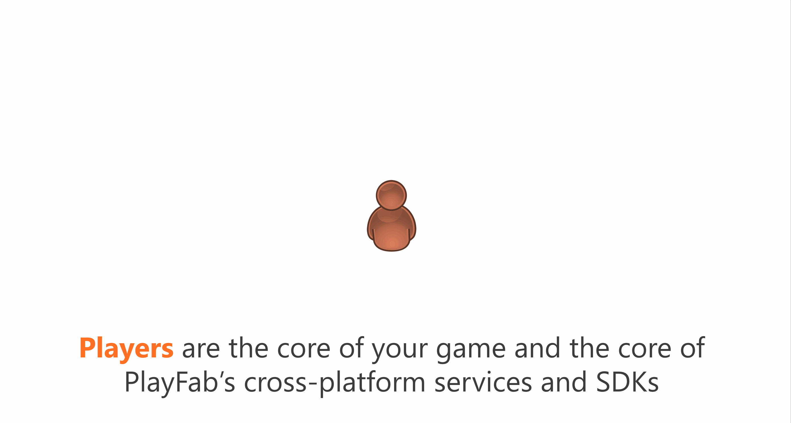

# Multiplayer at PlayFab

Multiplayer can be a great addition to many games and PlayFab provides several services focused on multiplayer scenarios:

- **Leaderboards** - Rank players with resettable statistics and leaderboards
- **Matchmaking** - Deploy custom matchmaking rules to group players quickly
- **Servers** - Dynamically scale custom multiplayer servers in Azure
- **Parties** - Connect players with networking and accessible in-game chat

Leaderboards and Matchmaking are both production services offered in PlayFab Essentials, our core services package, without any additional cost. Servers is a production service, but costs extra (see [Multiplayer Server billing](./servers/billing-for-thunderhead.md)).

Parties is a pre-production service still being shaped up. It is offered with very limited quota and for free. It will be a premium service when production support is enabled later this year.

|Service|Production Readiness|Billing|
|--|--|--|
|[Leaderboards](../social/tournaments-leaderboards/using-resettable-statistics-and-leaderboards.md)|Production|Included in PlayFab essentials| 
|[Matchmaking](./matchmaking/index.md)|Production (Preview)|Included in PlayFab essentials| 
|[Servers](./servers/index.md)|Production (Preview)|Premium Service - 30% Preview Discount|
|[Parties](./networking/index.md)|Pre-production (Beta)|Premium Service - Free during beta|

