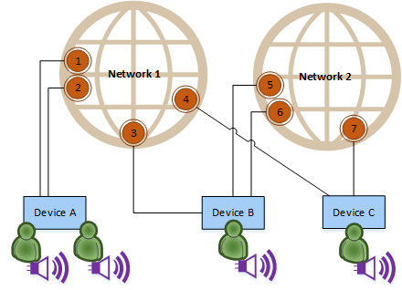

# Multiple networks

PlayFab Party supports using multiple PlayFab Party networks simultaneously. The following diagram provides an example representation of how different objects might relate to each other in a multi-network scenario.

For a more complete explanation of how these relationships work, check out the documentation covering [PlayFab Party objects and their relationships](concepts-objects.md#object-relationships).

This page will cover when using multiple networks is appropriate, when it isn't, and common pitfalls to avoid.

> [!WARNING]
> Using multiple, simultaneous PlayFab Party networks is an advanced scenario that may require more complex game logic to manage. Often, a game scenario which uses multiple networks can be redesigned or simplified to only require a single network, and care should be taken to evaluate whether this is possible before designing your game's network architecture around multiple Party networks. More information on when multiple networks is or is not appropriate can be found in the next section, [When to use multiple networks](#when-to-use-multiple-networks).

## When to use multiple networks

PlayFab Party networks are designed to provide a real-time communication channel between a collection of devices for exchanging game or chat data. Multiple networks often come into play when subsets of devices may need to communicate for differing spans of time.

An example scenario for multiple networks is to manage "fire team chat" where a group of players (the fire team) wants to maintain a constant, seamless chat session across multiple game sessions. For example:

* *Player A*, *Player B*, and *Player C* want to play an online game together.
* They each create a chat control, join a Party network together, and connect their chat controls to that network enabling chat.
* When they join a multiplayer game session with other players outside of their fire team, they join a separate Party network and create Party endpoints for sending game data to all players in the game session network.
* *Player A*, *Player B*, and *Player C* continue to chat with each other throughout the game session via the fire team network.
* When the game session ends, all players leave its respective Party network but the fire team Party network remains active and its participants continue chatting without any disruptions.

The key takeaway from this example is that the extra Party network enabled real-time communication beyond the lifetime of a single game session for a group of active players.

Multiple networks wouldn't have been appropriate if players were only partitioned into teams within the game session. In that scenario, it would be better to use [chat permissions](concepts-chat.md#chat-permissions-and-muting) in a single Party network to define each team's chat boundaries.

Additionally, using multiple networks would've been inappropriate if the long-lived group didn't represent players actively communicating with each other&mdash;for example, Guilds or chat-less lobbies. For these non-real-time scenarios, other features such as [PlayFab Lobbies](../lobby/index.md) or [PlayFab Entity Groups](../../social/groups/quickstart.md) may be more appropriate.

## Endpoints vs Chat Controls across multiple networks

It's worth noting that Party endpoints and Party chat controls interact with multi-network scenarios in different ways.

Endpoints represent a data messaging channel created for a specific network. An endpoint from one network can't send messages to an endpoint on another network.

Chat controls, on the other hand, more closely represent individual players. A single user can only have one chat control. Each chat control can be connected to multiple networks simultaneously, and chat controls can communicate across networks as long as the user associated with the given chat control is authenticated to all associated networks. Whether using a single network or multiple networks, defining communication boundaries between chat controls should be achieved with [chat permissions](concepts-chat.md#chat-permissions-and-muting).

## Cost

PlayFab Party's usage measurement is impacted by the number of networks a player is connected to. The *Party Connectivity* billing meter is calculated per-network, so using multiple networks simultaneously costs more than using a single network. Be sure to consider the cost-impact when planning your game architecture.

You can view more information about PlayFab Party costs on the [PlayFab Party Pricing](../../pricing/meters/meters.md#party) page.
