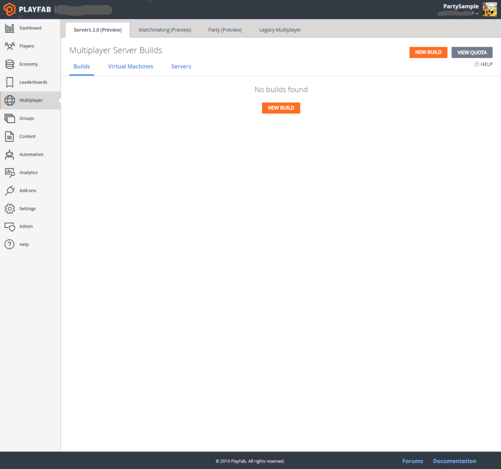
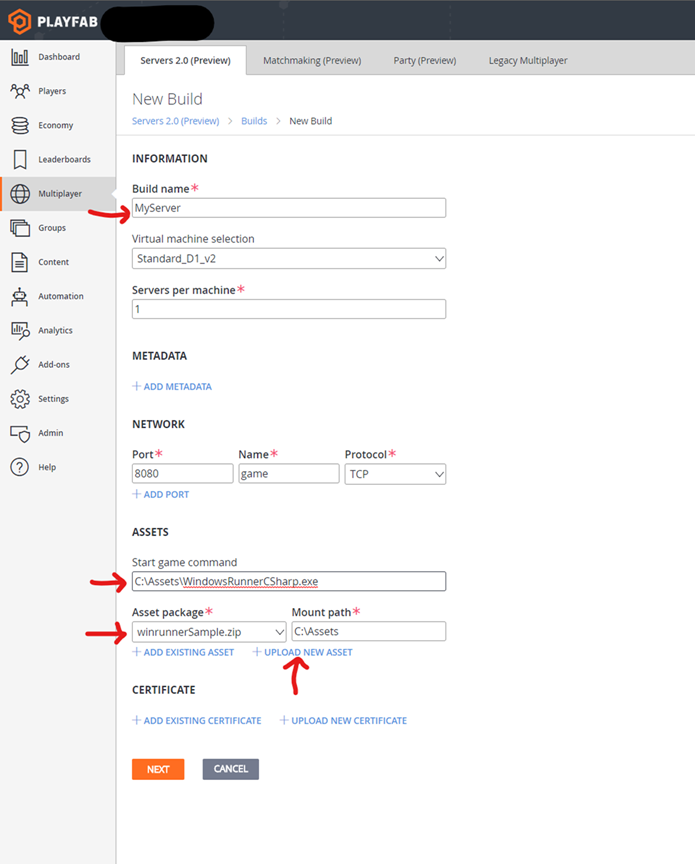
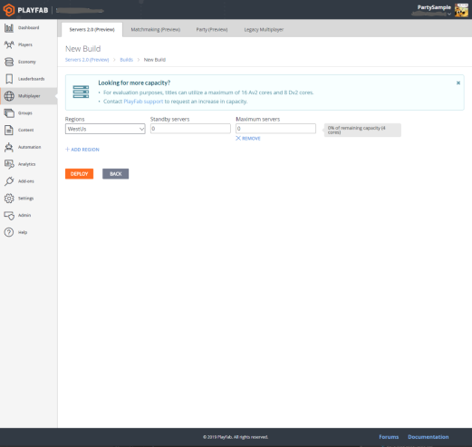
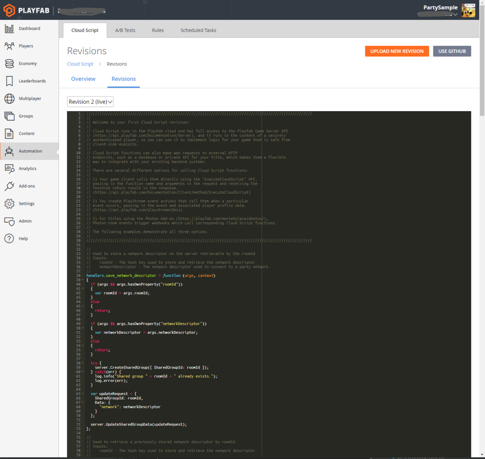

# Enabling PlayFab Party

This tutorial will get you up and running quickly by showing you in a few steps how to enable the use of PlayFab Party with the PlayFab Party demo app.

For more on the PlayFab Game Manager, see the [Game Manager quickstart](../../config/gamemanager/quickstart.md).

## Enable PlayFab Party in Game Manager

1. Log into PlayFab and open the game title for which you want to enable PlayFab Party. 

2. Select the **Multiplayer** section.

3. Select the **Party** tab.

4. Click **Enable**.

## Build and configure a multiplayer server

### Build the multiplayer server

1. Download the `winrunnerSample.zip` found here: https://github.com/PlayFab/gsdkSamples/releases/download/1.1/winrunnerSample.zip

2. While still in the Multiplayer section of Game Manager, select the **Server** tab.

3. Click **New Build**.

### Configure and deploy the server build

1. Name the build. 

2. Set the  **Start game command** to C:\Assets\WindowsRunnerCSharp.exe

3. Press **+ Upload New Asset** and follow the dialogs to upload your previously-downloaded `winrunnerSample.zip`.  

4. Select the **Asset Package** dropdown and set it to the `winrunnerSample.zip` file that was just uploaded.

5. Select an appropriate region in which to deploy the server and then press **Deploy**. 

> [!NOTE]
> If you are using your own title, you can skip the following steps which apply to connecting to the PlayFab demo only.

### Connect to the PlayFab Party demo app

1. Open the **Automation** page in Game Manager.

2. Select **Revisions** to view the title’s existing CloudScript.

3. Append the CloudScript code found at the end of these instructions to the existing CloudScript in the editor.

4. Press the **Save As Revision** button and confirm the changes.

5. Press **Deploy Revision** to make the new revision live.

