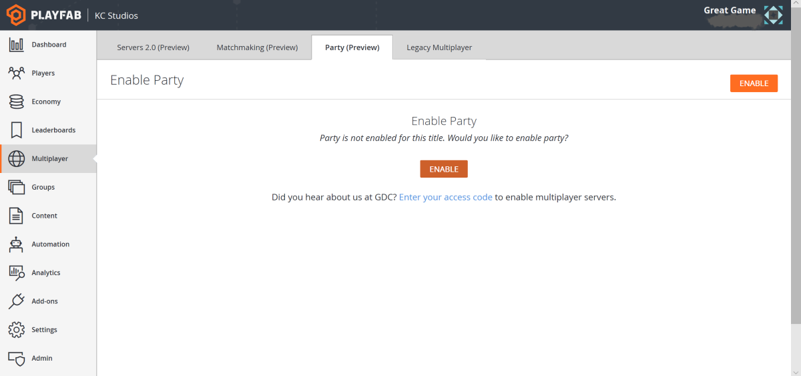

# Enabling PlayFab Party

This tutorial will get you up and running quickly by showing you in a few steps how to enable the use of PlayFab Party with the PlayFab Party demo app.

For more on the PlayFab Game Manager, see the [Game Manager quickstart](../../../gamemanager/quickstart.md).

>[!NOTE]
>You must [launch your title on Game Manager](../../pricing/title-launches.md) before shipping your title to avoid Dev Mode limits. Failing to do so can cause your title to not function as more players engage in your game.

## Enable PlayFab Party in Game Manager

1. Log into PlayFab and open the game title for which you want to enable PlayFab Party. 

2. Select the **Multiplayer** section.

3. Select the **Party** tab.

4. Click **Enable**.

