# PlayFab Party speech-to-text and text display UX guidelines
The PlayFab Party library gives game creators the power to engage more players through accessible game chat options. It provides a means for voice chat to be transcribed to text and for text input to be converted to synthesized voice. You can implement a custom UI solution for these features in your title. On Xbox and Windows, you can use platform APIs to implement the relevant UI.

This document is part two of a two-part series covering UX solutions for speech-to-text and text-to-speech implementation. [Part one](party-text-to-speech-ux-guidelines.md) focuses on text-to-speech implementation, requirements, and console and PC UI solutions, while this topic focuses on speech-to-text implementation, requirements, and console and PC UI solutions.

## Text-to-speech and speech-to-text scenarios

The following chart guides you through scenarios that players will experience when you enable speech-to-text and text-to-speech features. It outlines user impact for three stages of the gaming experience: initial setup, playing a game, and engaging in game chat.

|**Experience Stage**|**Set up**                |**Play**                           |**Chat**                 |**Message**                           |
| :------------------|:-------------------------|:----------------------------------|:------------------------|:--------------------------|
|**Goal**            |**User enables setting**  |**User enters a multiplayer game** |**User sends communication** |**User receives communication**
|**Action**          |Speech-to-Text    Alternative for hearing voice replies |Launches game    Enters MP lobby    Overlay opens when game chat is initiated  |User speaks |User reads team's voice replies converted to text in a speech-to-text chat overlay
| |Text-to-speech    Alternative for speaking voice replies |Launches game    Enters MP lobby    Game displays method for text input (keyboard, input field, etc) |User types replies using platform supported input methods    Typed messages are converted to synthesized voice | User hears team member's voice replies
| |UI Narration (in-game)    Alternative for reading in-game menus and text replies |User is guided by the Xbox OS synthesized voice to launch game    Game uses the Speech Synthesis API to narrate menu options leading the user to the MP lobby |For text messaging systems: Games use the Speech synthesis API to guide the user to launch the Xbox OS keyboard | For text messaging systems: Games use the Speech Synthesis API to narrate replies
| |Narrator (Xbox OS)    Alternative for reading Xbox menus |User is guided by the Xbox OS synthesized voice to launch game |For text messaging systems: A virtual Keyboard is narrated as the user types a message | N/A |

## Understanding the API

### Speech-to-text

#### Enabling transcription

Transcription of incoming audio for the user associated with a local chat control can be enabled by calling [`PartyLocalChatControl::SetTranscriptionOptions()`](reference/classes/PartyLocalChatControl/methods/partylocalchatcontrol_settranscriptionoptions.md). When the operation completes, a [`PartySetTranscriptionOptionsCompletedStateChange`](reference/structs/partysettranscriptionoptionscompletedstatechange.md) will be provided by [`PartyManager::StartProcessingStateChanges()`](reference/classes/PartyManager/methods/partymanager_startprocessingstatechanges.md) indicating whether the asynchronous operation succeeded.

#### Receiving transcriptions

When audio is sent to a chat control associated with a local user that has enabled transcription, the audio will be transcribed. Each transcription will be indicated by a [`PartyVoiceChatTranscriptionReceivedStateChange`](reference/structs/partyvoicechattranscriptionreceivedstatechange.md) provided by `PartyManager::StartProcessingStateChanges()`. The speaker, receiver(s), and transcription text will be specified in the state change. Additionally, the state change will specify whether the transcription text is a `Hypothesis` or `Final` phrase. A `Hypothesis` phrase is a snapshot in the transcription process that indicates an iterative refinement of the transcription text. These can optionally be used to improve the perceived responsiveness of the transcription process. A `Final` phrase represents the end of the transcription process after a user has completed a sentence or phrase.

#### Displaying transcriptions

When transcription text is received, it should be displayed according to the following UX design guidelines. The [Windows::Gaming::UI::GameChatOverlay](/uwp/api/windows.gaming.ui.gamechatoverlay) or `Windows::Xbox::UI::Accessibility` API can be used on Windows or Xbox, respectively, to use the default system text chat UI that has been designed to comply with these guidelines.

## Discovery

For Xbox and Windows, users can find text-to-speech and speech-to-text settings in the **Accessibility** section under **Settings** in Xbox Home (Xbox console) or Xbox App (Windows 10). The settings are controlled via toggle buttons that enable or disable the features for all Xbox games specific to the user profile that integrate with the platform settings. For all other platforms, refer to their accessibility guidelines for text-to-speech and speech-to-text setting locations.

> [!NOTE]
> If your game chooses to add additional settings that are game specific only, then they should be placed inside your game. In general, accessibility options belong under the game’s settings/options menu. Ideally, settings should be available as a dedicated button press and accessible from any screen or, at least, the Pause menu.

## UX guidance for creating a custom conversation window

### General best practices

Subtitles and voice chat transcription tackle a similar challenge: display rapid-fire, conversational text, overlaying rich media. Documentation on subtitles can apply to a conversation window.

#### Basics

1. High contrast between text and background.
2. Avoid presenting too much text on-screen at one time.
3. Use a large enough text size for the screen size.

#### Good practices

1. Ensure users can find and enable text-to-speech settings before engaging in game chat.
2. Avoid clashes with other UI elements.
3. When stacking multiple replies, add newest strings at the bottom.
4. Distinguish between speakers.
5. Use a clear, readable font.
6. Allow the conversation window and content to be customized by the user.

### Window size

To ensure an equivalent experience for all of your gamers, its crucial to consider both user needs and game UI needs.

This section will walk through a method for determining the best display, based on:

- The user's chat behavior.
- Varying UI layouts using game chat (lobbies, game setup, game session).
- Title-callable UI (TCUI) impact (for example, overlays, toasts, virtual keyboard).
- Presentation requirements such as fonts and formatting.

#### Users' chat behavior

Different game features will drive varying chat density. For example - the game lobby during the game session, and end-of-game wrap-up are times when game chat is engaged. However, the types of discussions change the objectives of the screen. Knowing the type of discussion can help gauge whether a conversation window is critical or optional to gameplay needs.

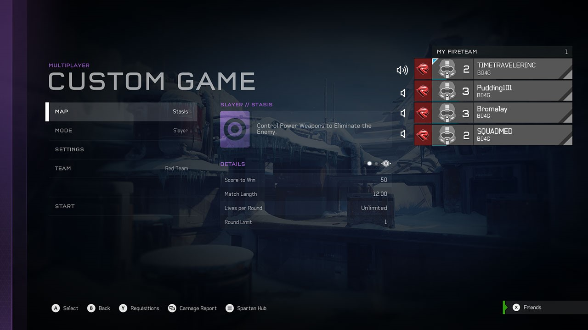

Discussion types

- **Small talk**. Not critical for achieving objectives. For example, common interests, expletives, socializing.
- **Functional**. Critical for achieving game objectives. For example, coordinating strategy with your team.

#### Chat length: minimum requirements

Discussion types in game chat influence a wide range of reply types by a single user (from short greetings and confirmations to longer instructional and descriptive replies). Once you've determined a primary discussion type for each screen, you can begin to make some broad assumptions about the type and length of replies.

Researching game chat activity for your game will deliver the most accurate results. It requires identifying common patterns in multiple user conversations. One solution is to conduct a user-research test, using the speech-to-text functionality inside your game to capture the user-research data of participants. Another suggestion is to watch game streams of similar genres and track conversation patterns.

That data can then be applied to this simple strategy for determining conversation length:

* **Reply frequency** - Determine how many replies were exchanged before a lull, and then average those replies to arrive at a final number. *Example: Two players chatting averaged five replies before a lull occurred.*

* **Reply length** - Determine the average word and character count of a single reply. *Example: A single reply averaged 10 words and 35 characters (with spaces) per reply.*

* **Formatting** - Each chat-related state change includes useful information to help visualize it. The lengths of each field need to be taken into account when determining formatting. In the following example, the **message type**, i.e. whether the message is a result of speech-to-text or text message, can be inferred from the state change type. A `PartyVoiceChatTranscriptionReceivedStateChange` will always indicate text that is a result of voice input, and a [`PartyChatTextReceivedStateChange`](reference/structs/partychattextreceivedstatechange.md) will always indicate text that is a result of text input. The **reply origin**, i.e. who sent the communication, and the **reply** itself can be determined by the fields within each state change.

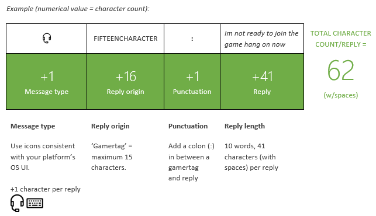

#### Font size and type

Choosing a legible font is important for players who are reading any on-screen text UI, some of whom might have low vision.

> [!NOTE]
> Verdana is the most legible font that Microsoft ships. Even better than Verdana by itself is to present the font with high contrast (full black on full white or vice-versa) and at large sizes. Size, contrast, and letterform are the three biggest factors in legibility (in that priority order).

*Example: Different typefaces of the same size can vary in readability.*

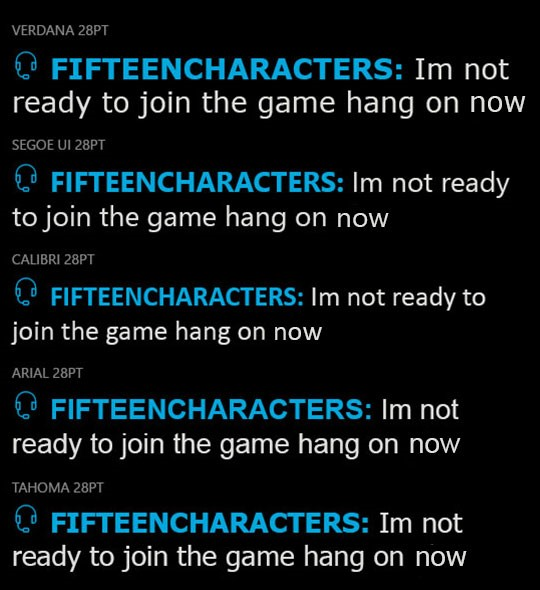

A minimum of **28px** for 1080p UI text (14sp) is recommended for chat transcriptions presented in a 10' experience. Like subtitles, these are displayed for a limited duration and so the text should be notably larger than the minimum acceptable (24pt for 10') for the rest of the UI.

#### Calculating your final minimum-size requirements

Now that you have your average reply frequency, reply length, formatting considerations, and font size and type, you can determine your window size requirement:

*Example: The result of using the specs above inside a window size of **525px (w) x 395px (h)**.*

Start testing your design by using the **ConversationWindow_Template.ai**. Go to [Resources](#resources) for the native Adobe Illustrator (.ai) file.

### Position and proportion

Now that you have minimum text requirements for the conversation window, you can begin testing positioning and size ratio.

#### Positioning: relative vs. fixed

Aligning the conversation window to a grid format provides a very straightforward set of inputs that can scale regardless of the screen resolution. For example, the Xbox OS speech-to-text UI references nine quadrants (Left/Top, Left/Center, Left/Bottom, Middle/Top, and so on) for positioning.

If your game outputs to multiple screen resolutions (4K, PC), you won't have to worry about scaling 1080p X,Y pixel values to a different screen size.

By having a predetermined number of relative positions, you won't have to fight with legacy code to maintain pixel-perfect positioning of design elements, fonts or safe areas. Your design guarantees a relative position instead.

Consider referencing multiple positions to accommodate varying screen complexity:

- Identify screens where game chat activity is critical.
- Avoid inhibiting interaction. (See Note)
- Avoid hiding critical details. (See Note)

> [!NOTE]
> Take care to position the conversation window so that it doesn't inhibit game activity. This will ensure speech-to-text users can enjoy a comparable experience as other users.

### User-controlled customization

There may be screens where there simply isn't room to accommodate a conversation window of any size.

*Example: The end-of-game results UI fills the entire screen. A conversation window risks covering critical stats.*

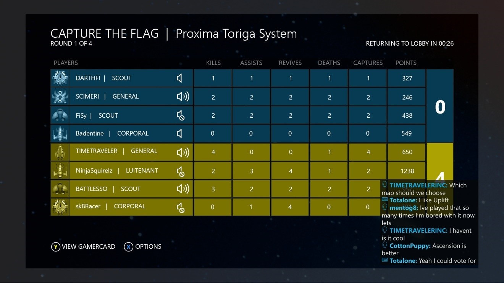

### Solutions for game UI and conversation window conflicts

1. **The user should be able to disable the feature via the OS**.  
   Ideally, the user has the option to leave the game and turn the speech-to-text option on or off, by using the Ease-of-Access settings.

   - **UI impact: NONE**
   - **UX impact: POOR**

   *Example: Disabling the speech-to-text setting via OS Settings. (This shows a critical path for the Xbox One console)*

   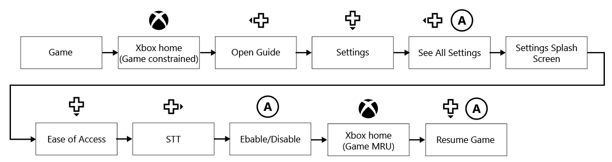

2. **The game provides a method for users to minimize the window**.

   Having a speech-to-text setting to minimize or move the window offers added flexibility for the designer and the user.

   - **UI impact: MODERATE**
     Requires adding a minimize/maximize chat window button to an in-game settings menu. We recommend that this option appear only when speech-to-text is enabled.

   - **UX impact: GOOD**
     This is a 3-click solution where settings menus are surfaced in the game.

   *Example: Minimize/maximize speech-to-text window via in-game Options menu (Xbox Console/PC critical path*

   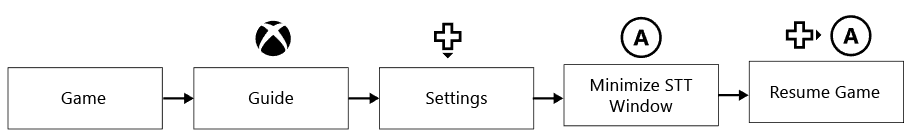

   *Console example: Add a speech-to-text setting in the Pause menu.*

   

   *PC example: Add a speech-to-text setting in the Pause menu.*

   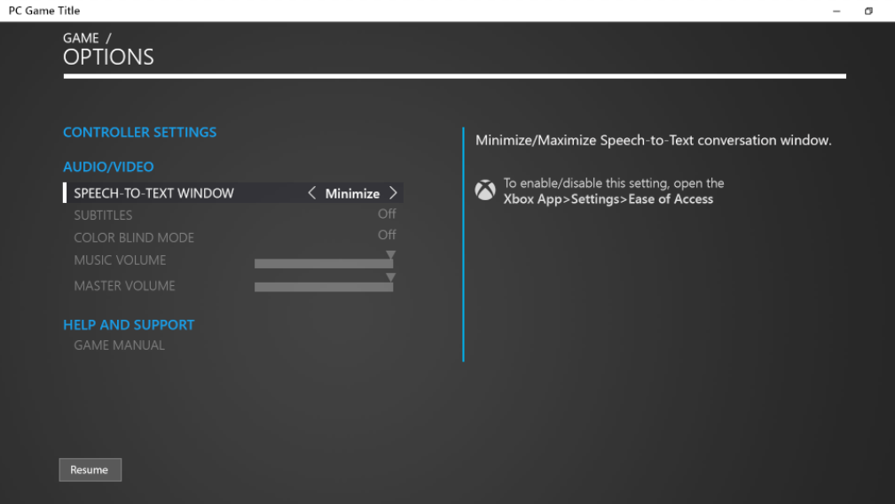

   Enabling users to minimize or maximize the conversation window puts the choice in their hands. The game doesn't have to try to avoid compromising critical real estate.

   Game screens that do not require immediate responses give users time to shift focus away and edit their settings. They can minimize or maximize the window without destroying the session. Keep navigation to and from this setting as efficient as possible.

   For game screens that do require immediate responses, or when point-and-click (PC) is not an option, a button or key command can be directly mapped.

   *Console example: A button is mapped to toggle the display ON/OFF and is annotated in the legend.*

   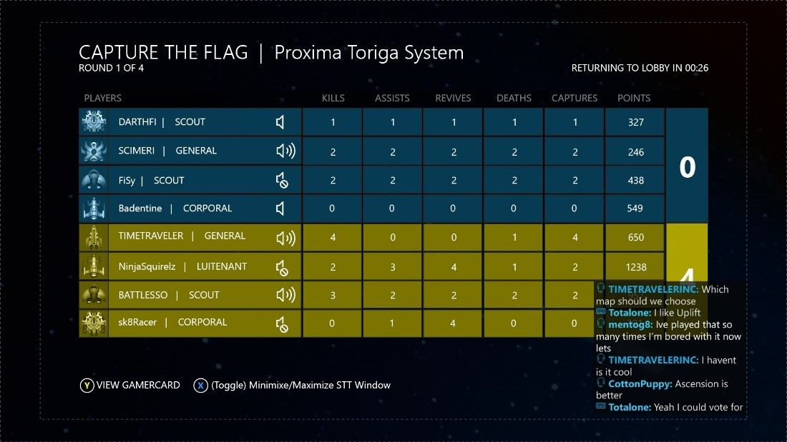

   *PC example: A button is mapped to toggle the display ON/OFF and is annotated in the legend.*

   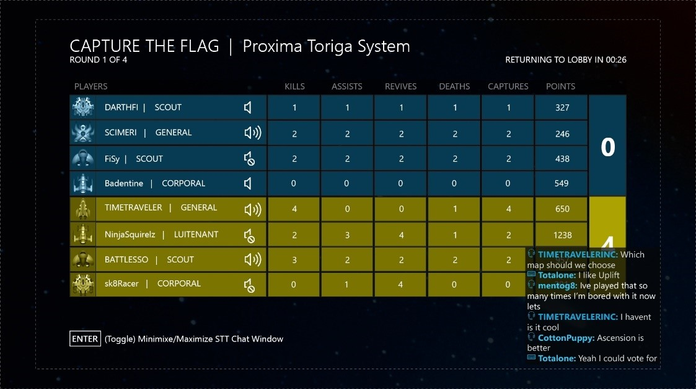

#### Functional requirements

- Conversation continues to be tracked while the window is minimized.
- The user can expand and see the latest replies. (The user does not see a history of missed replies.)
- This option appears when a user profile's speech-to-text setting is detected as enabled.
- This setting would not override the OS Profile's speech-to-text setting.

### Display frequency

Chat activity will fluctuate between players during game sessions. There is no value to keeping an empty chat window open when players aren't chatting.

Automatically close the window when chat has been inactive for a set period.

*Example: The speech-to-text window closes after 15s of inactivity. This number is based on the time it would take a user to read one message of 280 characters.*

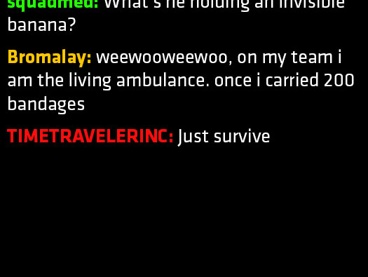

> [!NOTE]
> It's worth testing various settings to ensure that opening and closing a window isn't too distracting on a game screen with a lot of activity.

### Scrolling

During ongoing conversations, the window must facilitate a view of most recent replies. Most recent replies are displayed at the bottom of the replies and scroll up.

> [!NOTE]
> Auto-scrolling is a solution that makes managing conversations easier for both developers and users. It comes closest to mimicking fluid conversation. The less effort a user has to make to manage the view, the more time they have to focus on gameplay. A manual scrollbar would require shifting controller focus, which can be disruptive during active gameplay.

### Visual disparity

It may be tempting to design this chat window to match your UI style. However, the chat window has a specific function, unique from other game components. It is presenting information that originates outside of game instruction.

It is game information that also uses text and frames. A user could confuse the intention of the chat window with actual in-game components, if they look too similar. Therefore, the Chat overlay must possess unique attributes that clearly separate it from the game UI. Degree of disparity is up to the designer’s discretion.

### Closing or destroying the conversation window

A game must determine when the conversation window remains active (while a user is multi-tasking) or when it should close (for example, when a user exits a chat session). Keep in mind that this window represents a live chat conversation and is not to be confused with instant messaging (IM). For example, if a user walks away from their console or pauses a game, the conversation will continue but they'll have missed replies that occurred before they return.

> [!NOTE]
> UX recommendation: Keep the window active when a game is constrained or paused. Close the window when the game exits.

## Title-callable UI (TCUI)

*Console example: The Xbox One Guide is TCUI and has a transparent overlay that dims the screen.*

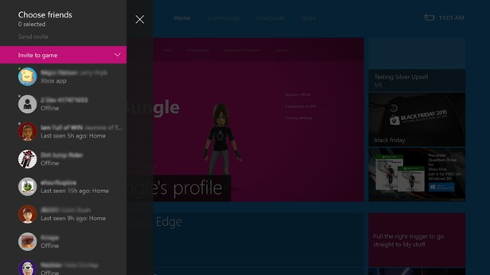

It's common for a platform’s system UI to be the ‘top’ visible layer of any game or app UI. For example, the Xbox One operating system-initiated UI (error messaging, a virtual keyboard, toasts, the Xbox One Guide, people picker, and other elements) applies a full screen, semi-transparent, black overlay with their content window.

- **UX impact**: Visibility of the conversation window will be obscured.

## Conclusion

PlayFab Party text-to-speech and speech-to-text APIs are highly effective features for including a wider range of users in a game and gaming conversations. The more gamers engage and develop relationships, the more likely they are to continue playing. This guidance will help ensure the best possible user experience.

## Resources

### Design templates

- [PlayFab Parties_AI_Templates.zip](https://aka.ms/gamechat-ai-templates)
  Contains:
  - PlayFab Parties_9GridTemplate.ai
  - ConversationWindow_Template.ai

### Text-to-speech narration menu guidelines

- [Speech interactions](/windows/apps/design/input/speech-interactions)
- [Speech synthesis API (Windows)](/uwp/api/Windows.Media.SpeechSynthesis)

### PlayFab Party text-to-speech and speech-to-text UX series

- Part 1: [PlayFab Party text-to-speech and text input UX guidance](party-text-to-speech-ux-guidelines.md)
- Part 2: PlayFab Party speech-to-text and text display UX guidance

### SDK documentation

- "Accessible in-game chat overview" in the PlayFab SDK (see [SDK Downloads](https://developer.xboxlive.com/live/development/Pages/Downloads.aspx))

### Accessibility guidance

- Griffiths, Gareth. [Subtitles: Increasing Game Accessibility, Comprehension](https://www.gamasutra.com/view/feature/132315/subtitles_increasing_game_.php?print=1)
  *Gamasutra*
- [Game Accessibility Guidelines](http://gameaccessibilityguidelines.com/)
A straightforward reference for inclusive game design
- Straub, Josh. [Game Accessibility: What It Is And Why It Matters](https://www.gameinformer.com/b/features/archive/2012/08/03/game-accessibility-what-it-is-and-why-it-matters.aspx)
  *Game Informer*

### Inclusive design

- [Xbox's Gaming for Everyone Initiative](https://news.microsoft.com/gamingforeveryone/)
- [Inclusive Design](https://www.microsoft.com/design/inclusive)
  Microsoft Design Toolkit and education
- Kojouharov, Stefan. [10 Tips on Creating an Addictive ChatBot](https://chatbotslife.com/10-tips-on-creating-an-addictive-chatbot-experience-b796ea6d1178#.ka4jz0vk7)
  Referenced in this document for conversational UI tips.
