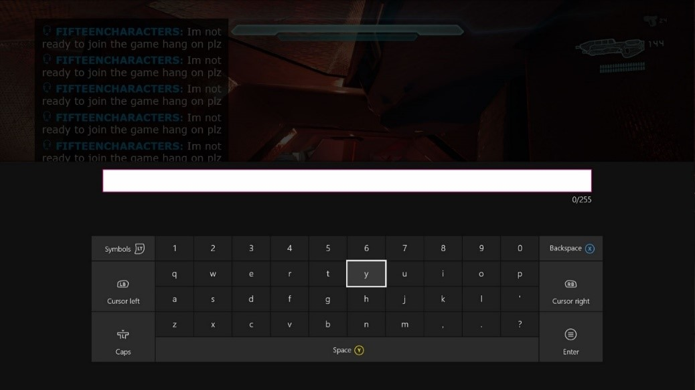
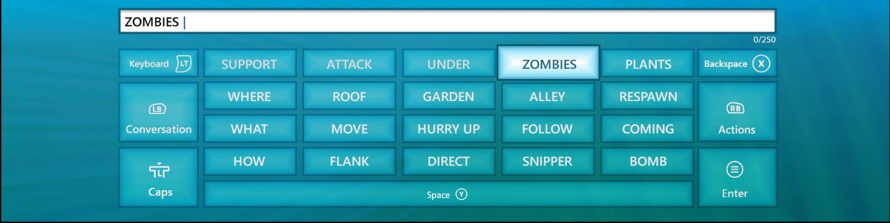
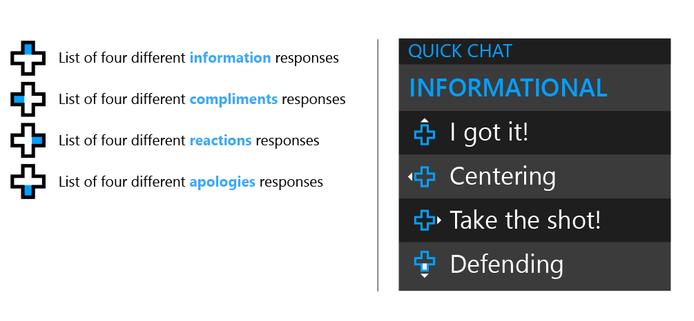
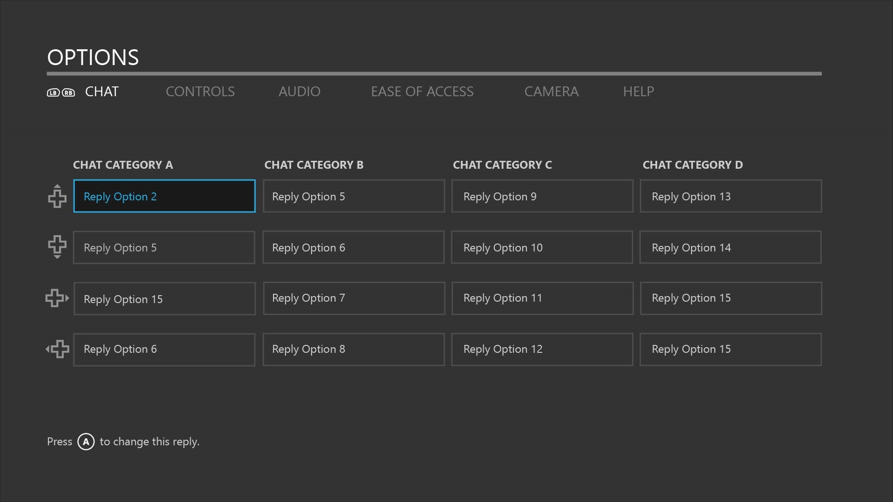
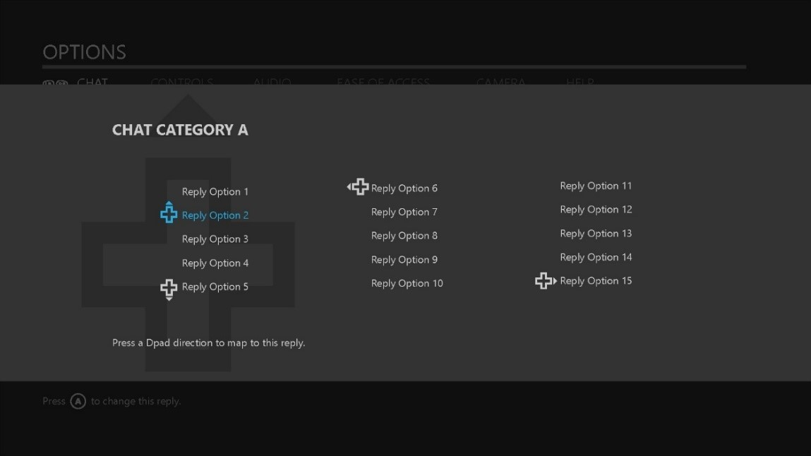

# PlayFab Party text-to-speech and text input UX guidelines
The PlayFab Party library gives game creators the power to engage more players through accessible game chat options. It provides a means for voice chat to be transcribed to text and for text input to be converted to synthesized voice. You can implement a custom UI solution for these features in your title. On Xbox and Windows, you can use platform APIs to implement the relevant UI.

This topic is part one of a two-part series covering UX solutions for speech-to-text and text-to-speech implementation. Part one focuses on text-to-speech implementation, requirements, and console and PC UI solutions, while [part two](party-speech-to-text-ux-guidelines.md) focuses on speech-to-text implementation, requirements, and console and PC UI solutions.

## Text-to-speech and speech-to-text scenarios

The following chart guides you through scenarios that players will experience when you enable speech-to-text and text-to-speech features. It outlines user impact for three stages of the gaming experience: initial setup, playing a game, and engaging in game chat.

|**Experience Stage**|**Set up**                |**Play**                           |**Chat**                 |**Message**                           |
| :------------------|:-------------------------|:----------------------------------|:------------------------|:--------------------------|
|**Goal**            |**User enables setting**  |**User enters a multiplayer game** |**User sends communication** |**User receives communication**
|**Action**          |Speech-to-Text    Alternative for hearing voice replies |Launches game    Enters MP lobby    Overlay opens when game chat is initiated  |User speaks |User reads team's voice replies converted to text in a speech-to-text chat overlay
| |Text-to-speech    Alternative for speaking voice replies |Launches game    Enters MP lobby    Game displays method for text input (keyboard, input field, etc) |User types replies using platform supported input methods    Typed messages are converted to synthesized voice | User hears team member's voice replies
| |UI Narration (in-game)    Alternative for reading in-game menus and text replies |User is guided by the Xbox OS synthesized voice to launch game    Game uses the Speech Synthesis API to narrate menu options leading the user to the MP lobby |For text messaging systems: Games use the Speech synthesis API to guide the user to launch the Xbox OS keyboard | For text messaging systems: Games use the Speech Synthesis API to narrate replies
| |Narrator (Xbox OS)    Alternative for reading Xbox menus |User is guided by the Xbox OS synthesized voice to launch game |For text messaging systems: A virtual Keyboard is narrated as the user types a message | N/A |

## Understanding the API

### Text-to-speech

#### Types of text-to-speech

Party supports two types of text-to-speech - **Voice Chat** and **Narration**. The Voice Chat type is for the scenario where a user elects to use text-to-speech audio as their speaking voice for voice chat communication. When this page discusses Party and text-to-speech, it's typically talking about this scenario. The Narration type is for the scenario where a user should have text-to-speech audio played to their audio output. This is primarily to support the "voice auditioning" scenario where a user compares audio between text-to-speech voice options to select the profile they prefer to use in Voice Chat scenarios. Although this can be used for arbitrary, game-defined narration scenarios, each platform typically provides a more flexible solution for in-game narration, such as the Speech Synthesis API on Xbox and Windows. Each method used to start a text-to-speech operation takes a [`PartySynthesizeTextToSpeechType`](reference/enums/partysynthesizetexttospeechtype.md) parameter that specifies which of the two text-to-speech scenarios is being used.

#### Text-to-speech voice profiles

A text-to-speech voice profile defines the audio characteristics used to generate text-to-speech audio. Profiles vary by language, locale, and gender. There may be multiple options for each combination. Party supports all profiles supported by Azure Cognitive Services. Refer to the [Language support reference](/azure/cognitive-services/speech-service/language-support) for a complete list of supported languages and voice options.
  
The profile options can also be enumerated by the Party library. The first step is to start an asynchronous operation that will populate the text-to-speech profiles via [`PartyLocalChatControl::PopulateAvailableTextToSpeechProfiles()`](reference/classes/PartyLocalChatControl/methods/partylocalchatcontrol_populateavailabletexttospeechprofiles.md). Once the operation completes, indicated by [`PartyManager::StartProcessingStateChanges()`](reference/classes/PartyManager/methods/partymanager_startprocessingstatechanges.md) providing a [`PartyPopulateAvailableTextToSpeechProfilesCompletedStateChange`](reference/structs/partypopulateavailabletexttospeechprofilescompletedstatechange.md), the profiles can be queried via [`PartyLocalChatControl::GetAvailableTextToSpeechProfiles()`](reference/classes/PartyLocalChatControl/methods/partylocalchatcontrol_getavailabletexttospeechprofiles.md).

#### Configuring the text-to-speech voice profile

Before any text-to-speech can be generated by the Party library, the title must configure the text-to-speech voice profile. An asynchronous option to configure the profile can be started via [`PartyLocalChatControl::SetTextToSpeechProfile()`](reference/classes/PartyLocalChatControl/methods/partylocalchatcontrol_settexttospeechprofile.md). The completion of the operation is indicated by `PartyManager::StartProcessingStateChanges()` providing a [`PartySetTextToSpeechProfileCompletedStateChange`](reference/structs/partysettexttospeechprofilecompletedstatechange.md).

#### Synthesizing text-to-speech

Once the title has configured a text-to-speech voice profile, text can be synthesized to speech audio via [`PartyLocalChatControl::SynthesizeTextToSpeech()`](reference/classes/PartyLocalChatControl/methods/partylocalchatcontrol_synthesizetexttospeech.md). For the Voice Chat scenario, the audio data will appear as though it was captured "naturally" by the microphone associated with the user starting the text-to-speech operation. This is akin to the user holding the microphone to a computer that is talking on their behalf. For the Narration scenario, the audio data will be played to the user's audio output.

Synthesizing text-to-speech is an asynchronous operation; the completion of the operation is indicated by `PartyManager::StartProcessingStateChanges()` providing a [`PartySynthesizeTextToSpeechCompletedStateChange`](reference/structs/partysynthesizetexttospeechcompletedstatechange.md).

Although a voice profile must be configured before synthesizing text-to-speech, it isn't necessary to wait for the asynchronous operation started by `PartyLocalChatControl::SetTextToSpeechProfile()` to complete before calling `PartyLocalChatControl::SynthesizeTextToSpeech()`. If a profile operation is in progress, the text-to-speech operation will be queued and start after the profile operation completes.

### Text messaging

In addition to text-to-speech, Party supports traditional text messaging. Although many titles tie text-to-speech to text messaging, that isn't a requirement - Party supports text-to-speech and text messaging as independent features. For more information, see [Understanding chat](concepts-chat.md).

## Text-to-speech UX

Text-to-speech enables a person to use the platform to send a synthesized voice stream to the active game chat participants. This is great for enabling the person to participate when there is no text chat-based system available, and all communication is active through the in-game voice chat.

### Discovery

For Xbox and Windows, users can find text-to-speech and speech-to-text settings in the **Accessibility** section under **Settings** in Xbox Home (Xbox console) or Xbox App (Windows 10). The settings are controlled via toggle buttons that enable or disable the features for all Xbox games specific to the user profile that integrate with the platform settings. For all other platforms, refer to their accessibility guidelines for text-to-speech and speech-to-text setting locations.

> [!NOTE]
> If your game chooses to add additional settings that are game specific only, then they should be placed inside your game. In general, accessibility options belong under the game’s settings/options menu. Ideally, settings should be available as a dedicated button press and accessible from any screen or, at least, the Pause menu.

### Text input/output options

**A title is responsible for prompting and accepting text**. This could be a custom text entry field or the platform-provided keyboard. The resulting entry can then be passed into PlayFab Party to be processed into a synthetic stream. That stream is sent to the other players in the chat session as voice. The receiving end would handle this voice stream in the same way they would another voice stream from a user speaking through a microphone.

1. **Console OS virtual keyboard** (*Xbox console example*)

   > [!NOTE]
   > The keyboard will still appear when a gamepad is installed. It will not appear when a hardware keyboard is installed.

   

2. **PC OS virtual keyboard**  (*Windows 10 example*)

   The PlayFab Party API supports receiving input across all platforms. However, text input components are not provided consistently across those platforms.

   - On the Xbox console, games can rely on the virtual keyboard. It has its own input box, which accepts text that is then provided to the title.
   - On Windows, games can rely on the virtual keyboard with a caveat - it doesn't have an input box. This means that the game must provide a text input box to accept the keystrokes generated by the virtual keyboard. Even if the game does not support traditional text chat, text input may be required for text-to-speech support.

   #### UX recommendation (Windows)
   Cross-platform games that do not support traditional text messaging must provide a text input box to accept keystrokes to support text-to-speech.

   

3. **A game-provided custom keyboard** (*console example*)

   > [!NOTE]
   > The phrases used here specific to the sample game being shown.

   - Games have full control over visibility.
   - Games can enhance the keyboard to include phrases for quick replies.

   

## Quick Chat: A solution for everyone

Consider your player's chat activity, discussion type, and screen objectives. For instance, during active gameplay sessions, launching a keyboard and typing replies would be cumbersome using a controller, but may be critical. Providing a method for users to quickly choose from a list of predefined replies would go far in solving this problem. For users who enable narration, each predefined reply would be narrated. The list of replies would be pre-scripted, so translation would increase in accuracy. The game would have control over contextual, game-specific terms appropriate for their players.

Here are two examples, using the Xbox console and Windows 10 platforms:

### 1a. Phrase list mapped to the D-pad

Pressing a direction (up, down, left, right) on the directional pad (D-pad) opens the chosen category. Once the category list is open, D-pad directions apply to the choices within that category. To swap categories, the user waits for the window to close (two seconds of inactivity) and then chooses an alternate D-pad direction to open a new list of replies.

### 1b. Phrase list mapped to a keyboard

Pressing a number key (1-4) opens the chosen category. Once the category list is open, the number keys apply to the choices within that category. To swap categories, the user waits for the window to close (two seconds of inactivity), and then chooses an alternate number key to open a new list of replies.

### 1c. Phrase list mapped to a keyboard with customizable reply settings

Take this feature one step further by allowing the user to choose from a range of responses.

- **Console example**: For keyboard and controller design template natives, see [Resources](#resources).

In the first image, the Options menu includes a Chat section. This screen displays default and user-selected replies, listed under four categories of conversation types (compliments, instructional, and so on).

Each category is mapped to a single-tap D-pad direction. Each reply is mapped to a double-tap D-pad direction. A user can select a reply to edit by pressing A.

In the second image, a pop-up display offers a list of ten replies. A user can select up to four, each mapped to a D-pad direction based on the order of selection.

### Controller schematic for mapping replies

Some games already provide custom controller mapping for a variety of gameplay preferences. This example proposes an alternative controller schema for text-to-speech and speech-to-tet. Users can select from a list of predefined replies and map to four D-pad directions. The left and right bumpers scroll through categories; the Y button launches a virtual keyboard for custom replies.

During a game session, a user can swap control schemas with a dedicated button press (assigned by the game). In this case, the B button exits this mode.

### Quick Chat reply guidance: A method to get gamers engaged

What if gamers could personalize a quick chat solution that enhances player-to-player exchange? What if there were a solution that maximizes game performance while minimizing communication barriers? Quick Chat comes close, by allowing users to choose from a list of predefined replies. Typically, however, these replies have been limited, redundant phrases that appear automated and boring. The guidelines below explore a strategy for keeping players engaged.

#### Goal: Make this behavior automatic

If Quick Chat satisfies a need repeatedly, a habit can be formed. Consider ways to trigger responses and how that can meet the conversational need at that moment.

#### Quick Chat use cases

- **Conversational**: Players want to engage to facilitate team activity or build deeper social connections.
- **Simplicity**: A Quick Chat solution must be easy to access during times of high-intensity activity.
- **Anonymity**: Players who normally avoid voice chat have a way to participate.

1. **Vary replies**
   Provide a large collection of reply options. This will contribute to the spontaneity normally achieved in dynamic voice conversations. Users will be less likely to get bored with the same reply options and replies will seem less automated.

2. **Surface the solution at the time the need arises**

   - Make Quick Chat available anytime game chat is engaged.
   - Use a dedicated button-press to launch Quick Chat replies.
   - Default to a category that is contextual to current game activity. For example, when a user scores, the default category is "Compliments."

3. **Keep replies focused and concrete**
   This is mostly to keep cognitive load low. Users should be able to read an entire message effortlessly.

   - Make replies relevant to gameplay and its category.
   - Use short phrases and one-syllable words that are most commonly used in your game.
   - Use words that you can instantly visualize.

4. **Use humor**
   *Banter* is a common form of taunting that addresses players in a friendly manner. This is different from *griefing*, where all too often, users are harassed. If replies are clever, relevant, and varied, some users may not resort to inappropriate choices.

5. **Be relative to skill and progress**

   - Offer chat preferences that include basing replies on progression and skill level.
   - Surface suggested replies that a user can communicate to other team members. These options would be contextual to current game activity. For example, "Anyone have an axe to beat this zombie?"

6. **Focus on the emotions**
   Replies that communicate certain target emotions can help make their experience more relatable.

## Conclusion

PlayFab Party text-to-speech and speech-to-text APIs are highly effective features for including a wider range of users in a game and gaming conversations. The more gamers engage and develop relationships, the more likely they are to continue playing. This guidance will help ensure the best possible user experience.

## Resources

### Design templates

- [QuickChat_AI_Template.zip](https://aka.ms/quickchat-ai-template)
  Contains:
  - QuickChat_ConsolePC_Templates.ai

### Text-to-speech narration menu guidelines

- [Speech interactions](/windows/uwp/design/input/speech-interactions)
- [Speech synthesis API (Windows)](/uwp/api/Windows.Media.SpeechSynthesis)

### PlayFab Party text-to-speech and speech-to-text UX series

- Part 1: PlayFab Party text-to-speech and text input UX Guidance
- Part 2: [PlayFab Party speech-to-text and text display UX Guidance](party-speech-to-text-ux-guidelines.md)

### SDK documentation

- "Accessible in-game chat overview" in the PlayFab SDK (see [SDK Downloads](https://developer.xboxlive.com/live/development/Pages/Downloads.aspx))

### Accessibility guidance

- Griffiths, Gareth. [Subtitles: Increasing Game Accessibility, Comprehension](https://www.gamasutra.com/view/feature/132315/subtitles_increasing_game_.php?print=1)
  *Gamasutra*
- [Game Accessibility Guidelines](http://gameaccessibilityguidelines.com/)
A straightforward reference for inclusive game design
- Straub, Josh. [Game Accessibility: What It Is And Why It Matters](https://www.gameinformer.com/b/features/archive/2012/08/03/game-accessibility-what-it-is-and-why-it-matters.aspx)
  *Game Informer*

### Inclusive design

- [Xbox's Gaming for Everyone Initiative](https://news.microsoft.com/gamingforeveryone/)
- [Inclusive Design](https://www.microsoft.com/design/inclusive)
  Microsoft Design Toolkit and education
- Kojouharov, Stefan. [10 Tips on Creating an Addictive ChatBot](https://chatbotslife.com/10-tips-on-creating-an-addictive-chatbot-experience-b796ea6d1178#.ka4jz0vk7)
  Referenced in this document for conversational UI tips.
