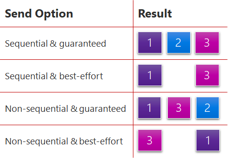

# Configuring transport behavior

PlayFab Party's networking capabilities expand on the User Datagram Protocol (UDP) features of the native platform to provide datagram transport facilities that are ideal for real-time multiplayer games.

While Transmission Control Protocol (TCP) provides reliable streams, and UDP provides unreliable datagrams, Party’s networking behavior can be configured on a per datagram basis. When using [PartyLocalEndpoint::SendMessage](reference/classes/PartyLocalEndpoint/methods/partylocalendpoint_sendmessage.md) to transmit a datagram from a local Party endpoint to a remote endpoint you can specify [PartySendMessageOptions](reference/enums/partysendmessageoptions.md) to fine-tune the desired transport behavior. 

Capabilities include:

- **Guaranteed Delivery** - The `GuaranteedDelivery` flag ensures the message arrives at all targets, implicitly retransmitting data if necessary to mitigate environmental packet loss. This option flag works well when sending important state information that must always reach the destination or else the target should be removed from the network. The default option is `BestEffortDelivery` which provides UDP-like fire and forget behavior. 
- **Sequential Delivery** - Orders the delivery of the message relative to other messages that were sent sequentially from this local endpoint to the target endpoint. Use this option flag to send state information that must reach the destination in a particular sequence. This may result in a slightly lower network efficiency and possibly longer wait  to receive all the packets when there is packet loss or reordering by the environment. Using `SequentialDelivery` with `GuaranteedDelivery` may result in messages being queued on the target endpoint while waiting for previously sent sequential messages to arrive. This may result in a perceived increase in latency when experiencing environmental packet loss or reordering, but the target endpoint will always see every message, in the same order in which they were sent. This performance trade-off is common to TCP-like protocols and sometimes called [head-of-line blocking](https://wikipedia.org/wiki/Head-of-line_blocking).
- **Coalescing** - The Party library automatically fragments and reassembles large messages that exceed the maximum size supported by the environment so that callers are not required to manage this. But if you're sending many small datagrams, coalescing multiple messages together in a single packet allows maximizing bandwidth efficiency (reducing per-packet overhead) at the potential expense of perceived latency for a message if you delay its transmission in order to coalesce. Sending with the `CoalesceOpportunistically` flag (the default coalescence option) causes the Party library to coalesce the message with other queued messages, if any are available, but not to wait for more messages if this message can be transmitted immediately. Sending with the `AlwaysCoalesceUntilFlushed` flag causes the Party library to delay transmission until PartyLocalEndpoint::FlushMessages is called, at which point the queued messages will be coalesced and transmitted.

## Network statistics and local queueing
Depending on the message sending options and network state, Party might locally queue messages before transmission. This local queueing is carefully managed to avoid introducing latency. This is necessary to ensure that Party does not flood the player's network and that features like coalescing can be applied.

[PartyNetwork::GetNetworkStatistics](./reference/classes/partynetwork/methods/partynetwork_getnetworkstatistics.md) allows you to collect data on aggregate network performance, including latency to Party relay service. [PartyLocalEndpoint::GetEndpointStatistics](./reference/classes/partylocalendpoint/methods/partylocalendpoint_getendpointstatistics.md) allows for visibility into queuing and packet loss statistics for a specific remote endpoint.
