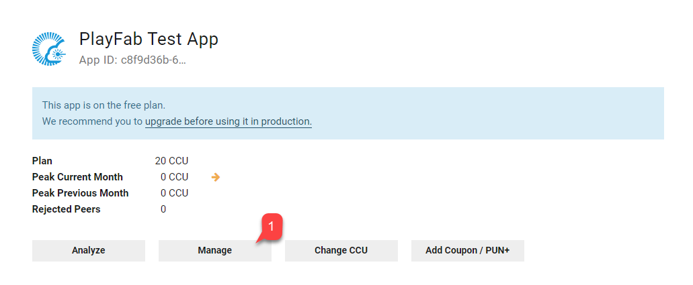
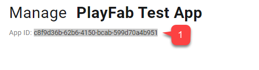
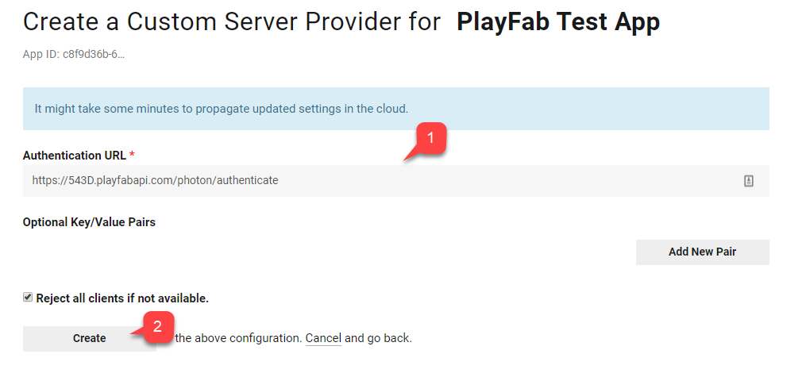
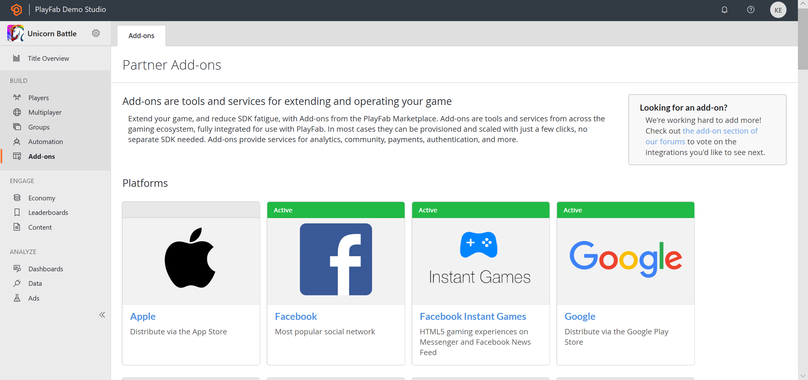
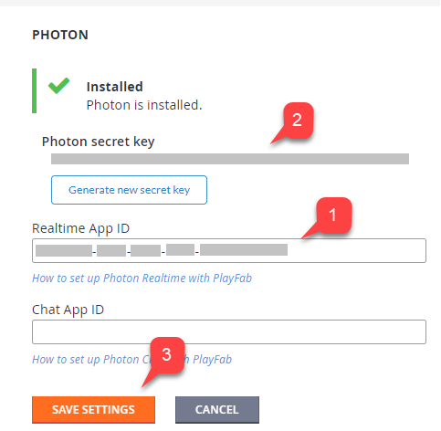
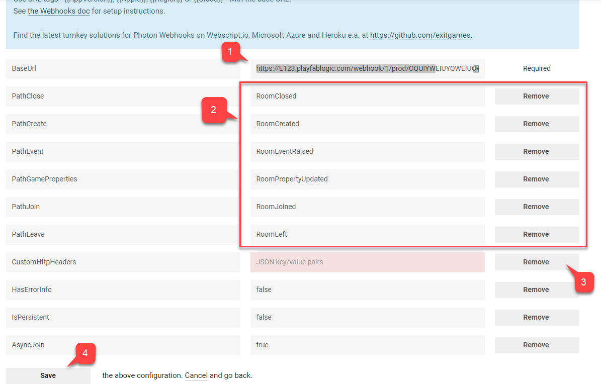
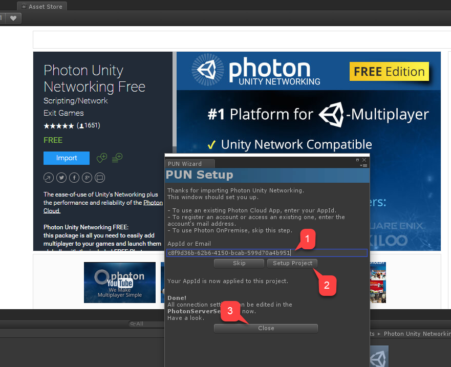
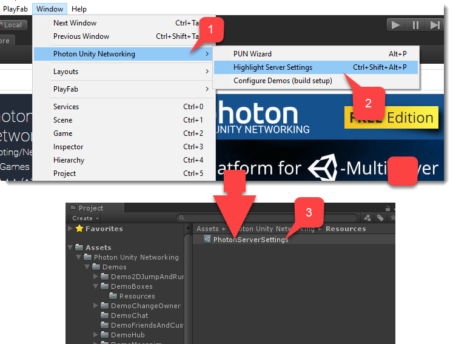
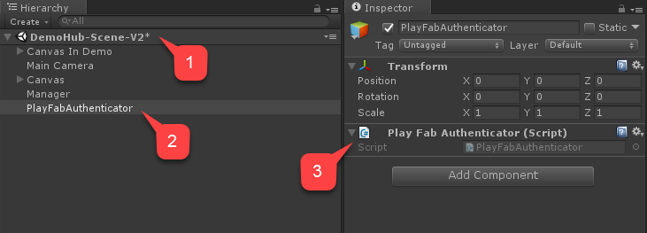
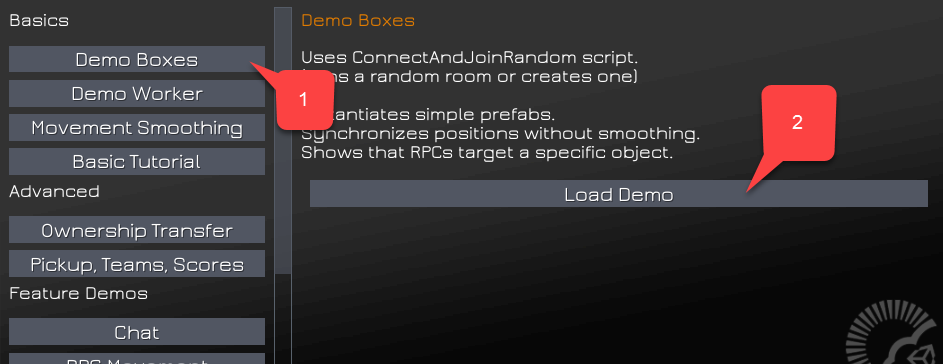

# Photon quickstart

This quickstart shows how to set up **Photon Multiplayer** to work with **PlayFab**. Currently, **PlayFab** offers the following **Photon** integrations:

- Authenticate **Photon Players** with **PlayFab**.
- Listen for room events using **PlayFab CloudScript** callbacks.

We will illustrate how both features work using the latest [Photon Unity example project](https://www.assetstore.unity3d.com/en/#!/content/1786).

## Prerequisites

1. A [Unity](../../../sdks/unity3d/quickstart.md) project with the **PlayFab SDK** imported, and a configured **Title**.
2. The **PlayFab Title** registered.

> [!NOTE]  
> This guide omits the **Chat Application** settings. For your **Chat Application** to be integrated, create a new **Photon Chat Application**, and enter the **App ID** in the corresponding boxes in **Unity** and in the **PlayFab Game Manager** - **Photon Add-on** page.

## Setting up a Photon Application

Once you have registered and logged into the  **Photon Dashboard**, create a new **App (1)**.

  

In the example shown below:

- Select **Realtime Application** type **(1)**.
- Choose a **Name (2)**.
- Create a **Description (3)**. 
- Submit by selecting **Create (4)**.

  

## Setting up Authentication

Find the newly created **Application** in the list and select **Manage (1)**.

  

- The **Application** dashboard will open.

- Find and save the **App ID (1)** located under the page title.

  

- Then locate the **Authentication** section **(1)**.
- Select the **Custom Server (2)**.

  

The next page will let you configure the **Authentication URL** for **Photon**.
The format is:

```html
https://{PlayFabTitleId}.playfabapi.com/photon/authenticate
```
Replace **Title ID** place holder with your own **Title ID**.

```html
{PlayFabTitleId}
```

Enter the **URL (1)** and submit by selecting the **Create** button **(2)**.

  

## Setting up a PlayFab Title for Photon

Navigate to your title's Game Manager page, then:
- Navigate to **Add-ons** tab **(1)**.
- In the list of add-ons find and select **Photon (2)**, as shown in the example provided below.

  

The **Photon Add-on** page will allow you to install **Photon** by specifying your **Photon Realtime Application ID (1)**.

- Optionally, you may specify **Chat App ID**.
- Once you install the add-on **(3)**, a **Photon secret Key** will be generated **(2)**.
- Save it for future use when configuring web-hooks. 

> [!NOTE]
> Remember to save your **Photon Secret Key** in a safe and easily accessible place. It will come in handy when configuring **Web-hooks**.
  
  

## Setting Photon Webhooks

As an optional integration, **Photon** may transmit certain events to your **PlayFab CloudScript**. This is done by means of **Web-hooks**:

- You specify a **Base URL**.
- Then you specify path for each of available **Events**.
- A path is, effectively, a handler name implemented in your **CloudScript**.

The **Base URL** will have the following format:

```html
https://{PlayFabTitleId}.playfablogic.com/webhook/1/prod/{PhotonSecretKey}
```

Make sure to replace **Title ID** placeholder with your own **Title ID**.

```html
{PlayFabTitleId}
```

Make sure to replace **Photon Secret Key** token with the **Secret Key** you generated on the **Photon Add-on** page.

```html
{PhotonSecretKey}
```

- Fill in the **Base URL (1)**.
- Assign a **CloudScript** handler **Name** for each of the available **Events (2)**.
- Remove any **CustomHttpHeaders (3)**.
- Submit this by selecting the **Save** button **(4)**.

  

## Setting up a Unity project

The guide assumes you already have **PlayFab SDK** imported, set up, and **Title** setting configured.

- Start by navigating to the **Asset Store**.
- Locate [Photon Unity Networking Free package](https://www.assetstore.unity3d.com/en/#!/content/1786).
- Select **Import (1)**.
- You may inspect the imported files.
- Then select **Import (2)**.

  

Right after import process finishes, the **PUN Setup** window will open.

- Enter your **Realtime Application ID (1)** found in the Photon Application Dashboard for the Photon app you created.
- Click **Setup Project (2)**.
- Once the setup finishes, press **Close (3)**.

  

If **AppId** was accepted, the Photon Server Settings object will be selected and viewable in the Unity Inspector window. To manually access the Server Settings object:

- Navigate to the top window panel.
- Select **Window**.
- Then select **Photon Unity Networking (1)**.
- Finally select **Highlight Server Settings (2)**.
- The **Standard Unity** project window will reveal the **PhotonServerSettings (3)** object. 
- Select the object to reveal its settings in the **Unity Inspector** window.

  

> [!NOTE]
> As part of **PhotonServerSettings**, you have the option to assign the **Chat Application ID**.

At this point the project is configured.

## Implementing PlayFab to Photon authentication

When you enable the **Photon Add-on** for your **Title** in the PlayFab Game Manager, and configure the authentication on the **Photon Application Dashboard**, **PlayFab** allows you to authenticate existing **PlayFab Players** inside the **Photon** environment.

This means you may completely avoid implementing any user management for Photon.

- Navigate to **DemoHub-Scene-V2** scene **(1)** from the **Photon Unity Networking Free** package, the Classic version.
- This scene is a hub for all the examples from the package.
- As it is the *first* scene to load, let's add a small script to enable authenticating **PlayFab** with **Photon**.
- Create an empty **GameObject** called **PlayFabAuthenticator (2)**.
- Then in the Unity Inspector window, add a component with the same name to this **GameObject (3)**.



Click on the gear icon and from the drop-down menu choose to edit the script. Copy and paste the code for the **PlayFabAuthenticator** component as illustrated below (please, read the comments for the explanation), and save and close the file.

```csharp
using PlayFab;
using PlayFab.ClientModels;
using UnityEngine;

public class PlayFabAuthenticator : MonoBehaviour {

    private string _playFabPlayerIdCache;

    //Run the entire thing on awake
    public void Awake() {
        AuthenticateWithPlayFab();
    }

    /*
     * Step 1
     * We authenticate current PlayFab user normally.
     * In this case we use LoginWithCustomID API call for simplicity.
     * You can absolutely use any Login method you want.
     * We use PlayFabSettings.DeviceUniqueIdentifier as our custom ID.
     * We pass RequestPhotonToken as a callback to be our next step, if
     * authentication was successful.
     */
    private void AuthenticateWithPlayFab(){
        LogMessage("PlayFab authenticating using Custom ID...");

        PlayFabClientAPI.LoginWithCustomID(new LoginWithCustomIDRequest()
        {
            CreateAccount = true,
            CustomId = PlayFabSettings.DeviceUniqueIdentifier
        }, RequestPhotonToken, OnPlayFabError);
    }

    /*
    * Step 2
    * We request Photon authentication token from PlayFab.
    * This is a crucial step, because Photon uses different authentication tokens
    * than PlayFab. Thus, you cannot directly use PlayFab SessionTicket and
    * you need to explicitly request a token. This API call requires you to
    * pass Photon App ID. App ID may be hardcoded, but, in this example,
    * We are accessing it using convenient static field on PhotonNetwork class
    * We pass in AuthenticateWithPhoton as a callback to be our next step, if
    * we have acquired token succesfully
    */
    private void RequestPhotonToken(LoginResult obj) {
        LogMessage("PlayFab authenticated. Requesting photon token...");
        
        //We can player PlayFabId. This will come in handy during next step
        _playFabPlayerIdCache = obj.PlayFabId;

        PlayFabClientAPI.GetPhotonAuthenticationToken(new GetPhotonAuthenticationTokenRequest()
        {
            PhotonApplicationId = PhotonNetwork.PhotonServerSettings.AppID
        }, AuthenticateWithPhoton, OnPlayFabError);
    }

    /*
     * Step 3
     * This is the final and the simplest step. We create new AuthenticationValues instance.
     * This class describes how to authenticate a players inside Photon environment.
     */
    private void AuthenticateWithPhoton(GetPhotonAuthenticationTokenResult obj) {
        LogMessage("Photon token acquired: " + obj.PhotonCustomAuthenticationToken + "  Authentication complete.");

        //We set AuthType to custom, meaning we bring our own, PlayFab authentication procedure.
        var customAuth = new AuthenticationValues { AuthType = CustomAuthenticationType.Custom };
        
        //We add "username" parameter. Do not let it confuse you: PlayFab is expecting this parameter to contain player PlayFab ID (!) and not username.
        customAuth.AddAuthParameter("username", _playFabPlayerIdCache);    // expected by PlayFab custom auth service
       
        //We add "token" parameter. PlayFab expects it to contain Photon Authentication Token issues to your during previous step.
        customAuth.AddAuthParameter("token", obj.PhotonCustomAuthenticationToken);
        
        //We finally tell Photon to use this authentication parameters throughout the entire application.
        PhotonNetwork.AuthValues = customAuth;
    }

    private void OnPlayFabError(PlayFabError obj) {
        LogMessage(obj.GenerateErrorReport());
    }

    public void LogMessage(string message) {
        Debug.Log("PlayFab + Photon Example: " + message);
    }
}
```

## Testing PlayFab to Photon authentication

Start the scene **(1)** and inspect the flow of console messages **(2)**. 
Control that:

 1. Authentication to **PlayFab** itself was successful **(3)**
 2. The **Photon** token was acquired **(4)**

The following picture illustrates the correct flow.

  

For example, we can start a demo called **Demo Boxes**. Click **Load Demo (2)**, as shown in the picture below.

Once the **Photon** token has been acquired, and authentication is complete, we are okay to check out the **Photon** demos.

For example, start a demo called **Demo Boxes**. Ensure that the **PlayFab** authentication is complete, select **Demo Boxes (1)**, then select **Load Demo (2)**, as shown on the following picture.

  

**Photon** will start outputting **Debug** messages. By simply monitoring your console, you can easily spot if you have any authentication issues.

  

Ensure that no **Authentication Denied** errors are present in the console. At this point, you have set up minimal **PlayFab** and **Photon** integration.

## Photon Room Event + CloudScript

**Photon** matchmaking system has the concept of a **Room**. If you are not familiar with this concept, please consult with the [Photon Matchmaking Guide](https://doc.photonengine.com/en-us/realtime/current/reference/matchmaking-and-lobby).

**PlayFab** allows you to intercept various **Room Events**. The following **Room Events** require only **CloudScript** to be intercepted:

- **RoomCreated**
- **RoomJoined**
- **RoomLeft**
- **RoomClosed**

The following **Events** will require additional control over **Unity** code to be intercepted (details are given later in this document):

- **RoomPropertyUpdated**
- **RoomEventRaised**

> [!NOTE]  
> Once you introduce a handler for a **Room Event**, it becomes an essential part of **Event** handling flow. So errors produced while running your **CloudScript** may cause problems for the *entire* system. For example, if the **RoomCreated** handler throws an error, your **Clients** will throw an error as well, and will not be able to connect properly.

Let's construct a **PlayFab CloudScript** by defining a handler for each **Event** type one-by-one.

### Room Created

The **Room Created** handler is invoked every time a **Photon Room** is created. The following **CloudScript** handler will intercept such **Event**.

```javascript
// Triggered automatically when a Photon room is first created
handlers.RoomCreated = function (args) {
    return { ResultCode : 0, Message: 'Success' }; 
};
```

> [!NOTE]
> You may acquire additional data about the **Event** using the **args** argument. The example of **args** payload is given below.


```javascript
{
  "ActorNr": 1,
  "AppVersion": "1.2_1.85",
  "AppId": "bfd5f98b-c6a4-4763-80d9-824d20db842b",
  // Options with which the room was created.
  "CreateOptions": {
    "MaxPlayers": 4,
    "LobbyId": null,
    "LobbyType": 0,
    "CustomProperties": {
      
    },
    "EmptyRoomTTL": 0,
    "PlayerTTL": 0,
    "CheckUserOnJoin": false,
    "DeleteCacheOnLeave": true,
    "SuppressRoomEvents": false,
    "PublishUserId": false,
    "ExpectedUsers": null
  },
  // Unique game identifier
  "GameId": "8b8322de-096d-4481-a2b2-8db8bb45cfef",
  "Region": "EU",
  "Type": "Create",
  // User that caused the room to be created
  "UserId": "834D5AA5BAB1DFB6",
  "Username": ""
}
```

### Room Joined

The **Room Joined** handler is invoked every time a **Player** joins the **Room**. The following **CloudScript** handler will intercept such an **Event**.

```javascript
// Triggered automatically when a player joins a Photon room
handlers.RoomJoined = function (args) {
    return { ResultCode : 0, Message: 'Success' }; 
};
```

This callback is not invoked for the very first user entering the **Room**. Use **Room created** to intercept the first **Player** that joins. You may acquire additional data about the **Event** using **args** argument.

The example of **args** payload is shown below.

```javascript
{
  "ActorNr": 2,
  "AppVersion": "1.2_1.85",
  "AppId": "bfd5f98b-c6a4-4763-80d9-824d20db842b",
  // Unique Game Identifier
  "GameId": "b0f55a2e-431d-402a-9809-b0240443267e",
  "Region": "EU",
  "Type": "Join",
  // Id of the player that has joined
  "UserId": "AAC7634BF46289DF",
  "Username": ""
}
```

### Room Left

The **Room Left** handler is invoked every time a **Player** leaves the **Room**. The following **CloudScript** handler will intercept such **Event**.

```javascript
// Triggered automatically when a player leaves a Photon room
handlers.RoomLeft = function (args) {
    return { ResultCode : 0, Message: 'Success' }; 
};
```

You may acquire additional data about the **Event** using **args** argument. The example of **args** payload is shown below.

```javascript
{
  "ActorNr": 2,
  "AppVersion": "1.2_1.85",
  "AppId": "bfd5f98b-c6a4-4763-80d9-824d20db842b",
  // Unique Game Identifier
  "GameId": "b0f55a2e-431d-402a-9809-b0240443267e",
  "IsInactive": false,
  "Reason": "0",
  "Region": "EU",
  "Type": "ClientDisconnect",
  // Id of the user that has left the room
  "UserId": "AAC7634BF46289DF",
  "Username": ""
}
```

### Room Closed

The **Room Closed** handler is invoked every time the last **Player** leaves the room and room has no **Players** left. The following **CloudScript** handler will intercept such event.

```javascript
// Triggered automatically when a Photon room closes
// Note: currentPlayerId is undefined in this function
handlers.RoomClosed = function (args) {
    return { ResultCode : 0, Message: 'Success' };
};
```

You may acquire additional data about the event using **args** argument. The example of **args** payload is shown below.

```javascript
  "ActorCount": 0,
  "ActorNr": 1,
  "AppVersion": "1.2_1.85",
  "AppId": "bfd5f98b-c6a4-4763-80d9-824d20db842b",
  // Unique game identifier
  "GameId": "b0f55a2e-431d-402a-9809-b0240443267e",
  "Region": "EU",
  "State2": {
    "ActorList": [
      
    ]
  },
  "Type": "Close"
}
```

### Room Property Updated

**Room Property Updated** handler is invoked every time room property is changed. The following **CloudScript** handler will intercept such event.

```javascript
// Triggered automatically when a Photon room game property is updated.
// Note: currentPlayerId is undefined in this function
handlers.RoomPropertyUpdated = function (args) {
    return { ResultCode : 0, Message: 'Success' }; 
};
```

> [!NOTE]
> The **currentPlayerId** is undefined in this handler. If the **Room** property was changed from the **Client**, you may use the **args** argument, and refer to the **UserId** to acquire the **Player** in charge.

You may acquire additional data about the event using **args** argument. The example of **args** payload is shown below.

```javascript
{
  "ActorNr": 1,
  "AppVersion": "1.2_1.85",
  "AppId": "bfd5f98b-c6a4-4763-80d9-824d20db842b",
  // Custom Room Properties
  "Properties": {
    "CustomProperty": "It's Value"
  },
  "GameId": "8b8322de-096d-4481-a2b2-8db8bb45cfef",
  "Region": "EU",
  "State": {
    "ActorCounter": 1,
    "ActorList": [
      {
        "ActorNr": 1,
        "UserId": "834D5AA5BAB1DFB6",
        "Username": "",
        "IsActive": true,
        "Binary": "RGIAAAEBRAAAAAFi\/3MAAA==",
        "DEBUG_BINARY": {
          "1": {
            "255": ""
          }
        }
      }
    ],
    "Binary": {
      "18": "RAAAAANi+nkAAHNzAA1QbGF5ZXJJbmRleGVzRGlpAAEAAAABAAAAAHMADkN1c3RvbVByb3BlcnR5cwAKSXQncyBWYWx1ZQ=="
    },
    "CheckUserOnJoin": false,
    "CustomProperties": {
      
    },
    "DeleteCacheOnLeave": true,
    "EmptyRoomTTL": 0,
    "IsOpen": true,
    "IsVisible": true,
    "LobbyType": 0,
    "LobbyProperties": [
      
    ],
    "MaxPlayers": 4,
    "PlayerTTL": 0,
    "SuppressRoomEvents": false,
    "Slice": 0,
    "DebugInfo": {
      "DEBUG_PROPERTIES_18": {
        "250": [
          
        ],
        "PlayerIndexes": {
          "1": 0
        },
        "CustomProperty": "It's Value"
      }
    },
    "ExcludedActors": [
      
    ],
    "PublishUserId": false,
    "ExpectedUsers": [
      
    ]
  },
  "Type": "Game",
  "UserId": "834D5AA5BAB1DFB6",
  "Username": ""
}
```

When changing custom **Room** properties using the **Unity Photon Client**, *it is important to mark the call*, so that it passes the **Event** to **WebHook** (**PlayFab** in this case).

```csharp
// Properties updates ( this hashtable contains the properties to be changed. Properties not mentioned here will stay as is
var properties = new ExitGames.Client.Photon.Hashtable() { { "CustomProperty" , "It's Value" } };

// Control set. Empty in this case, because our property has not existed before. 
// Otherwise you would include previous value of the property.
var expectedProperties = new ExitGames.Client.Photon.Hashtable();

// Set Custom Properties call. Notice the last argument set to "true"
// This tells Photon to forward event to the webhook.
PhotonNetwork.room.SetCustomProperties(properties, expectedProperties, true);
```

### Room Event Raised

The **Room Event Raised** is called every time a custom **Room Event** is raised. The following **CloudScript** handler will intercept such an **Event**.

```javascript
// Triggered by calling "OpRaiseEvent" on the Photon client. The "args.Data" property is
// set to the value of the "customEventContent" HashTable parameter, so you can use
// it to pass in arbitrary data.
handlers.RoomEventRaised= function (args) {
    return { ResultCode : 0, Message: 'Success' };
};
```

You may acquire additional data about the **Event** using **args** argument. The example of **args** payload is shown below.

```javascript
{
  "ActorNr": 1,
  "AppVersion": "1.2_1.85",
  "AppId": "bfd5f98b-c6a4-4763-80d9-824d20db842b",
  // Custom event data
  "Data": {
    "Hello": "World"
  },
  "GameId": "8b8322de-096d-4481-a2b2-8db8bb45cfef",
  "Region": "EU",
  "State": {
    "ActorCounter": 1,
    "ActorList": [
      {
        "ActorNr": 1,
        "UserId": "834D5AA5BAB1DFB6",
        "Username": "",
        "IsActive": true,
        "Binary": "RGIAAAEBRAAAAAFi\/3MAAA==",
        "DEBUG_BINARY": {
          "1": {
            "255": ""
          }
        }
      }
    ],
    "Binary": {
      "18": "RAAAAAJi+nkAAHNzAA1QbGF5ZXJJbmRleGVzRGlpAAEAAAABAAAAAA=="
    },
    "CheckUserOnJoin": false,
    "CustomProperties": {
      
    },
    "DeleteCacheOnLeave": true,
    "EmptyRoomTTL": 0,
    "IsOpen": true,
    "IsVisible": true,
    "LobbyType": 0,
    "LobbyProperties": [
      
    ],
    "MaxPlayers": 4,
    "PlayerTTL": 0,
    "SuppressRoomEvents": false,
    "Slice": 0,
    "DebugInfo": {
      "DEBUG_PROPERTIES_18": {
        "250": [
          
        ],
        "PlayerIndexes": {
          "1": 0
        }
      }
    },
    "ExcludedActors": [
      
    ],
    "PublishUserId": false,
    "ExpectedUsers": [
      
    ]
  },
  "Type": "Event",
  // PlayFab User Id if he/she was the source of the event
  "UserId": "834D5AA5BAB1DFB6",
  "Username": "",
  // Event code
  "EvCode": 15
}
```

When raising custom **Room Events** using **Unity Photon Client**, it is important to mark the call so that it passes the **Event** to **WebHook** (**PlayFab** in this case).

```csharp
var data = new Dictionary<string,object>() {
    { "Hello" , "World" }
};

// Raise custom room event
// Replace 15 with any custom event code of your choice [0..299]
PhotonNetwork.RaiseEvent(15, data, true, new RaiseEventOptions() {
    ForwardToWebhook = true, // Mark call to pass event to WebHook (PlayFab in this case)
});
```

## Testing Room Event Handlers

This example extends the previous example (**PlayFab** + **Photon** authentication).

Upload the following **CloudScript** for your **Title**.

```javascript
handlers.RoomCreated = function (args) {
    server.WriteTitleEvent({
    	EventName : "room_created"
    });
    return { ResultCode : 0, Message: 'Success' };
};

handlers.RoomJoined = function (args) {
    server.WriteTitleEvent({
    	EventName : "room_joined"
    });
    return { ResultCode : 0, Message: 'Success' };
};

handlers.RoomLeft = function (args) {
    server.WriteTitleEvent({
    	EventName : "room_left"
    });
    return { ResultCode : 0, Message: 'Success' };
};

handlers.RoomClosed = function (args) {
    server.WriteTitleEvent({
    	EventName : "room_closed"
    });
    return { ResultCode : 0, Message: 'Success' };
};

handlers.RoomPropertyUpdated = function (args) {
    server.WriteTitleEvent({
    	EventName : "room_property_changed"
    });
    return { ResultCode : 0, Message: 'Success' };
};

handlers.RoomEventRaised = function (args) {
    server.WriteTitleEvent({
    	EventName : "room_event_raised"
    });
    return { ResultCode : 0, Message: 'Success' };
};
```

The code does nothing more than posting a new **Title Event** whenever a **Photon** callback is invoked. Being of no use in production, this example will let us clearly see how the callbacks are invoked.

Extend the **PlayFabAuthenticator** script by including new example code that will raise custom **Event**, and set custom room property. The extended version also utilizes an **Awake** method to not destroy object between scene loads.

```csharp
using System.Collections.Generic;
using PlayFab;
using PlayFab.ClientModels;
using UnityEngine;

public class PlayFabAuthenticator : MonoBehaviour {

    private string _playFabPlayerIdCache;


    //Run the entire thing on awake
    public void Awake() {
        AuthenticateWithPlayFab();
        DontDestroyOnLoad(gameObject);
    }


    /*
     * Step 1
     * We authenticate current PlayFab user normally. 
     * In this case we use LoginWithCustomID API call for simplicity.
     * You can absolutely use any Login method you want.
     * We use PlayFabSettings.DeviceUniqueIdentifier as our custom ID.
     * We pass RequestPhotonToken as a callback to be our next step, if 
     * authentication was successful.
     */
    private void AuthenticateWithPlayFab()  {
        LogMessage("PlayFab authenticating using Custom ID...");

        PlayFabClientAPI.LoginWithCustomID(new LoginWithCustomIDRequest()
        {
            CreateAccount = true,
            CustomId = PlayFabSettings.DeviceUniqueIdentifier+"EDITOR"
        }, RequestPhotonToken, OnPlayFabError);
    }

    /*
    * Step 2
    * We request Photon authentication token from PlayFab.
    * This is a crucial step, because Photon uses different authentication tokens
    * than PlayFab. Thus, you cannot directly use PlayFab SessionTicket and
    * you need to explicitely request a token. This API call requires you to 
    * pass Photon App ID. App ID may be hardcoded, but, in this example,
    * We are accessing it using convenient static field on PhotonNetwork class
    * We pass in AuthenticateWithPhoton as a callback to be our next step, if 
    * we have acquired token succesfully
    */
    private void RequestPhotonToken(LoginResult obj) {
        LogMessage("PlayFab authenticated. Requesting photon token...");
        
        //We can player PlayFabId. This will come in handy during next step
        _playFabPlayerIdCache = obj.PlayFabId;

        PlayFabClientAPI.GetPhotonAuthenticationToken(new GetPhotonAuthenticationTokenRequest()
        {
            PhotonApplicationId = PhotonNetwork.PhotonServerSettings.AppID
        }, AuthenticateWithPhoton, OnPlayFabError);
    }

    /*
     * Step 3
     * This is the final and the simplest step. We create new AuthenticationValues instance.
     * This class describes how to authenticate a players inside Photon environment.
     */
    private void AuthenticateWithPhoton(GetPhotonAuthenticationTokenResult obj) {
        LogMessage("Photon token acquired: " + obj.PhotonCustomAuthenticationToken + "  Authentication complete.");

        //We set AuthType to custom, meaning we bring our own, PlayFab authentication procedure.
        var customAuth = new AuthenticationValues { AuthType = CustomAuthenticationType.Custom };

        //We add "username" parameter. Do not let it confuse you: PlayFab is expecting this parameter to contain player PlayFab ID (!) and not username.
        customAuth.AddAuthParameter("username", _playFabPlayerIdCache);    // expected by PlayFab custom auth service
       
        //We add "token" parameter. PlayFab expects it to contain Photon Authentication Token issues to your during previous step.
        customAuth.AddAuthParameter("token", obj.PhotonCustomAuthenticationToken);
        
        //We finally tell Photon to use this authentication parameters throughout the entire application.
        PhotonNetwork.AuthValues = customAuth;
    }

    private void OnPlayFabError(PlayFabError obj) {
        LogMessage(obj.ErrorMessage);
    }

    public void LogMessage(string message) {
        Debug.Log("PlayFab + Photon Example: " + message);
    }


    // Add small button to launch our example code 
    public void OnGUI() {
        if (GUILayout.Button("Execute Example ")) ExecuteExample(); 
    }


    // Example code which raises custom room event, then sets custom room property
    private void ExecuteExample() {

        // Raise custom room event
        var data = new Dictionary<string, object>() { {"Hello","World"} };
        var result = PhotonNetwork.RaiseEvent(15, data, true, new RaiseEventOptions()
        {
            ForwardToWebhook = true,
        });
        LogMessage("New Room Event Post: "+result);

        // Set custom room property
        var properties = new ExitGames.Client.Photon.Hashtable() { { "CustomProperty", "It's Value" } };
        var expectedProperties = new ExitGames.Client.Photon.Hashtable();
        PhotonNetwork.room.SetCustomProperties(properties, expectedProperties, true);
        LogMessage("New Room Properties Set");
    }

}
```

- Run the hub scene and wait for **PlayFab** authentication to complete **(1)**.
- Then load the **Boxes Demo** scene **(2)**.

  

- Once the scene loads, wait for the peer to connect newly created room **(1)**.
- Then select **Execute Example** in the top left corner **(2)**.
- Observe the console output **(3)**.
- Make sure no errors have occurred.


Don't forget to stop **Unity** from playing. This is done to ensure that we also receive **RoomLeft** and **RoomClosed Events**.

Navigate to **Title Game Manager** page, and observe the **PlayStream** panel. You should be able to see **Events** generated as a result of our **CloudScript** code handling **Photon Events**.

 1. Initially, our **Photon** instance had no opened **Room**. When we launched the example, **Photon** has **created the room** for the Boxes Demo.
 2. The first **Player** to join is the **Player** who requested the **Room**. So no **RoomJoined Event** was recorded. We then executed our example code:
     - First, we raised a custom **Room Event**.
     - Then, we set a custom **Room Property**.
     - Then we stopped the **Unity** play mode. This resulted in our **Client** leaving the **Room**.
 3. Since our disconnected **Client** was the last one, there are no more **Clients** and **Photon** closes the **Room**.

All the **Events** should be logged into the **PlayStream Event** flow, as shown on the following picture.


At this point, you have fully integrated **Photon** event support into your **PlayFab Title**.
