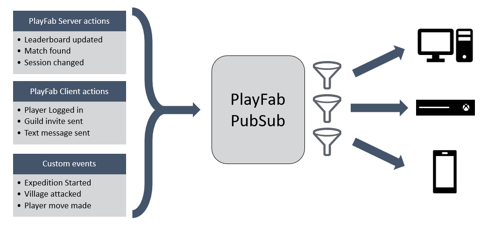

# PlayFab PubSub

> [!IMPORTANT]
> This feature is currently in **Private Preview**.  
>
> It is provided to give you an early look at an upcoming feature, and to allow you to provide feedback while it is still in development. We will be making it broadly available to developers as soon as we can.

## Overview

PlayFab PubSub is a flexible system for pushing information in real time between services and clients. Events are relayed via a persistent connection between PlayFab and game clients, allowing clients to subscribe to topics and be notified of events remotely.

PubSub is integrated natively with [PlayStream](../../../api-references/events/index.md) events, extending PlayFab's server-side event-driven model to clients.

## Uses of PubSub

Game clients can use PlayFab PubSub to receive all sorts of events, including standard built-in events like `entity_logged_in`, or custom events you can define like `player_won_match`. This can be used in a variety of scenarios.

For example:

- Populating a player's friends list with presence information.
- Sending in-game text chat messages.
- Displaying a game invite or friend request notification.
- Syncing state changes between a game and its companion app.
- Notifying a player that an opponent has made a move in a turn-based game.

PlayFab features are also built with standard PubSub events in mind. The first example of this is the new PlayFab [Matchmaking preview](https://blog.playfab.com/blog/matchmaking-preview), which leverages PubSub to inform clients of updates to the status of their matchmaking tickets, such as when a match is found. This allows clients to avoid constantly polling the service for updates, while ensuring they are informed of matches as soon as they happen.

## Key concepts

- **Event** - Each message sent or received via PubSub is called an event.

- **Topic** - PubSub events are addressed based on topics. A topic is made up of three components:  

  - **Event namespace**
  
  - **Event name**
  
  - **Target entity**  
  
Each published event has a specified topic, and with each subscription, clients specify the topic in which they are most interested.

- **Event namespace** - The namespace representing the category of an event. Standard PlayFab events reside under `playfab.*` namespaces. Custom events fall under `custom.*` namespaces.

- **Event name** - The specific type of event.

- **Target entity** - The target entity component of a topic indicates the entity associated with the event. It may or may not be the entity which is sending and/or receiving the event.

## Example
> [!NOTE]
> This example is currently theoretical and will not work yet since the entity_logged_in event is not currently a V2 event.  PubSub only works with PlayStream V2 events.

Imagine you want to add a feature to your game that will pop up a notification whenever one of a player's friends logs in. This can be done by leveraging the built-in `entity_logged_in` PlayStream event. At a high level, you can set up this functionality in just a few steps:

1. Use the [policy manager](pubsub-policies.md) to configure a policy which allows a player's friends to subscribe to their `entity_logged_in` events (Event Namespace = `playfab.profile`, Event Name = `entity_logged_in`, Target Entity = `Player`).

1. Add code to your client to retrieve a player's friends list after login and subscribe to `playfab.profile.entity_logged_in` for each friend on the list. With each subscription, pass in a reference to the handler function which will be executed when this event is received.

1. Implement the specified event handler function with code which pops up the notification.

> [!NOTE]
> This example uses a built-in event, but a similar process can be used for custom events. The only addition would be that custom events need to be sent from your code at the appropriate time by using the [WriteEvents](xref:titleid.playfabapi.com.events.playstreamevents.writeevents) API.

## Links

- [PubSub API Reference](pubsub-reference.md)
- [Creating PubSub Policies](pubsub-policies.md)
- [PubSub Unity Quickstart](quickstart-unity.md)
