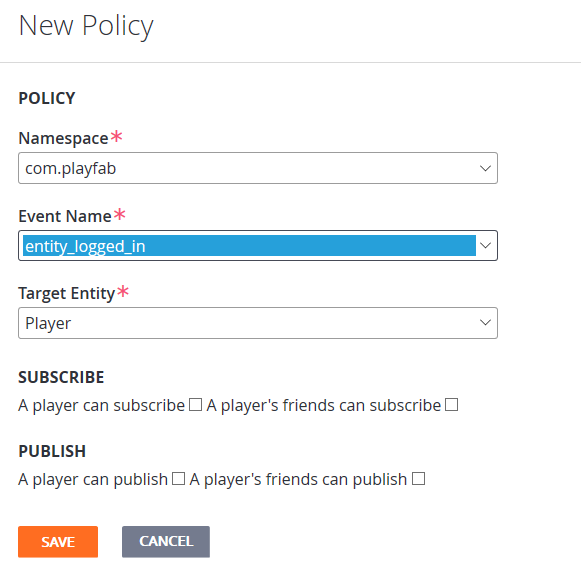
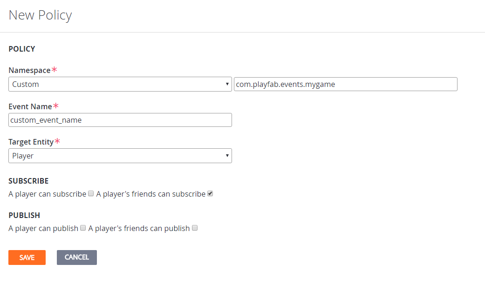
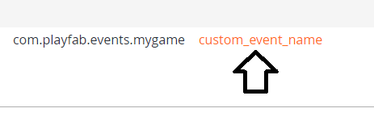

# PubSub policies

> [!IMPORTANT]
> This feature is currently in **Private Preview**.  
>
> It is provided to give you an early look at an upcoming feature, and to allow you to provide feedback while it is still in development.  
>
> Access to this feature is restricted to select titles. If you are interested in trying it, please contact us at [helloplayfab@microsoft.com](mailto:helloplayfab@microsoft.com).

## Overview

PubSub events are governed by a set of policies, which control who is allowed to publish to (and subscribe to) each topic. You can use these policies to ensure that only *authorized* clients are able to receive or send each type of event.

Each policy specifies permissions for one set of topics (combination of event namespace, event name, and entity type), including which entities are allowed to subscribe to the specified events.

By default, all event subscriptions are disallowed, so prior to setting up policies here, clients will not be able to subscribe to any events.

## Configuring policies

For your clients to receive any events via PubSub, you must first configure the appropriate policies on the **PubSub Policy** page within **Game Manager**.

Open **Game Manager**, and navigate to the **Settings** tab on the left, then to the **PubSub** tab on the top.

If you are using a title with access to PubSub, this page provides you with a list of any existing PubSub policies configured for your title as well as the ability to modify those policies or create new ones.

### New policy

To create a new PubSub policy, select the **NEW POLICY** button at the top right of the page. This opens up a **New Policy** screen, which should look like the example provided below.

For standard PlayFab events, select a **Namespace** and **Event Name** from the drop-downs, to indicate what sort of event you wish to configure (standard events are under the `com.playfab` namespace).

Then choose the type of entity that will be subscribing to the desired event in the **Target Entity** drop-down. Check the appropriate boxes under **SUBSCRIBE**, to control who is allowed to receive these events.

> [!NOTE]
> For now, ignore the check boxes under **PUBLISH**, as they currently have no effect.

For custom events, the process is largely the same.  The big difference is that you need to select **Custom** for the namespace, type in the full namespace (beginning with `com.playfab.events`), and the name of the event into the text boxes which appear.

> [!NOTE]
> For now, ignore the check boxes under **PUBLISH**, as they currently have no effect.

When you are ready, select the **SAVE** button to store and enable your new policy.

## Edit policy

To edit a policy later, select its **Event Name** in the list of policies.

>[!NOTE]
> When editing a policy, you cannot change any of the fields which make up the topic of the event. If you wish to change the topic, create a new policy and delete the old one.

