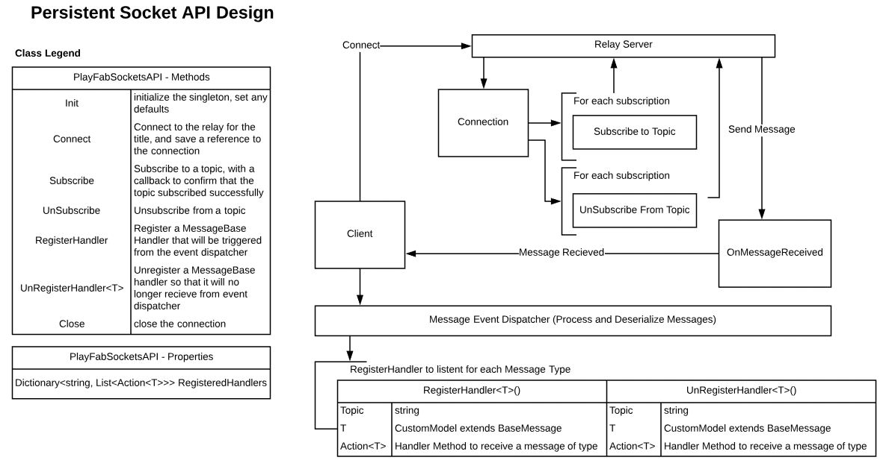

# PubSub client API

> [!IMPORTANT]
> This feature is currently in **Private Preview**.  
>
> It is provided to give you an early look at an upcoming feature and to allow you to provide feedback while it is still in development.  
>
> Access to this feature is restricted to select titles. If you are interested in trying it, you can request access by submitting a ticket on [support.playfab.com](https://support.playfab.com/hc/en-us/requests/new).

This topic explains the technical design behind the Persistent Sockets API in a PlayFab client. Below you will find dependencies and explanations of each API signature required to make a clean Persistent Socket API that can talk to the PlayFab PubSub service, receive events and subscribe handlers to those events.

## Dependencies

- SignalR - The underlying technology in which messages are sent to the game client and referred to as a PbuSub service (aka: a Relay Server).
- (A JSON Serializer) – `PluginManager<ISerializePlugin>` - Any serialization or de-serialization uses the PlayFab SDK's serialization.

## Design

The API was designed for easy integration. A game client can open a socket (`connect`) and subscribe to topic events (generally PlayStream messages, but not always). Once subscribed to events, messages are sent from the PubSub service and are received by the client via the `OnMessageReceived` handler. This handler is and will remain internal and private to the API. The `OnMessageReceived` handler processes the message. This process is known as the Message Event Dispatcher. It is responsible for looking at the `RegisteredHandlers`, taking the message topic, and de-serializing the message into the type registered. Types are an extension of `PlayFabMessageBase` (which we will talk about later) and can have their own de-serialization strategy. Once the message has been successfully de-serialized, the registered handler is invoked thereby dispatching the event to all listed handlers.

<!--
 
-->

## The API methods

- `Initialize(bool autoconnect=false)` – This method of the API initializes the Sockets API and instantiates any Unity specific objects into the scene that need to persist. It also sets up the `PlayFabSocketsAPI` as a singleton object that can be referenced from anywhere in game code. In addition, the API provides an additional "autoconnect" parameter Boolean that will also auto `Connect` to the PubSub service upon successful initialization.
- `Connect()`  - This method connects to the PubSub service and stores a reference to the connection. Optionally, you can register your `OnConnect`, `OnDisconnect`, and `OnConnectionError` handlers when calling this function.
- `IsConnected()` - This returns **true** if you are currently connected to the PubSub service.
- `Debugging` - Set this variable to true for verbose debugging output to the Unity console.
- `Subscribe(topic, callback, error)` - This method sends a message to the PubSub service to inform it that this client has registered to receive notifications for the specified topic.
- `Subscribe(topics, callback, error)` - This method sends a message to the PubSub service to inform it that this client has registered to receive notifications for the specified topics (one or more topics).
- `UnSubscribe(topic, callback, error)` – This method sends a message to the PubSub service to inform it that this client should no longer receive notifications for the specified topic.
- `UnSubscribe(topics, callback, error)` – This method sends a message to the PubSub service to inform it that this client should no longer receive notifications for the specified topics (one or more).
- `RegisterHandler(topic, Action<PlayFabNetworkMessage> handler)` - This methods lets you register a handler to a topic from anywhere in your code. Each topic can have multiple handlers invoked, allowing you to register to the topic and receive messages in one or more views. By inheriting type `PlayFabNetworkMessage`, the event processor will attempt to de-serialize the message to the type specified. Types should extend `PlayFabMessageBase` (see below).
- `UnRegisterHandler(topic, Action<PlayFabNetworkMessage> handler)` - This method lets you de-register a handler and no longer receive invocations in the view.
- `Disconnect()` – This method will close the connection and trigger the `OnDisconnect` event.

## The API events

- `OnConnect` – This event fires when a connection has been successfully made to the PubSub service. You can subscribe to this event to be informed of a successful connection.
- `OnDisconnect` – This event fires when you are disconnected from the PubSub service. It is fired/triggered only when the `close()` method has been invoked.
- `OnConnectionError(PlayFabError)` – This event fires when a disconnection happens due to some sort of error. The reason model (`PlayFabError`) should provide some information as to why the disconnect from the PubSub service occurred if that information is available. If that information is not available, the reason is listed as unknown.
- `OnRetryConnection()` - In the case where a connection is lost, this event will fire during the re-connection attempt.
- `OnTopicResubscriptionFailedEvent(Topic)` - If a connection is lost, and a re-connection has been established, this API will auto resubscribe to topics you were previously subscribed to. This event is fired if any of those attempts to resubscribe fail.

## PlayFabMessageBase

The message base class is a base class in which you can form message models off of. Message models are messages that a client can expect to receive via the PlayFab PubSub service. Message models might have some properties that are common across all messages, and also provide a way to handle the message (serialization and de-serialization).

`PlayFabMessageBase` should observe the following:

- `PublisherEntity` - This is the entity that published the event.
- `OriginalId` - The message identity.
- `OriginalTimestamp` - The original timestamp of the message.
- `PayloadJSON` -  The actual JSON payload of the message.
- `ReadMessage<T>()` - This returns a de-serialized typed object for this message

## Retry Logic

Any persistent socket connection requires some sort of error handling. Connections are lost for various reasons and PlayFab attempts to maintain the connection for as long as possible. The PlayFab API has retry logic in place which will attempt to regain connection to the PubSub service should a connection error occur.

**Exponential back off** - When a connection failure happens, the API does the following:

- First Failure - Immediately try to reconnect once.
- Second Failure – Try to reconnect in 15 seconds.
- Third Failure – Try to reconnect in 30 seconds
- Fourth Failure – Try to reconnect in 1 minute.
- Fifth Failure – Try to reconnect in 5 minutes.
- Sixth Failure – Try to reconnect in 15 minutes.

Trying to reconnect post 15 minutes is unlikely to regain connection. Each attempt will notify you via an event that you can subscribe to. In addition, `OnConnectionError` is also fired.