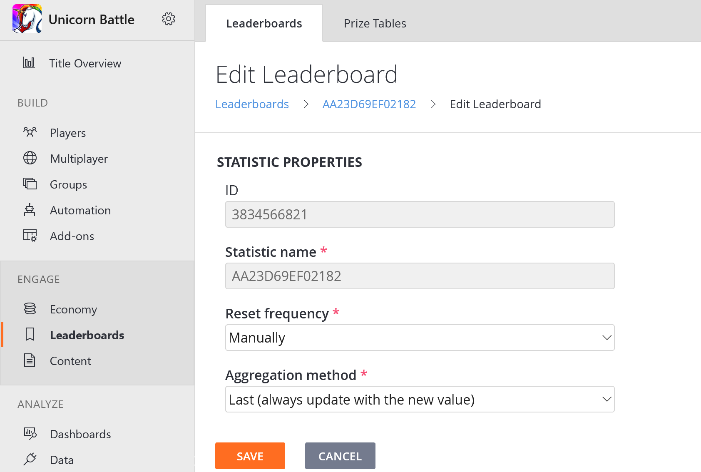
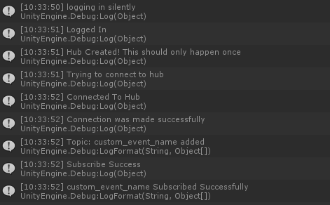
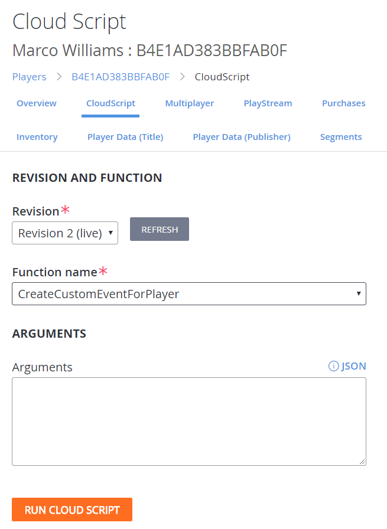
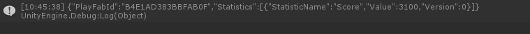

# PubSub Unity quickstart

The purpose of this topic is to explain how to quickly get started with using the PubSub client for Unity. In this guide, we will show you step by step how to connect to the PubSub hub and subscribe to topics. Then we will show you how to receive your first message.

## Prerequisites

- **Unity 2018** - This package currently only works with Unity 2018 or later.
- **PlayFab SDK for Unity** - To use this package, you must be familiar with the PlayFab SDK and have it already installed. Please be sure to have the latest PlayFab SDK installed.
- **PlayFab Authentication** - To use this package, you must also be familiar with authenticating in PlayFab.
- **Unity .Net 4.X** - This package uses 4.x within Unity. Your project must be set to 4.x in **PlayerSettings**.
- **Setup PubSub policies** - You will need to setup PubSub policies in order to receive events on the clients. If you have not setup a policy yet, please visit [PubSub policies](pubsub-policies.md) to learn more.

## Installation

The pubsub feature does not come with the PlayFab SDK by default.  You can acquire it via GitHub from our site, or from within the Unity PlayFab Editor Extensions panel.

> [!IMPORTANT]
> **Private preview only.**  While this feature is in [Private Preview](pubsub-private-preview-notes.md), you must be logged into GitHub for the package to download and install correctly.

### Installing from **Editor Extensions**

1. Ensure you are logged into the **PlayFab Editor Extensions  Window-->PlayFab-->Editor Extensions**.
2. Login with your PlayFab developer account, if you are not currently logged in.
3. Select your title with PubSub enabled.
4. Install from **Editor Extensions** via the **Packages Tab**, this will import all files into the project.

### Installing from GitHub

1. Login to GitHub.
2. Go to [GitHub: PlayFab PubSub](https://github.com/PlayFab/UnitySignalRBetaSdk/releases/download/0.0.1/PubSub.unitypackage) - If you don't have access to this repository, please request it via devrel@playfab.com.
3. If the above link didn't automatically download, then you can click on the releases tab and download the latest released distribution package. You may also obtain updates from this location.
4. Open the **PubSub.unityPackage**.
5. Click **Import All** to import all the files into your Unity Project.

## Usage

Using the pubsub plugin is pretty easy. If you have not looked at our reference for this feature, you should get familiar with it at [PubSub client API](pubsub-reference.md).

1. **Initializing PubSub** - While you can initialize the plugin at any time in your code, we recommend that you initialize in either the start or awake method. When just getting started it also helps to set `Debugging` to true.

   ```csharp
   PlayFabSocketsAPI.Debugging = true;
   PlayFabSocketsAPI.Initialize();
   ```

2. **Authenticate** - Before you can use the PubSub feature, you must authenticate your client via PlayFab. For more information about Authenticating, please go to [Platform-Specific Authentication](../../authentication/platform-specific-authentication/index.md) to learn more.

    When you authenticate, you must store your Entity Key for later usage. In addition, this is when you want to start your connection by using the `PlayFabSocketsAPI.Connect()` method.

   ```csharp
   private EntityKey _currentEntity;

   private void OnAuthenticated(LoginResult result)
   {
       Debug.Log("Logged In");
       _currentEntity = result.EntityToken.Entity;
       _playFabId = result.PlayFabId;
       PlayFabSocketsAPI.Connect();
   }
   ```

3. **Event subscriptions** - You will want to subscribe to connection, disconnection, and connection error events.

   ```csharp
   PlayFabSocketsAPI.OnConnected.AddListener(OnSocketsConnected);
   PlayFabSocketsAPI.OnConnectionError.AddListener(OnSocketsConnectionError);
   PlayFabSocketsAPI.OnDisconnected.AddListener(OnSocketsDisconnected);
   ```

   And you will need handlers for each of these events.

   ```C#
   private void OnSocketsConnected()
   {
       // We will subscribe to topics and register handlers here
   }

   // Here we are just going to log a message to the console for disconnection and errors
   private void OnSocketsDisconnected()
   {
       Debug.Log("PlayFab Sockets:You were disconnected from the server");		
   }

   private void OnSocketsConnectionError(PlayFabError error)
   {
       Debug.LogFormat("PlayFab Sockets Error: {0}", error.GenerateErrorReport());
   }
   ```

4. **Create a topic message** - To create a topic, we must create an Entity Object and a Topic object to pass to the Subscribe method. You will put this code in the ``OnSocketsConnected()`` method you defined in step 3.

   ```csharp
   //First we must transform your EntityKey that you received at login, to the proper Entity Object
   var entity = new PlayFab.Sockets.Models.Entity()
   {
       Id = _currentEntity.Id,
       Type = _currentEntity.Type
   };
   //Create a list of Topics to subscribe to
   var topics = new List<Topic>();

   //Create a Topic object to listen to
   var objectChangeTopic = new Topic()
   {
       Entity = entity,
       EventName = "custom_event_name",
       EventNamespace = "com.playfab.events.mygame"
   };
   //Add that topic to the array		
   topics.Add(objectChangeTopic);
   ```

5. **Create a Handler** - Create a handler for when your event is received. Add the following after you create your Topic:

   ```csharp
   PlayFabSocketsAPI.RegisterHandler(customEventTopic, OnCustomEvent);
   ```

6. **Create a Handler Method** - Be sure to add your method that you defined in the previous step. Here we are just logging the received JSON payload. You can use `var myMessage = netMsg.ReadMessage<T>` where T is a model you want to deserialize to make this a strongly typed object.

   ```csharp
   private void OnCustomEvent(PlayFabNetworkMessage netMsg)
   {
       Debug.Log(netMsg.PayloadJSON);		
   }
   ```

7. **Subscribe to topic(s)** - Now that you have topics you want to subscribe to, we need to notify the relay server that we want to receive these events. This does require that you have setup a policy to allow this. For more information, see [PubSub policies](pubsub-policies.md).

   ```csharp
   //send topic subscriptions and output any success or failures
   PlayFabSocketsAPI.Subscribe(topics, (subscribedTopics) =>
   {
       Debug.Log("Subscribe Success");

       subscribedTopics.ForEach((t) =>
       {
           Debug.LogFormat("{0} Subscribed Successfully", t.EventName);
       });
   }, (subscribedErrors) =>
   {
       Debug.Log("Subscribe Failed");

       subscribedErrors.ForEach((t) =>
       {
           Debug.LogFormat("{0}", t.Message);
       });
   });
   ```

## Setup the event

In this example, we are triggering a custom event from a player. The event name is **custom_event_name** and we will increment a statistic **Score** from that custom event and return the result to the player via PubSub.  

1. First we need to create a statistic for Players. This is also known as [Leaderboards](../../social/tournaments-leaderboards/index.md). Click on Leaderboards and create a new leaderboard with the following settings:

   

2. We need a [CloudScript](../../automation/cloudscript/index.md) that you can run on a player to increment the statistic for the player and then fire your custom event. You can edit this directly in PlayFab by going to **Automation --> Cloud Script**. Add the following handler to your Cloud Script:

   ```javascript

   handlers.CreateCustomEventForPlayer = function(args,context){
     //Get current PlayerId
     var playerId = currentPlayerId;
     //Increment Statistics by 100
     server.UpdatePlayerStatistics({
       PlayFabId:playerId,
       Statistics:[
         {
           StatisticName:"Score",
           Value:100
         }
       ]
     });

     var stats = server.GetPlayerStatistics({
       PlayFabId:playerId,
       StatisticNames:"Score"
     });
  
     //Get account info
     var accountInfo = server.GetUserAccountInfo({PlayFabId:playerId});
  
     //Get the Title Player Account
     var titlePlayerAccount = accountInfo.UserInfo.TitleInfo.TitlePlayerAccount;
  
     //Create a TitlePlayerEntity object
     var titleEntity = {
       Id:titlePlayerAccount.Id,
       Type:titlePlayerAccount.Type
     }
  
     //Trigger our event we will receive in PubSub
     var entityEvent = {};
     entityEvent.Entity = titleEntity;
     entityEvent.EventNamespace = "com.playfab.events.mygame";
     entityEvent.Name = "custom_event_name";
     entityEvent.PayloadJSON = JSON.stringify(stats);
     entity.WriteEvents({Events:[entityEvent]});
  
     return stats;
   }
   ```

## Run and test

Now you have all the pieces to run and test your code.

1. Run your project in unity.  You should see the following:

   

1. Login to [Game Manager](https://developer.playfab.com) and navigate to your player that just logged int.

1. Run the Cloud Script method on the player from the Cloud Script Tab.

   

1. You should have received a message to your console that is similar to the following.

   