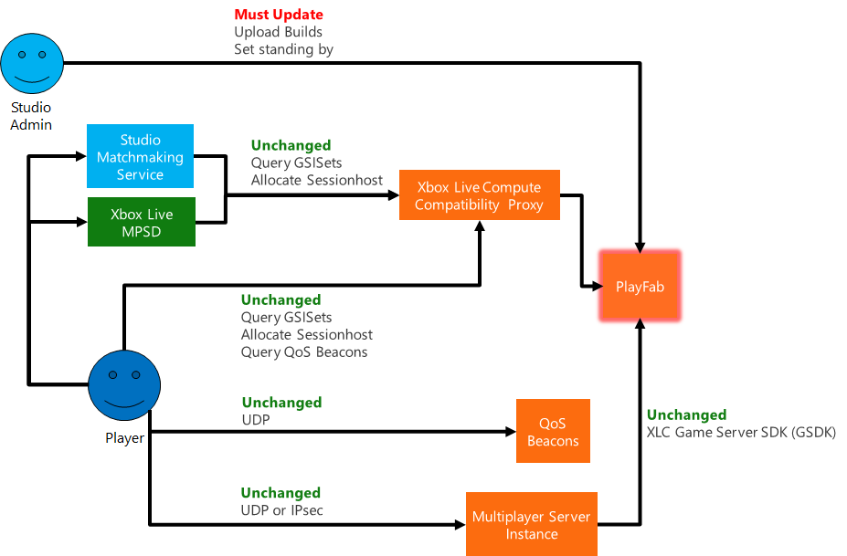

# Decommissioning Xbox Live Compute
Xbox Live Compute (XLC) is being de-commissioned on November 1st, 2019. All XLC hosted game servers will be de-activated.

Xbox Live Compute customers can get an improved multiplayer server orchestration capability through PlayFab Multiplayer Servers. PlayFab will provide XLC customers similar pricing terms as XLC customers enjoy today. We also implemented several compatibility features that reduce the need to change code, especially client code:

1. XLC game server SDK (GSDK) will work in the PlayFab environment, reducing the need to change your server code
2. XLC endpoints used for QoS, listing game server builds, and allocating session hosts, can be re-directed to a PlayFab title once configured

XLC customers will need to do several things to migrate:
1.	Create PlayFab titles corresponding to XLC titles
2.	Identify and upload the last-known-good multiplayer server
3.	Provide multiplayer server config (certs, standing-by, etc.)
4.	Transition of production activity from XLC to PlayFab. If you would like to continue to use XLC endpoints for allocation, we can work with you to direct those API calls to new PlayFab titles. 
5.	Perform ongoing management operations with PlayFab APIs and the PlayFab portal

  

We regret the inconvenience this may cause. XLC was an innovative preview program but has increasingly become difficult to maintain and operate. PlayFab Multiplayer Servers is a much more advanced orchestrator and we hope these compatibility features allow for a reasonable migration.

If you have any questions please reach out to your Microsoft developer account manager.
