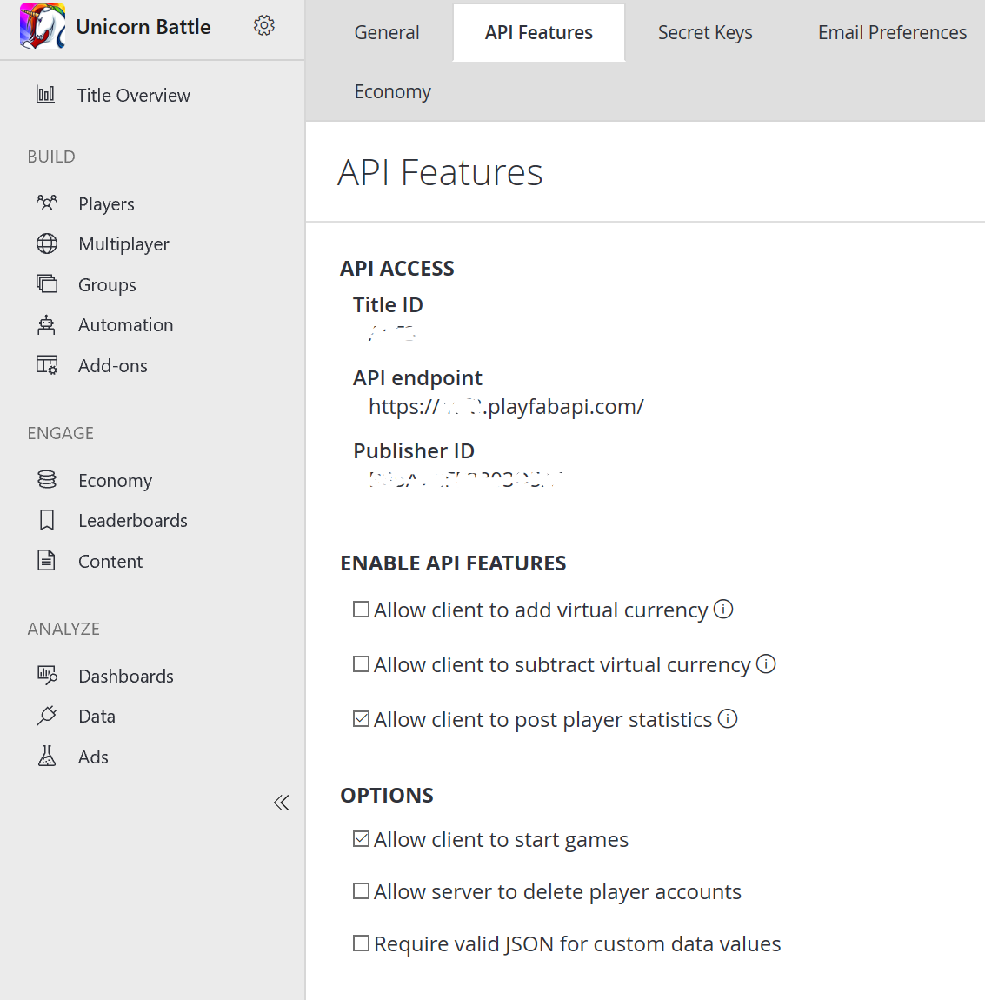

# Allocating game servers and connecting Visual Studio debugging tools

## Allocating multiplayer sessions

With PlayFab multiplayer servers 2.0, you can allocate instances of your multiplayer server application using the [RequestMultiplayerServer](xref:titleid.playfabapi.com.multiplayer.multiplayerserver.requestmultiplayerserver) API.

Typically this API is called from your own services (perhaps a matchmaking service or lobby service), using a PlayFab Developer Secret Key configured for the specific title. For more information about secret keys, see [Secret key management](../../../gamemanager/secret-key-management.md).

A typical pattern for bringing players together and allocating servers:

1. Clients collect network QoS information.
2. Clients interact with a custom matchmaking service, or assemble via social invitations.
3. A custom matchmaking service allocates a session for the group, using a prioritized list of regions.

**RequestMultiplayerServer** has several key parameters:

- **BuildID** - The specific server build to be allocated.
- **SessionID**- An identifier for the session. *This is a GUID string generated by the caller*. Retries to this API for the same logical session should re-use the same identifier. This mitigates the possibility of caller retry behavior creating unnecessary servers.
- **SessionCookie** - Arbitrary data that will be communicated via the game server SDK to the allocated session at activation. A typical usage of this field is communicating a shared key that game servers use to authenticate clients. *Data must be smaller than 4 kilobytes*.
- **PreferredRegions** - An ordered list of regions used to allocate servers. We recommend using network QoS measurements collected from the client devices as the primary factor for ranking regions.

A successful allocation will return the following information:

- The **IPv4** address of the server.
- The **TCP/UDP** port mappings (see [Connecting Clients to game servers](connecting-clients-to-game-servers.md)).
- The **Region** of the server.

> [!Note]
> You can use the MpsAllocatorSample (found [here](https://github.com/PlayFab/MpsSamples/tree/master/MpsAllocatorSample)) for an easy way to allocate game servers during development of your game

## Client allocation

Multiplayer servers are expensive and powerful. By default, you can only request a multiplayer server from your *own* trusted service using a PlayFab developer secret key.

However, allocating servers *directly* from player devices can save you the cost of implementing service-to-service calls and be useful in some circumstances.

To enable client allocation:

- Select **Settings** from the menu on the left.
- Select the **API Features** tab.
- Then activate the **Allow Client to start games** option.

  

When this setting is activated, you can call [RequestMultiplayerServer](xref:titleid.playfabapi.com.multiplayer.multiplayerserver.requestmultiplayerserver) using the entity token for any player associated with the title.

## Debugging a deployed multiplayer server

You may want to remotely debug a game server while it is deployed in Azure. With Visual Studio, this currently requires you to install and configure the Visual Studio Remote Debugging tools in the container.

> [!NOTE]
> The procedure that follows will enable insecure, unauthenticated debugging.

The following procedure should *only* be applied to server builds that are for development and testing, and *generally avoided* in a player-facing environment.

1. Get the VS2017 Remote Debugging tools:

```cmd
Invoke-WebRequest -OutFile rtools_setup_x64.exe -Uri
https://aka.ms/vs/15/release/RemoteTools.amd64ret.enu.exe
```

2. Include these tools in your game server asset package.
3. As part of creating your server build in Game Manager or with the Entity API, configure port 4022 TCP as a debug port.
4. You will need to run `msvsmon` within the container, to enable remote debugging. A common pattern is to specify a CMD script as the Game Start command, and to use a command-line argument to launch `msvsmon` in addition to your game server executable.
5. Execute `msvsmon` once with:

```cmd
/prepcomputer /quiet
```

6. Execute `msvsmon` with flags (shown below).

```cmd
/nostatus /noauth /nosecuritywarn /anyuser /nofirewallwarn /nodiscovery /port 4022
```

> [!NOTE]
> We recommend *specifically listing* the port so your program can handle the process exit code if the port is already in use, rather than binding to a random port which isn't open.

7. Allocate your game server.
8. Attempt to debug via VS, using the external debug port returned from the allocate call.
