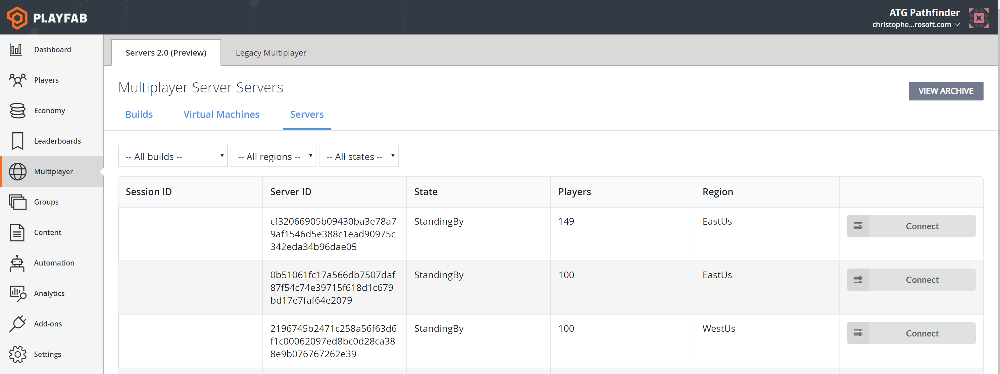
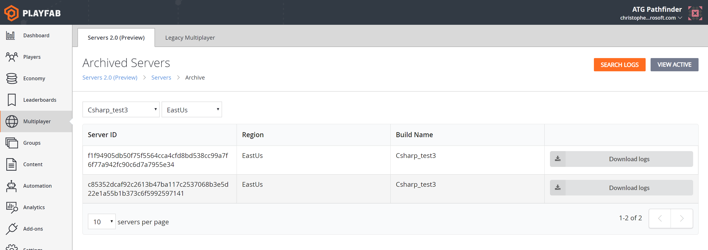
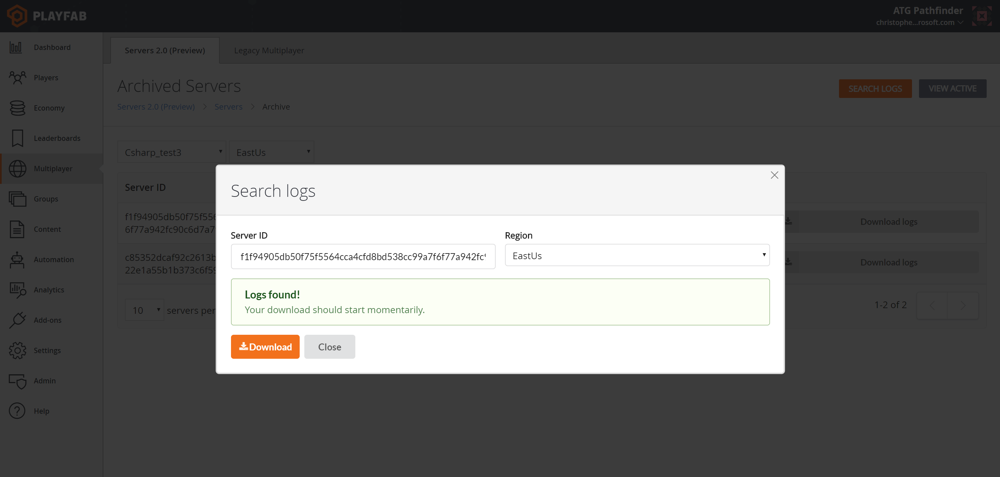

# Archiving and retrieving multiplayer server logs

In several scenarios, you may want to retain logs or other arbitrary file content from your game servers for later analysis. The Game Server SDK provides an API that allows you to write to a log file or access a logging directory.

See [Integrating game servers with the PlayFab game server SDK (GSDK)](integrating-game-servers-with-gsdk.md) to learn more about these logging mechanisms.

**Archived Servers** is the vehicle for retrieving these logs after the game server has terminated.

First, go to the **Servers** page in the **Multiplayer Servers 2.0 tab**, and select **View Archive** on the top right, as shown below.

To do this programmatically, use the [ListArchivedMultiplayerServers](xref:titleid.playfabapi.com.multiplayer.multiplayerserver.listarchivedmultiplayerservers) method.

Use the **Search Logs** button to download logs for a specific server by **Server ID**. The programmatic equivalent is the [GetMultiplayerServerLogs](xref:titleid.playfabapi.com.multiplayer.multiplayerserver.getmultiplayerserverlogs) method.

