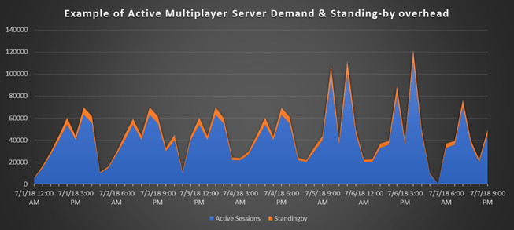

# Billing for PlayFab Multiplayer Servers 2.0

Most PlayFab services, including PlayFab Multiplayer Matchmaking, are included with every paid PlayFab pricing mode, as part of our core offering. However, PlayFab Multiplayer Servers are billed on a consumption basis. This document describes that billing plan.

## What comes with your basic PlayFab Core Services package?

When MPS is enabled, you can use Multiplayer Servers for free in a limited capacity to evaluate the building of multiplayer server games.

| Service |Included Free| Region |
|-|-|-|
|Dasv4 VM core hours | 750 Dasv4 core hours | East US |
|Dasv4 VM core hours | 750 Dasv4 core hours | North Europe |
| Network Egress | 10 GB | Zone 1 |
| Network Egress | 10 GB | Zone 2 |

The free evaluation mode also includes limit imposed on simultaneous cores activated in game servers.  The paid modes, however, allow game developers to request additional server cores for their title.

The maximum simultaneous core quota in the free evaluation modes is:

| Service | Included Free | Region |
|-|-|-
| Maximum Dasv4 cores | 24 Dasv4 cores | East US |
| Maximum Dasv4 cores | 24 Dasv4 cores | North Europe |

This is typically *not* enough to launch a live game, but it can help you evaluate the service and get started.

To learn more about these different virtual machines, see [Azure VM Sizes](/azure/virtual-machines/sizes).

> [!NOTE]
> The amount of free evaluation capacity provided per month is based on your PlayFab billing mode and is also calculated based on core hours. This means that if you use a **single core ** Av2 series VM (like A1v2), you have 750 free hours. But if you use a **dual core ** Av2 series VM (like A2v2), you have 375 free hours instead—750 divided by 2 equals 375.

## <a name="consumption-pricing"> Consumption pricing for PlayFab Multiplayer Servers</a>

Games that require Multiplayer Servers must purchase additional capacity through PlayFab's consumption pricing plan. Below are the PlayFab resources that are used to bill for server utilization:

- **Virtual machine instance hours** - The hours of virtual machine time that your game servers are utilizing. Different virtual machine and container selections are priced at different rates. See [Multiplayer Servers detailed price sheet](multiplayer-servers-detailed-price-sheet.md) for more information.
- **Network egress** - The volume of data transmitted by your game servers to the Internet (in gigabytes). Network egress is billed at different rates depending on the originating data center.

A typical monthly bill might be:

| *Line item*| Consumption |Unit |Rate | Sub-total
|-|-|-|-|-|
| Multiplayer Servers - D2v2 - US East | 1000 | VM Hours | $0.252 | $252.00 |
| Multiplayer Servers - D2v2 - US South Central | 1000 | VM Hours | $0.252 | $252.00 |
| Multiplayer Servers - D2v2 - US West | 1000 | VM Hours | $0.252 | $252.00 |
| Multiplayer Servers - D2v2 - West Europe | 1000 | VM Hours | $0.252 | $252.00 |
| Multiplayer Servers - D2v2 - Australia  East | 100 | VM Hours | $0.302 | $30.20 |
| Multiplayer Servers - D2v2 - East Asia |100 | VM Hours | $0.277 | $27.70 |
| Multiplayer - Data Egress - Zone 1 |1000 | GB | $0.05 | $50.00 |
| Multiplayer - Data Egress - Zone 2 |100 | GB | $0.08 | $8.00 |
| *Total* | |  |  | $1,124.90 |

## Estimating cost with an example

The primary inputs into your multiplayer server deployment are:

1. The amount of multiplayer activity (total user-minutes).
2. The number of users playing in a single session.
3. Compute, storage, and networking resources are required for a session.
4. Overhead for stand-by sessions.

An example:

| Input|  Definition|
|-|-|
|12 minutes| Average multiplayer gameplay minutes per user per month
|100,000 users| Unique users per month
|4 users| Average users per session

```console
  12 User Minutes          100,000 Users        1 Session                  Session Minutes
------------------    × -----------------  ×   ------------   =  300,000  -----------------  
     User⁄Month               Month             4 Users                        Month
```

At 100,000 users, each averaging 12 user minutes per month, this comes out to 1.2 million user minutes. Dividing this number by the average users per session (4) results in 300,000 total session minutes used.

In this example we're packing 3 servers on a **2-core D2_v3** virtual machine:

| Input |Definition |
|-|-|
| 3 Servers|Servers per virtual machine |
|D2_v3 |Virtual machine size|

```console
300,000 Server Minutes       1 D2_v3 VM        100,000 D2_v3 VM Minutes
----------------------- x    ------------ =    ------------------------
         Month                3 Servers                Month
```

Since we're running 3 servers on our **D2_v3 VM**, we can divide the total session minutes used (300,000) by the number of servers (3) to figure out approximately how many **D2_v3 VM** minutes (100,000) have been used this month.

Traditional multiplayer server hosting may require you to pay for significant overhead capacity, to handle natural variation in player activity.

It's common for games to have higher levels of concurrency during the weekends and holidays that require you to "prepay" for more servers than necessary, as shown below.



PlayFab Multiplayer Server builds automatically scale with your player base. Servers are transitioned to the active state by calling [RequestMultiplayerServer](xref:titleid.playfabapi.com.multiplayer.multiplayerserver.requestmultiplayerserver), and are later recycled when your game server terminates (typically the end of a "multiplayer round").

However, delivering this dynamic scaling with minimal allocation latency requires some overhead, which originates from two key sources:

1. **Standing-by servers** - Players don't want to wait for servers, and PlayFab targets a 3-second response time for fulfilling a server request. PlayFab maintains a set of standing-by servers to ensure that servers are immediately available. As this standing-by pool is consumed by new allocations, PlayFab initializes new standing-by sessions. The number of standing-by sessions required is dependent on how fast new sessions are requested during peak utilization, and how quickly they can be created and initialized.

2. **Virtual machine fragmentation** - If you host multiple sessions on a single virtual machine, there can sometimes be extra stand-by capacity due to fragmentation. In our example of three sessions per virtual machine, a virtual machine might have only one active session, and the remaining two "spaces" are added to the stand-by pool. Until the active session is terminated, the virtual machine must stay online - even if the additional stand-by capacity isn't needed.

> [!NOTE]
> Typically, these sources of overhead increase the required compute-hours by *20%*.

### Calculating networking

Network egress can be a substantial expense, especially for large multiplayer sessions with many simultaneous connected players (32+). During development and testing, run your server locally to get an estimate of its network utilization during play.

| Input| Definition |
| -| - |
|1  | Megabytes per second transmitted from the server during active play|

```console
300,000 Session Minutes × 60 Seconds/Minute × 1 MBPS/Session   = 18,000,000 MB
```

In this example, assume that testing shows that a multiplayer session sends 1 MB of data per second of active play.

Since we earlier calculated 300,000 server minutes used in a month, we can estimate that 300,000 users x 60 MB per minute equals 18,000,000 MB of data sent per month.

## How to pay

PlayFab offers three pathways for billing.

1. **Billing through credit card.**
2. **Billing through PlayFab invoicing.** This is ideal for many professional projects, but requires you to contact our [customer services group](https://playfab.com/contact/) to get set up.
3. **Billing through Azure & Microsoft Enterprise Agreements.** This is ideal for organizations that may have a volume deal with **Azure** or another **Microsoft** product line. Contact our [customer services group](https://playfab.com/contact/) or your **Azure** solutions specialist to learn more.

In all three options, you receive a detailed analysis of your multiplayer server activity in Game Manager. However - for Azure/EA customers - the final invoicing through Azure is simplified, and will show these high level line-items denominated in dollars:

- PlayFab Essential Services
- PlayFab Multiplayer Servers
