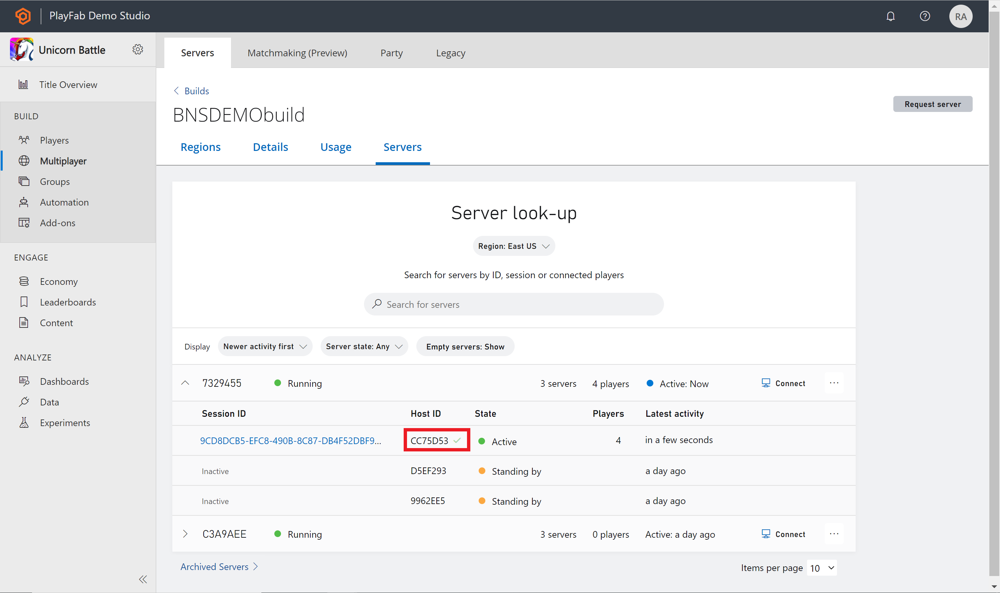
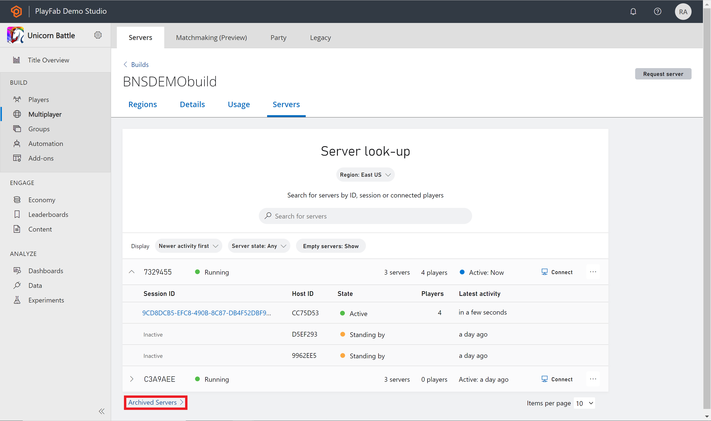

# Servers overview page

This article describes the servers page for a specific build for Multiplayer Servers in Game Manager. 

To get to this page, you'll need to select a build from the builds overview page and then select the Servers tab at the top.

From the Servers page, you can see details of your Virtual Machines (VMs). This page will list all the VMs and their servers. You can search for a specific server, filter, or request a server. Once you expand a VM, the following information is available per server: 

* Session ID (only if currently active)
* Host ID
* Session state
* Number of players connected
* Latest Activity

To find more servers you can change the **Region** filter at the top of the page, search for a server, or sort based on the filters next to **Display**. If you would like to request a server, you can select the **Request server** button located on the top right portion of the page.

For VM or Host ID, only the last seven characters of the ID are shown. To view the full VM or Host ID, hover over the ID. If you would like to copy an ID select the ID itself, a checkmark will appear next to the ID when complete.

## Search servers
When searching for servers, you can search based on any of the following criteria: 

* VM ID
* Server Host ID
* Server Session ID
* Server IPv4/IPv6 Address
* Server FQDN
* Connected players

All search results will be sorted by the latest activity column. 

## Server details

Once a server becomes active, you can select on the Session ID to navigate to the **Server Details** page.

On the servers details page, you can see more information about that specific server. Including but not limited to connected players and region. You can also shut down your server or connect to the VM by selecting the buttons in the top-right corner.

## Archived servers
Once a server has been shut down, the state will be terminated and be moved to the **Archived servers** page. If you would like to see an archived server, select the link at the bottom of the servers page called **Archived Servers**. The list of archived servers will show you the last 30 days of servers that have been archived. 

## Server logs
If you find that you would like to learn more about your archived servers, you can download the logs found under **Archived Servers**. Next to each server is a **Download logs** button if you select that it will download a zip file of your logs from that file. 

## See also

* [Archiving and retrieving multiplayer server logs](archiving-and-retrieving-multiplayer-server-logs.md)
* [Builds overview](build-overview.md)