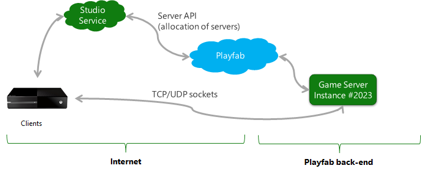

# Connecting clients to game servers

Playfab game servers are containerized applications. When game servers are deployed to **Azure**, their networking environment is virtualized and the game server will not have direct access to its Internet accessible **IP** addresses.

Instead, game servers using `GetAdaptersInfo` (**Windows**) or `GetIfAddrs` (**Linux**) will observe a single network adapter with non-unique **IP** addresses that have been configured through **Network Address Translation** (**NAT44**). This usage of network virtualization and NAT allows game servers to maintain connections even as underlying **Azure** infrastructure may be changing. All game servers have **IPv4** connectivity, but **IPv6** connectivity will be added in the future.

You may configure a server deployment to pack multiple game server instances on a single virtual machine. For the most part this does not modify the network environment, as containerization allows each game server instance to have independent IP addresses and TCP/UDP port spaces. However, all instances on a single virtual machine do share the physical network infrastructure and can create network contention. While testing high-density configurations it is important to test that typical contention does not cause unacceptable gameplay issues.

Different virtual machine sizes and operating systems are provisioned with differing levels of bandwidth. To see the bandwidth provisioned for a specific SKU, please refer to [Azure’s throughput documentation.](https://docs.microsoft.com/en-us/azure/virtual-machines/windows/sizes-general)

## Connecting game clients

Typically, game servers will listen on well-known UDP and TCP ports selected by the game developer. Clients then initiate TCP or UDP flows against NATed ports on the Azure edge that flow back to the game server.

The following diagram shows the data flows for custom game servers.

Game servers are allocated through service-to-service calls through the Playfab server **API**. The connection information required for client connectivity is passed through these services and clients which typically use **TCP** or **UDP** sockets to drive a direct connection to the game server.

### Communicating server addressing information from Playfab to clients

Game clients need the Internet-facing IP address of your game servers to connect to them. Clients also need port forwarding information to allow well-known ports that the server is listening upon to be addressable through the **Azure** network virtualization apparatus.

When you allocate a game server, the response information provides:

- Public **IPv4** Address
- A mapping of developer-provided ports (by name) to the Internet-facing port

|Game Server Protocol Name|Protocol | Internet-facing Port|
| ------------- |-------------| -----|
|Multiplayer | **UDP** |  3098 |
|Debugger | **TCP** |  23222 |

## Enabling TCP/UDP ports for game servers

The port requirements provided through Game Manager or the [CreateBuildWithManagedContainer()](xref:titleid.playfabapi.com.multiplayer.multiplayerserver.createbuildwithmanagedcontainer) method, enables game clients to contact the virtual machine. Enabling these ports also configures the firewall on the resident operating system to enable network traffic on the ports you specify.
