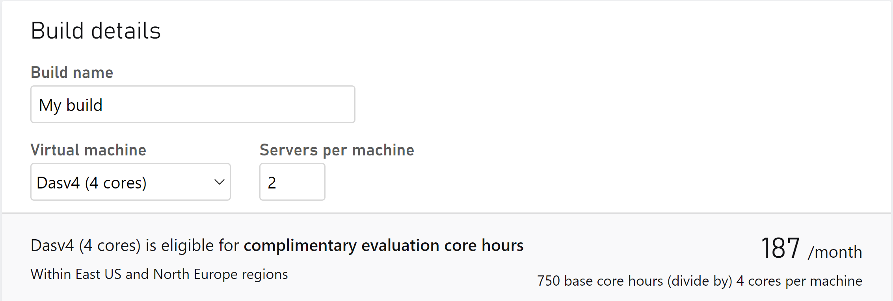
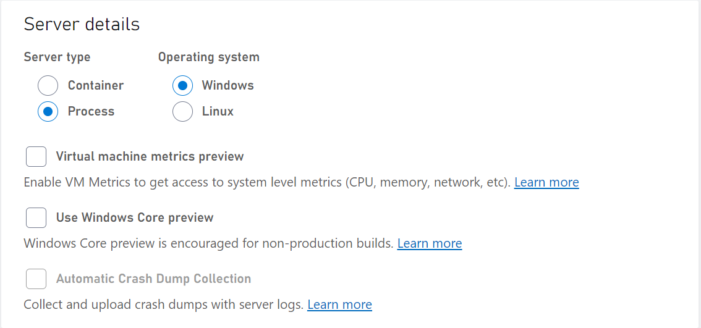
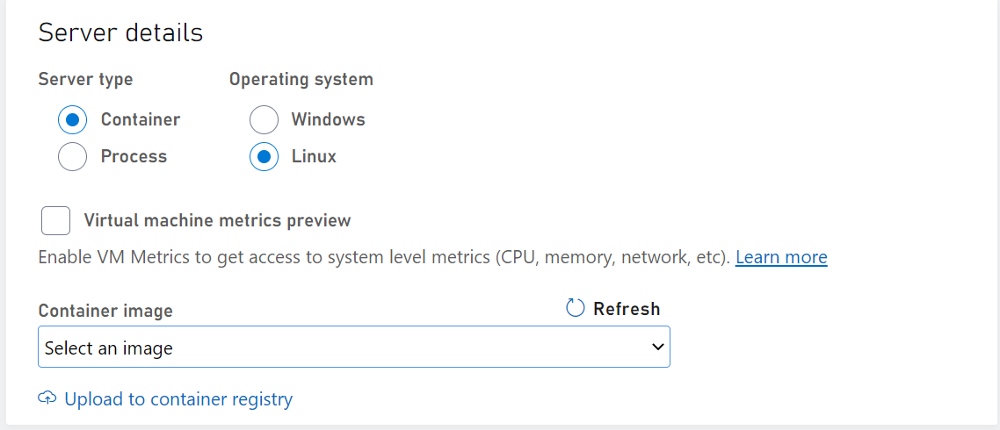
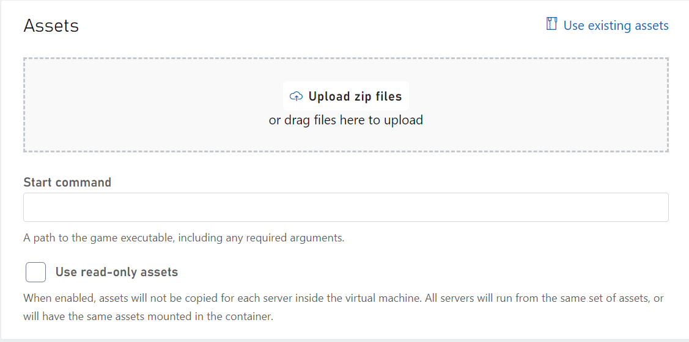

# Deploy builds using Game Manager

This article lists the general steps to deploy/create builds for VMs using Game Manager.

If this is your first time deploying a build, we recommend deploying a build using the [Windows Runner C# sample](windows-runner-sample.md) or [Wrapper sample](wrapper-sample.md). Both will come with all the assets you need to actually deploy servers.

> [!Note]
> In order to use and view the PlayFab Multiplayer Servers, you need to enable the feature from Game Manager. For instructions, see [Enable the PlayFab Server feature](enable-playfab-multiplayer-servers.md).

For details about the values you can use for each parameter, see [Build definition](build-definition.md).

## Steps to deploy through Game Manager

1. Sign in to [Game Manager](https://developer.playfab.com)
1. Go to **My Studios and Titles** page and select your game title to display the dashboard
1. Go to **Multiplayer** > **Servers** page, select **New Build** at the top right to create a new build
1. Starting with the Build details, use a descriptive string as the Build Name
1. Select a server with limited-free usage, such as **Dasv4** during development. To learn more about pricing, see [Billing for PlayFab Multiplayer Servers](billing-for-thunderhead.md)
1. Set a value you want for Servers per machine

    Image below shows values used in the info section.
    

1. Next we have the server details portion where you'll need to select an OS type either **Windows** or **Linux**. Then you'll select your server type, either process or container based on the OS you choose.

> [!Note]
> For Linux platform, you need to create your own container image. For more instructions, see [Create and deploy Linux container images](deploying-linux-based-builds.md). If you've already uploaded a container image, it will appear in the __Image__ dropdown. To use it, select the image.

Once you've selected your OS type, you can then choose the server type. Based on the OS/Server type you'll have the following features you can enable.

- Virtual Machine Metrics Preview: By enabling the metrics it allows you to see system level metrics such as CPU, memory, network, etc. To learn more, read our [VM performance metrics (preview) article](vm-metrics.md)
- Windows Core Preview: Allows you to test the newest versions of Windows operating system on test builds to see how your game will run with the newer operation system. To learn more, read [OS patch level updates for Windows](os-patch-updates.md)
- Automatic Crash Dump Collection: Allows you to enable automatic crash dump collection on your **Windows Container** server types. You can choose between doing a full, mini, or custom dump. To learn more, read [Enabling automatic collection of crash dumps](crash-dump-collection.md)

### Server details for Process mode
Image below shows values used in the OS section when you select Windows as the platform but use Process based server type. There's also the option of using Linux process based servers as well. 



### Server details for Container mode
Image below shows values used in the OS section when you select Linux as the platform but use Container based server type. There's also the option of using Windows container based servers as well. 


## Assets for builds
7. Under Assets, select **Upload**. Navigate to folder with the compiled PlayFab Multiplayer Server Build and then select the .zip package to upload.

### Assets for Windows servers
* For Windows platform, you must upload a PlayFab Game Server Build as an asset. To learn how to create a PlayFab Game Server Build, see [Author a game server build](author-a-game-server-build.md). Upload assets to modify and customize the Windows container image. Mount path for the assets in windows servers should be rooted in C drive.

**Assets for Windows container servers**

Assets for windows servers will need to be in the C drive otherwise the API may return an error. The mount path is **only** necessary for containers. 

> [!Note]
> Do not provide a mount path for process based servers.

### Assets for Linux servers 
* For Linux platform, uploading an asset is optional as the  Game Server can be included as part of the container image. But you must still have a Game Server, make sure the mount path is valid within the container you're uploading. 

If you're uploading assets:
* Set __C:\Assets__ or select a different path as the mount path
* Set  __C:\Assets\YourGameServerBuild.exe__ as the Start Command



## Network settings
8. For network, set the port number, name, and protocol. 

### Setting port for container server types
If you're using a container server type, you should specify the port number. 

For example, in Game Manager for a container server type, you could specify:
* Port name: "gameServerPort"
* Port number: 7777
* Protocol: UDP


Then in your code you would do something like the following
```C#
int port = 7777; // since you already know the port
GameServer gs = new GameServer(port);
gs.start();
```

> [!Note]
> In container mode, each game server runs on its own network namespace. This is the reason why every game server can listen to the same port. The container port is dynamically mapped to a unique port on the virtual machine. However, on process mode, all game servers run on the same network namespace. Having all game servers listen to the same port would create conflicts, so this is why you'll need to get the ServerListeningPort from the GSDK.

### Setting port for process server types
For process server type, you should use the GSDK to retrieve your port number. Don't include a port number as part of the build definition.


Then in your code you would do something like: 
```C#
var gsc = GameServerSDK.GetConnectionInfo();

var gp = gsc.Where(x=>x.Name=="gameServerPort").Single();

GameServer gs = new GameServerPort(gp.ServerListeningPort);
```
To view the full sample code, go to [GameServerConnectionInfo.cs](https://github.com/PlayFab/gsdk/blob/master/csharp/GSDK_CSharp_Standard/GameServerConnectionInfo.cs) in [GSDK/CSharp/GSDK_CSharp_Standard](https://github.com/PlayFab/gsdk/tree/master/csharp/GSDK_CSharp_Standard)
The above code sample that gets the port from the GSDK would work in container mode as well.

## Start command
### Start command for container based servers
Your start command should be the absolute path (including the mount path) to your game executable that should include any required arguments. For example, your start command could look like C:\Assets\wrapper.exe -g C:\Assets\fakegame.exe arg1 arg2. Adding in the "C:\Assets" portion to your absolute path for your start command is only required if it's a Windows container based server. This is because that's the directory where your game asset would be extracted from.

### Start command for windows process based servers 
Your start command is the relative path within the uploaded asset. If the executable is directly within the asset folder, then you can just use <yourGameServerBuild.exe>. If it is within another folder (for example GameDirectory), then the start command would be gameDirectory/YourGameServerBuild.exe.


9. Under Regions, select the region you want to deploy the servers. Then specify the number of standby and maximum servers.
10. Select **Save** to start the deployment process. You'll be taken to the build home page. The build will display the **Deploying** status as show in the image below. 

In a couple minutes, your build should be in the **Deployed** state. This means that servers are deployed and can be allocated. For more information on allocating game servers, you can check [here](allocating-game-servers-and-configuring-vs-debugging-tools.md) whereas you can use the [MpsAllocatorSample](mps-allocator-sample.md) to experiment with server allocation.

## Configure region information

After deploying builds, you can still modify the following parameters.
* Regions
* Standby servers
* Maximum servers

To configure regional settings:
* Go to the __Servers__ > __Builds__ page
* Select the build you want to modify
* On the __Regions__ tab, go to the **Servers by region** section
* Add/remove region and modify the server numbers


> [!Tip]
> During development, shut off any unused or unhealthy regions to avoid VM core hour usage. Core hour usage begins during VM startup and continues until the VM is shut off. VMs in a region will not automatically be shut off unless the region's target standby servers reach 0, or a region is deleted. 

### Shutting down VMs
There are three ways to shut down VMs 
1. Set a region's **target standby** to 0, this will shut down VMs for this region only.
2. Delete a specific region from a build.
3. Delete the whole build, this will shut down VMs across **all regions** for this build.


## See also

* [Walkthrough: Deploy builds using Game Manager](quickstart-for-multiplayer-servers-game-manager.md)
* [Deploy a build using PowerShell/API](deploy-using-powershell-api.md)
* [Create your first server](create-your-first-server.md)
* [Wrapper C# sample](wrapper-sample.md)
* [MPS Allocator Sample](mps-allocator-sample.md)
* [Samples and resources](server-samples-resources.md)
