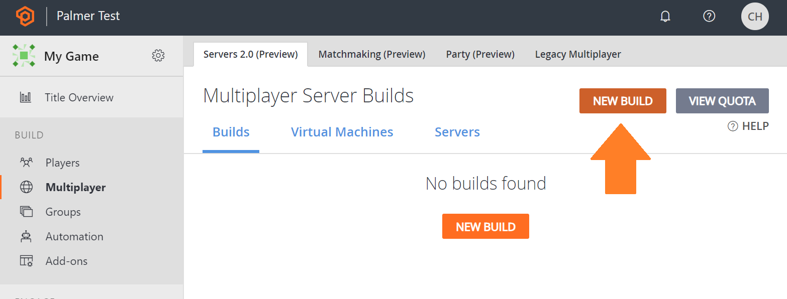
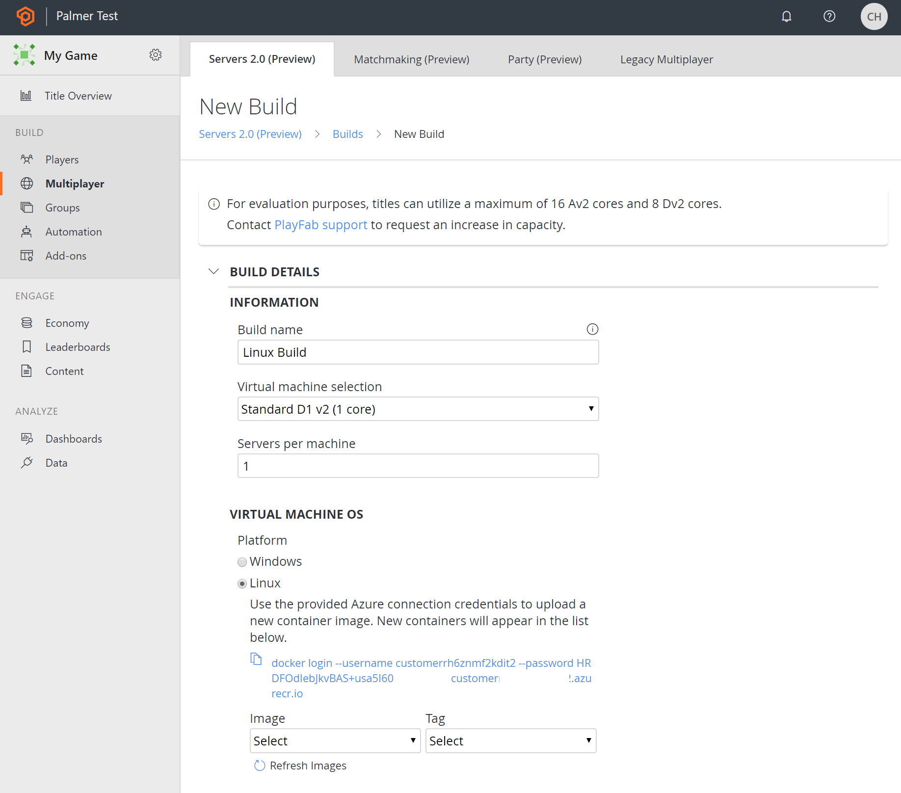

# Deploying Linux based builds

PlayFab Multiplayer Servers can deploy Linux-based game servers. While Windows managed container configuration are a simple and default choice for many game developers, Linux servers are deployed on virtual machines running Ubuntu and enjoy a cheaper hourly rate. 

Linux-based multiplayer server builds are deployed and managed very similarly to Windows builds. But there are a few important differences between PlayFab's Windows and Linux options:
1.  Linux multiplayer servers integrate with the same Game Server SDK, [you can use LocalMultiplayerAgent to test this integration](https://github.com/PlayFab/MpsAgent/blob/main/lcow.md).
2.  Linux servers are uploaded as containers which PlayFab deploys without modification, unlike Windows servers which are uploaded as zip files and deployed using a PlayFab managed container image. You can still upload zip/tar/tar.gz files and associate them with server builds if you do not want to bundle everything in to a container.


## Deploying a Linux build with APIs

With Linux servers, you have complete control over the container image. PlayFab operates a container registry for each PlayFab Multiplayer Server customer, to make it easy to upload containers and scale them as multiplayer server builds. The steps below provide an overview of how to use PlayFab APIs to create a Linux-based server build:

1. Integrate your Linux application with the [PlayFab Game Server SDK (GSDK)](integrating-game-servers-with-gsdk.md).
2. Call the [GetContainerRegistryCredentials](https://docs.microsoft.com/rest/api/playfab/multiplayer/multiplayerserver/getcontainerregistrycredentials?view=playfab-rest) API to retrieve a container registry address, user name, and password.
3. Use [docker push](https://docs.docker.com/engine/reference/commandline/push/), or another container registry client, to upload your container to the PlayFab operated registry. Use a meaningful and helpful tag, as the tag is used to link multiplayer server builds to uploaded container images.
4. Use [ListContainerImages](https://docs.microsoft.com/rest/api/playfab/multiplayer/multiplayerserver/listcontainerimages?view=playfab-rest) and [ListContainerImageTags](https://docs.microsoft.com/rest/api/playfab/multiplayer/multiplayerserver/listcontainerimagetags?view=playfab-rest) to ensure your new image and tag are listed (sometimes it might take a couple of minutes for image to be fully registered in the system).
5. Call the [CreateBuildWithCustomContainer](https://docs.microsoft.com/rest/api/playfab/multiplayer/multiplayerserver/createbuildwithcustomcontainer?view=playfab-rest) API to create a build with a custom container. Specify the tagged image you uploaded earlier. Ensure the following properties are set on the request:
  * **ContainerImageReference** - The image name and tag that was uploaded earlier (and is visible in ListContainerImages and ListContainerImageTags above).
  * **ContainerFlavor** - "CustomLinux"
  * **ContainerRunCommand** (Optional) - In case your container doesn't have a default command that it runs, this can be used to provide the command to run, along with any arguments.
6. The rest of build lifecyle (viewing usage, updating regions and standingBy configurations, deletion) can be managed via Game Manager.

## Using Game Manager
Game Manager can help upload Linux builds and reduce the number of required REST interactions. The process is similar:

1. Integrate your Linux application with the [PlayFab Game Server SDK (GSDK)](integrating-game-servers-with-gsdk.md).
2. In Game Manager, press the NEW BUILD button to enter the build creation page.



3. Select Linux as the virtual machine operating system. 



4. Use [docker login](https://docs.docker.com/engine/reference/commandline/login/) to access the Azure container registry that is show in Game Manager.
```
docker login --username customer5555555 --password HRDFOdIebJkvBAS+usa55555555 customer5555555.azurecr.io
```
5. Use [docker push](https://docs.docker.com/engine/reference/commandline/push/), or another container registry client, to upload your container to the PlayFab operated registry. Use a meaningful and helpful tag, as the tag is used to link multiplayer server builds to uploaded container images. After the container is uploaded, click refresh in Game Manager to see the image in the list and select it.

```
docker tag hello-world customer5555555.azurecr.io/pvp_gameserver:v1
docker push customer5555555.azurecr.io/pvp_gameserver:v1
```
