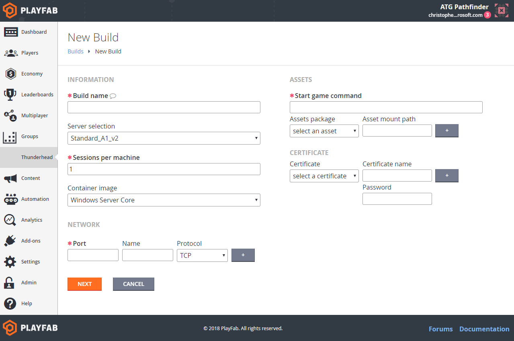
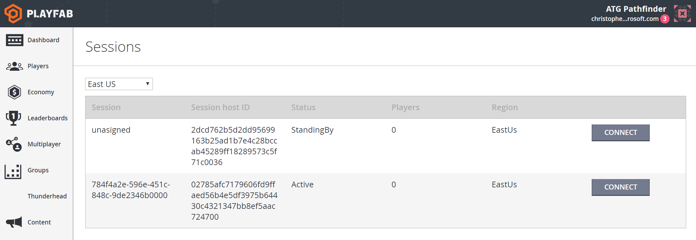

# Deploying PlayFab multiplayer server builds

A PlayFab multiplayer server build is a combination of your game server executable, assets, certificates, and associated configuration that determines how your game scales across Azure.

Some aspects of a build cannot be modified once a build is created, this is the build's *definition*:

- **Assets** - Assets are zip files. At least one asset containing your game server executable is required. (See [Basics of a PlayFab game server](basics-of-a-playfab-game-server.md)). Each asset has an asset mount path that specifies where it is mounted in the container file system. Assets should be less than 10GB in size. A typical mount path might be `C:\Assets`.
- **Machine selection** - Required. The virtual machine size you want to use. PlayFab currently supports four Azure compute families (See [Multiplayer Servers detailed price sheet](multiplayer-servers-detailed-price-sheet.md)).  
- **Servers per machine** - Required. The maximum number of game servers that should be operated on a single virtual machine. A typical configuration may have four servers on a Standard_D2s_v3, providing each server effectively 50% of a core.
- **Certificate** - Optional. A pfx file (Windows) or pem file (Linux) containing a certificate to be installed within the container. Typically a certificate for service-to-service authentication is installed through this configuration.

> [!NOTE]
> Certificate names provided to PlayFab can *only contain letters and numbers*. No spaces or special characters (dashes, underscores, etc.)

- **Network** - Required. A 3-tuple array of Ports, Names, and Protocols (TCP or UDP) that your game server is listening upon for incoming traffic. Outgoing (or solicited) network flows do not need to be configured. (See [Connecting clients to game servers](connecting-clients-to-game-servers.md)).
- **Container** - Required. The container that will host your game server. Currently only Windows Server Core is supported.

You provide the build definition when you create a build through the PlayFab **Multiplayer Servers** tab:



Build configuration can be modified at any time in a build's life. The build configuration is a 3-tuple array containing:

- **Region** - The Azure region where game servers should be deployed.
- **Standby servers** - How many game servers should be maintained in a "standby state" to handle incoming allocations in the specified region. This should be determined by the maximum allocation rate (allocations per second) for the build, and tuned over time as player behavior changes.
- **Maximum servers** - The maximum number of game servers to operate in the specified region


When selecting the virtual machine size and regional configuration, keep in mind the overall usage limits configured for your PlayFab title. See [Accessing increased core limits and additional Azure regions](identifying-and-increasing-core-limits.md).

Once you've provided a valid build definition, you will be able to deploy the build in Game Manager. In 5-10 minutes you should see standing by machines on the **View Sessions** page for your build, as shown below.



After your game has launched, you will probably want to update your game server without interrupting service to players. This is a typical workflow for updating a game server:

1. Create a new build: **Server v2.** Deploy this build with the build package containing your updated game server, assets and certificates as appropriate. From the build page you can use an existing build as a template, this can be helpful if most of the configuration is preserved.
2. On the service performing allocations (through `RequestMultiplayerServer`) - begin allocating and sending players to the new Server v2 build.
3. To reduce server consumption, at this point you may want to reduce the standby sessions configuration on the older *Server v1* build, because the build is no longer taking on new allocations.
4. Eventually gameplay on Server v1 will end, and there will be no more active servers in that deployment. At this point you can delete the build.  You will have successfully migrated your player base to Server v2.

## Managing builds using the multiplayer server API and PowerShell

You may want to manage PlayFab server builds programmatically. You can do this using the [Multiplayer Server APIs](xref:titleid.playfabapi.com.multiplayer.multiplayerserver) directly our using with any of our [PlayFab SDKs](../../../index.md?#pivot=documentation&panel=sdks).

PlayFab multiplayer servers has a simple PowerShell module enabling build management. This module uses PlayFab's C# SDK to interact with the entity API, and can be a useful resource for navigating the entity API.

This module is published on [PowerShell Gallery](https://www.powershellgallery.com/packages/PlayFabMultiplayer/). Install it by running the following in a PowerShell prompt, as shown below.

```powershell
Install-Module PlayFabMultiplayer
```

You may need to run `Set-ExecutionPolicy -ExecutionPolicy Unrestricted` to run the module. If you only want to browse it's code and usage of the entity API, run `Save-Module PlayFabMultiplayer` or view the code on [PowerShell Gallery](https://www.powershellgallery.com/packages/PlayFabMultiplayer/) in the browser.

View help for the module by running:

```powershell
Get-Command -Module PlayFabMultiplayer| Get-Help
```

The PowerShell module, like all of the SDKs, requires you to specify the PlayFab titleid you want to manage, and to provide a developer secret key to authenticate.

You can get this information through **Game Manager** -> **Settings** -> **Secret Key**. Some examples of using the PowerShell module are shown below.

```powershell
## Get an entity token for the specific title and using a developer secret key for auth
Get-PFTitleEntityToken -TitleID "mytitleID" -secretkey "mysecretkey"

## Add an asset and get the list of assets
Add-PFMultiplayerAsset -FilePath "C:\example.zip"
Get-PFMultiplayerAsset

## Add a certificate and get the list of certificates
Add-PFMultiplayerCertificate -Name "CertName" -FilePath "C:\examplecert.pfx"
Get-PFMultiplayerCertificate

##Create a build

$VMSelection = [PlayFab.MultiplayerModels.AzureVMSize]::Standard_D2_v2

$Ports = New-object PlayFab.MultiplayerModels.Port
$Ports.Name = "Test Port"
$Ports.Num = 3600
$Ports.Protocol = [PlayFab.MultiplayerModels.ProtocolType]::TCP

$BuildCert = New-Object System.Collections.Generic.List[PlayFab.MultiplayerModels.GameCertificateReferenceParams]
$BuildCertParams = New-Object PlayFab.MultiplayerModels.GameCertificateReferenceParams
$BuildCertParams.Name = "FakeCert"
$BuildCertParams.GsdkAlias = "FakeCert"

$BuildCert.Add($BuildCertParams)

New-PFMultiplayerBuild -BuildName "PowerShellTest902" -AssetFileName "winrunnerasset_notimeout.zip" -AssetMountPath "C:\Assets\" -StartMultiplayerServerCommand "C:\Assets\WinTestRunnerGame.exe" -MappedPorts $Ports -VMSize $VMSelection -BuildCerts $BuildCert


##View servers for a build
Get-PFMultiplayerServer -BuildName "PowerShellTest"

```
