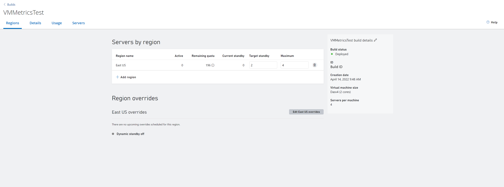

# Create VMs

This article outlines the process to start deploying virtual machines (VMs) for your game servers.

Using our service, you configure VMs to be automatically spun up globally as game servers according to your budget and demand. In order to do so, you don't explicitly create VMs but define parameters that determine how they get created on your behalf. This process is called deploying or creating a build for the VMs. 

For general steps to deploy a build, see the section below. If you already have a build and want to update it, see [Safe deployment using alias](allocating-with-build-alias.md#safe-deployment-that-is-backwards-compatible).

> [!Note]
> The builds that you deploy for VMs are not game server builds. This build defines when and how VMs are deployed. Game server builds run on servers, just like client builds run on clients. You upload the game server build as an asset or include it as part of a container image, so it runs on the VMs when it gets created.

## Steps

Details about each available option are provided in [Build definition and configuration](build-definition.md).

1. Select from a broad range of VMs distributed globally based on number of cores, storage space, and RAM. For more information about the VMs, see [Multiplayer Servers details and price](multiplayer-servers-detailed-price-sheet.md)
2. Select the OS for the VM&mdash;Windows or Linux. The way builds are deployed for Linux servers are similar to Windows servers with a few important differences. To learn more, see [Using Windows and Linux servers](deploying-linux-based-builds.md).
3. Upload your assets like the PlayFab Multiplayer Game Server Build. For more information on how to create this, see [Author a game server build](author-a-game-server-build.md).
4. Determine network settings&mdash;port number and protocol
5. Set other parameters such as maximum number of servers and number of standby servers for the regions

Once you've provided a valid build definition, the build starts deploying. You'll be automatically directed to the **Server** page. In 5-10 minutes, you'll see standby machines for your build, as shown below. 

To see more information about your build select the name of your build you would like to drill into. On the build page you can see your build status, ID, creation date, region with number of servers, and more information, as seen below. 

In order to see your servers, their status, and to easily request a server select the **Servers** tab at the top. To learn more read our documentation on [servers overview](build-server-overview.md)

## Ways to deploy

There are two ways to deploy or create a build for the VMs.

1. [PlayFab portal&mdash;Game Manager](deploy-using-game-manager.md)
2. [Using PowerShell/API](deploy-using-powershell-api.md)

To help you evaluate and develop using our servers, certain servers have limited free usage and capacity limits. For more information, see [What comes with your basic PlayFab Core Services package?](billing-for-thunderhead.md?what-comes-with-your-basic-playfab-core-services-package).

To start deploying a build using our samples, see [Create your first server](create-your-first-server.md).

> [!Tip]
> During development, shut off any unused or unhealthy regions to avoid VM core hour usage. Core hour usage begins during VM startup and continues until the VM is shut off. VMs in a region will not automatically be shut off unless the region's target standby servers reach 0, or a region is deleted. 

### Shutting down VMs
There are three ways to shut down VMs 
1. Set a region's **target standby** to 0, this will shut down VMs for this region only.
2. Delete a specific region from a build.
3. Delete the whole build, this will shut down VMs across **all regions** for this build.

## See also

* [Create your first server](create-your-first-server.md)
* [Deploy a build using Game Manager](deploy-using-game-manager.md)
* [Deploy a build using PowerShell/API](deploy-using-powershell-api.md)

