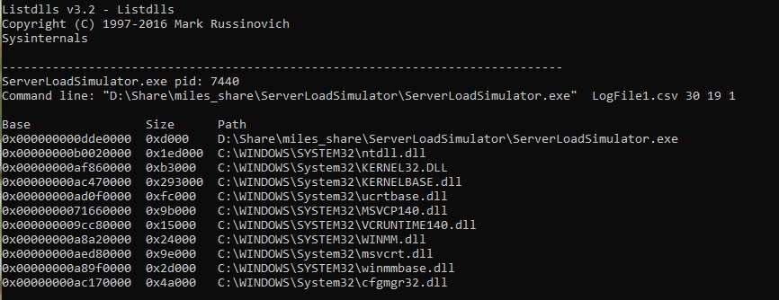
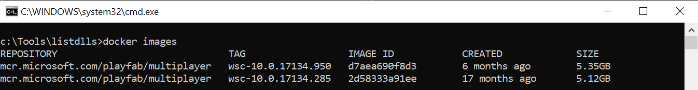

# Determining required DLLs that need to be included in the asset package
This article helps you generate a list of DLLs required to run your Windows game server in PlayFab Multiplayer Servers.
By default, the managed container image includes many commonly used DLLs. To determine which additional DLLs are needed, compare the list of DLLs for your game server with the list of DLLs included in the manged container image. Any additional DLLs must be included in your asset zip file.

## Determine required DLLs
Use the [ListDlls](/sysinternals/downloads/listdlls) utility to list all of the DLLs that are loaded when you run your game server locally. To generate the list:

1. Download [ListDlls](/sysinternals/downloads/listdlls) from sysinternals.
1. Run your game server executable on your local machine by using the instructions found in [local debug steps](locally-debugging-game-servers-and-integration-with-playfab.md) in **process mode** or as a standalone process without using the [LocalMultiplayerAgent](https://github.com/PlayFab/MpsAgent).
1. Run listdlls and specify your running game server as a parameter. Example: `listdlls ServerLoadSimulator.exe`
1. Compare the list that is output against the list of DLLs included in your asset zip file (typically everything in the same folder as your executable). The delta between the lists are the system DLLs that are required by your game server. 



## Compare required DLLs with those included in container
With the list of system DLLs determined, the next step is to determine which of these system DLLs are already included in the container.
1. Download the PlayFab multiplayer container image. To download the container image, run the setup.ps1 script referenced in [local debug steps](locally-debugging-game-servers-and-integration-with-playfab.md). Alternatively, allocate a new MPS instance and connect via Remote Desktop. All Windows MPS instances will have the container image downloaded.
1. Start a command line session in a new docker container by running the following command. You might need to run an administrator command window.
```bash
docker run -it mcr.microsoft.com/playfab/multiplayer:wsc-10.0.17134.950 cmd
```
Replace "wsc-10.0.17134.950" with the tag of the docker image you downloaded in step 1. If you are not sure of the correct tag, run `docker images` to list the downloaded images. 
1. From the command line, locate the folders that correspond to the folders of the required DLLs on your local machine.  List the DLLs present in the container and compare to the list of required DLLs that you generated. Any DLLs in the required list, but not present in the container, must be included in your asset zip file.
1. To end the cmd process and cause the container to stop, type `exit`.
