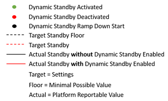
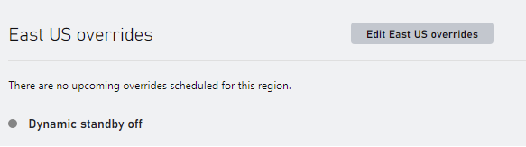
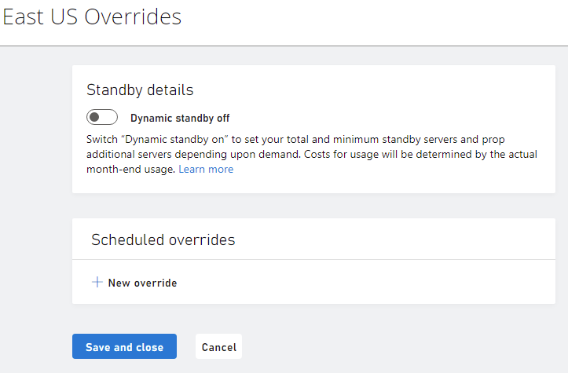
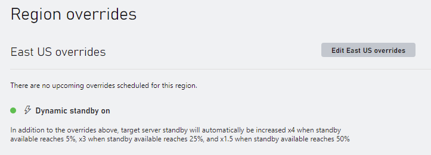

# Dynamic Standby

Dynamic Standby is an auto scaling enhancement that monitors standby server threshold levels and dynamically activates increased provisioning of game servers to meet demand at scale.

Dynamic Scaling enables you to follow the demand curve for your player traffic, reducing the need to manually provision multiplayer server capacity in advance.  For example, you can set thresholds to multiply standby servers by amounts when standby servers deplete to percentage of “standby available”.

## Terminology

- Dynamic Standby Settings – A game developer configurable programmatic object representing Dynamic Standby settings to avoid standby pool starvation.
- Dynamic Standby Activated – The point in time when the Multiplayer Servers platform starts allocating standby servers at a rate aligned with the dynamic Standby settings, overriding that target standby floor settings.
- Dynamic Standby Deactivated – The point in time when the Multiplayer Servers platform stops allocating standby servers at a rate aligned with the dynamic Standby settings, restoring the target standby floor settings.

## How it works

Game developers specify a target standby floor value for the minimum number of standby servers. If the rate at which active servers are allocated grows rapidly, the actual standby servers may hit zero. If Dynamic Standby is enabled, an auto scaling heuristic will trigger and adjust the target standby value used by the platform to compensate for the rate of active server allocations.

To state this another way, if the number of available standby servers decreases at a rate that could lead to standby pool starvation, dynamic standby will increase the target number standby servers.

The following graphs show the difference of availability of servers when Dynamic Standby is enabled and when it is disabled.

|             Chart          |            Legend           |
| --------------------- | --------------------- |
|  |  |

At time T2, even though the target standby floor setting is 10, the actual standby value reported by the platform is near zero because the rate at which active servers are allocated is too large for the number of standby servers. With Dynamic Standby enabled, the target standby is set to 20. This allows the standby pool to handle the request rate and rebuild to handle the additional growth in active servers.

### Calculating Dynamic Standby Targets

With Dynamic Standby enabled, the target standby is calculated for each threshold configured:

**IF** (Active Servers \> 1X Target Standby) **AND** ((Actual Standby / Target Standby Floor) \< 0.50) **THEN** Target Standby = 1.5 \* Target Standby

**IF** (Active Servers \> 1X Target Standby) **AND** ((Actual Standby / Target Standby Floor) \< 0.25) **THEN** Target Standby = 3.0 \* Target Standby

**IF** (Active Servers \> 1X Target Standby) **AND** ((Actual Standby / Target Standby Floor) \< 0.005) **THEN** Target Standby = 4.0 \* Target Standby

Revisiting figure \#1 above, the following table illustrates the target standby calculation inputs and its values:

| Time  | Active Server Count  | Active Server Allocation Rate   | Target Standby Floor | Actual Standby  |  Target Standby |
|---|---|---|---|---|---|
| T0 | 40 | >+40 servers per time T| 10 | 10 | 10 |
| T1 | 20 | -20 servers per time T | 10 | 10 | 10 |
| T2 | 30 | +10 servers per time T | 10 |  4 | 35 |
| T3 | 50 | +10 servers per time T | 10 |  1 | 40 |
| T4 | 70 | +20 servers per time T | 10 |  4 | 40 |
| T5 | 80 | +10 servers per time T | 10 | 10 | 40 |
| T6 | 50 | -30 servers per time T | 10 | 10 | 10 |

When Dynamic Standby is deactivated, there is a gradual ramp down of standby servers until the original standby floor is reached.

## Dynamic Standby User Interface

The Dynamic Standby feature can be enabled from the developer portal by navigating to the Multiplayer | Servers | Build Regions page. Dynamic Standby settings are uniquely applied to each region of a build. When enabled, the Build Servers by Region table presents a lightning bolt next to the region name

To enable Dynamic Standby, create a region overrides by selecting Edit overrides to configure scaling settings for a specific region.

When the dynamic standby button is toggled in the on position, the dynamic overrides dialog expands to with configuration options.  The options control how Dynamic Standby responds when it ramps up or down due to player demand.  Each dialog input is described in the table below:

| Dialog Input | Description |
|---|---|
| Standby servers | The target number of servers to have waiting for an allocation before applying dynamic standby  |
| Maximum servers | The maximum number of servers that will be started including servers in all states  |
| Ramp down time | The amount of time after a threshold is no longer triggered before the target standby will be reduced to the normal level  |
| Dynamic Activation Thresholds | The thresholds at which to trigger dynamic standby |
| Percent Standby | The threshold triggered when current standby drops to this percentage of the base target standby  |
| Multiply by | The target standby will be multiplied by this amount while the threshold is reached |

After making changes to the dynamic overrides of a region, select Save and close to save the changes made and return to the build regions summary page.  The builds region summary page indicate that Dynamic standby is enabled and briefly summarize the threshold settings.

