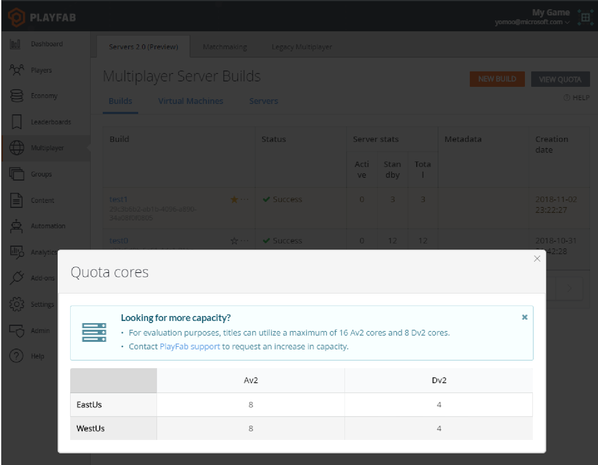
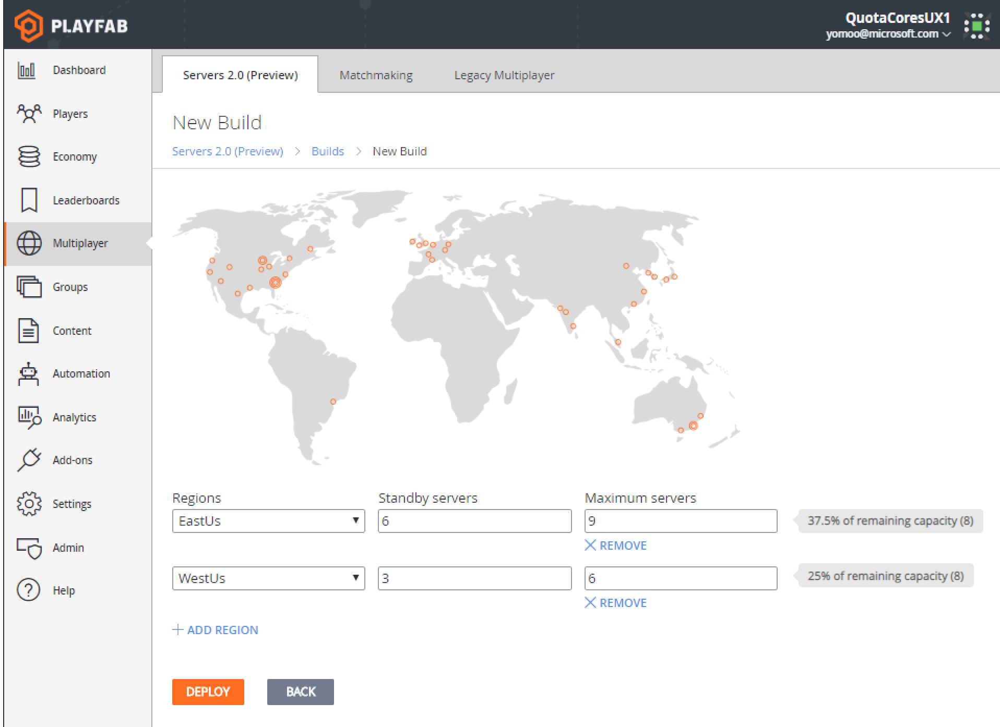

# Accessing increased core limits and additional Azure regions

> [!NOTE]
> This topic frequently references available Azure compute series and regions. To review PlayFab's current selection and pricing see [Multiplayer Servers - detailed price sheet](multiplayer-servers-detailed-price-sheet.md).

Usage of PlayFab multiplayer servers has limits that are applied on a per-title basis. A key limit is the aggregate number of Azure compute cores.

By default, indie, pro, and enterprise customers have limits set to **16 Av2 cores** and **8 Dv2 cores** split in East US and West US.

Contact [PlayFab Support](mailto:support@playfab.com) to gain access to additional compute series, regions, or limit increases.

It is important to review title limits well in advance of any major game event, so you can be assured that PlayFab will support peak player demand.

> [!NOTE]
> For requests of *1,000 cores or more*, it can take several days for PlayFab to secure the desired limit increases for you.

## How to view and interpret multiplayer server limits

PlayFab measures your quota in **cores**:

- **6 F2_v2 virtual machine** consumes **12 Fv2 cores**.
- **3 F4_v2 virtual machines** also consumes **12 cores**.

The number of virtual machines does not matter, *only the number of cores*. Quota is specifically allocated for each available compute series (A v2, D v2, D v3, F v1...) and region.

You can view the quota for a title on the **Builds** page by selecting **View Quota** in the top right.
> [!NOTE]
> In the future, this will be integrated with the PlayFab limits page.

When you attempt to edit a build's regional configuration,  PlayFab enforces that the maximum server configuration you specify does *not* cause your title to exceed configured limits in aggregate.

The following screenshot of the **Edit Build** page shows these safeguards in action, as shown below.

You can use this page to specify the maximum number of multiplayer servers that a build can support in each region. Depending on your virtual machine and density selections, a single server might require 1/4 of a Av2 core, or 4 Av2 cores.

In the above example there are 8 Av2 cores allocated to this title in West US. This build is configured to pack 3 servers on an single-core A1v2 virtual machine, so the configured "6 servers" maximum will consume 25% (2 cores) of the available 8 Av2 core quota in West US.
