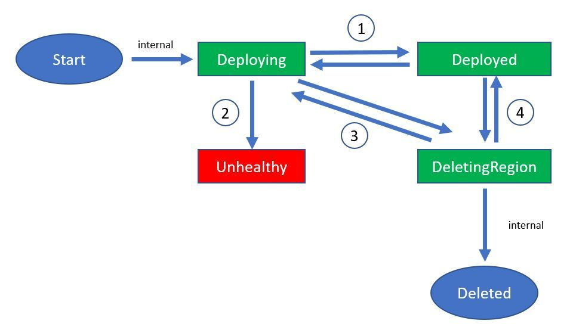

# Lifecycle of multiplayer server builds

A build can exist in one of the following states:

- **Unhealthy**: One or more configured regions are in an unhealthy state.
- **Deploying**: The following conditions are met:
  - No region is in an **Unhealthy** state.
  - One or more regions are in **Deploying** state.
- **DeletingRegion**: The following conditions are met:
  - No region is in an **Unhealthy** state.
  - No region is in **Deploying** state.
  - One or more regions are in **Deleting** state.
- **Deployed**: All configured regions are in **Deployed** state.

The transitions between these states are depicted in the following image, and described below:

1. **Deploying/Deployed Regions**

   - **Deploying -> Deployed**: All regions in **Deploying** are now in a **Deployed** state.  
   - **Deployed -> Deploying**: One or more new regions were configured for the build. The new regions are in **Deploying** state.

2. **Deploying -> Unhealthy**: One or more regions which were in **Deploying** state are now in **Unhealthy** state.

3. **Deploying/Deleting Regions**

   - **Deployed -> DeletingRegion** (rare scenario): Regions which were in **Deploying** were requested to be deleted.
   - **DeletingRegion -> Deploying** (rare scenario): All regions in **Deleting** completed deletion, and new regions were added which are the new regions in **Deploying** state.

4. **Deployed/Deleting Regions**

    - **Deployed -> DeletingRegion**: One or more regions were requested to be deleted.
    - **DeletingRegion -> Deployed**: All regions that were requested to be deleted have been deleted. The rest of the regions are in **Deployed** state.

> [!NOTE]
> Start and Deleted are internal states and are not exposed.
