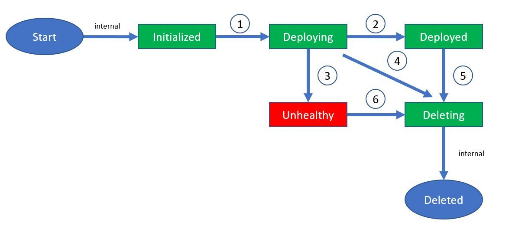

# Lifecycle of a multiplayer server build region

A build region can exist in one of the following states:

- **Initialized**: The PlayFab multiplayer service has recorded the configuration for the region.
- **Deploying**: A small number of VMs are being provisioned in the region in order to validate the build.
- **Deployed**: The initial set of VMs have all completed loading the game servers and at least one game server has reported a **StandingBy** status (via the `ReadyForPlayers` API call in [GSDK](integrating-game-servers-with-gsdk.md)).
  > [!NOTE]
  > Even though a build region may configured for say 50 standBy servers, a build region will be marked as **Deployed**, even if only one game server has reported **StandingBy**.  
- **Deleting**: The region is marked for deletion. All VMs are being de-provisioned.

The transitions between these states are depicted in the following image and described below:

1. **Initialized -> Deploying** : **StandBy** servers have been configured to be **> 0**. A few VMs are being provisioned in the region, and the build is being validated on those VMs (propping the assets and ensuring game server can reach StandingBy state).
2. **Deploying -> Deployed** : At least one game server in the region has reached a **StandingBy** state, thus validating the build (for that region).
3. **Deploying -> Unhealthy**: One of the following occurred:
   - All the initial set of VMs (from Step 1 above) are deemed **Unhealthy**. Some reasons include:  
      - None of the game servers have sent a heartbeat via [GSDK](integrating-game-servers-with-gsdk.md) for more than 10 minutes after being started. This usually indicates that the server is crashing, and you will see a **NoServerHeartbeat** health status for each VM in the region.
      - The PlayFab Multiplayer Agent itself is crashing, or not being initialized on the VM (rare occurrence). Essentially the multiplayer service has not received a heartbeat from the Agent for over 10 minutes.
   - None of the VMs have reached a **Running** state (mostly stuck in loading assets) for more than 90 minutes.
   - None of the game servers have reached a **StandingBy** state for more than 90 minutes (although they are sending a heartbeat). This indicates an issue during game server initialization.
4. **Deploying -> Deleting**: This state transition is uncommon, and occurs when the developer requests to remove a region while it is still deploying.
5. **Deployed -> Deleting**: The region was removed from the build configuration. Removing a build is equivalent to removing each region from it (as far as build region status is concerned).
6. **Unhealthy -> Deleting**: The region was removed from the build configuration. Removing a build is equivalent to removing each region from it (as far as build region status is concerned).

> [!NOTE]
>
> - Start and Deleted states are internal to the system and are not exposed.
> - If the number of standby servers for a region is configured to be **0**, the region will remain in the **Initialized** state.
> - In rare unexpected cases (outages), we might see a transition from **Deploying** to **Unhealthy** for a brief period.
