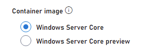
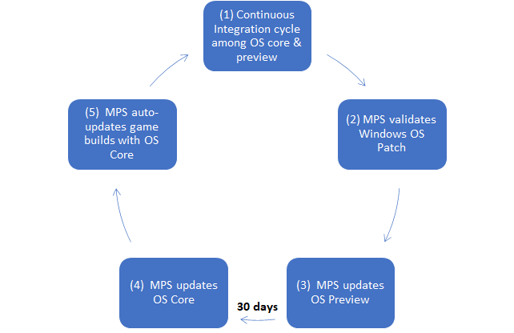

# OS patch updates for Windows

Playfab Multiplayers Servers managed Windows containers undergo a methodical OS patch update process to ensure game servers are operating with the latest security updates.  Each month, Azure Compute certifies a Windows OS image that is integrated into Multiplayer Servers for developers to choose from the "Windows Server Core Preview" toggle during the build creation process.  Developers are encouraged to test their non-production game servers built with the "Windows Server Core Preview" option.  

After 30 days, Multiplayer Servers will migrate the Windows Server Core Preview to the Windows Server Core image option - signaling a PlayFab approved OS image for production readiness.  This process will repeat every 30 days, cycling an OS preview image to its mainline OS core image.  If a game server built with OS core version that doesn’t match PlayFab’s OS core version, PlayFab will auto-update your game build server with the latest mainline OS core image.  This process is applied automatically with no build changes required by the developer.   

## Patch update cycle

The following image illustrates the OS patch level update cycle.

| Stage  | Stakeholder  | Description   |
|---|---|---|
| 1 | Customer |  Continuous integration & test process deploys production game builds with OS core and tests game builds with OS preview |
| 2 | Azure |  MPS validates new published Windows OS patch |
| 3 | MPS |  PlayFab replaces MPS OS preview with Windows OS patch |
| 4 | MPS |  PlayFab replaces MPS OS core with MPS OS preview 30-days prior |
| 5 | MPS |  PlayFab auto-updates game builds with OS Core |

## Best Practices

1. Developers are encouraged to create and test their non-production game server builds with the OS preview image option.
1. Developers with a mature build and continuous integration & deployment process should take into consideration that OS image updates cycle every 30 days

## Constraints

1. The patch update process occurs monthly
1. Developers cannot opt out of the monthly OS patch level updates
1. The patch update process is only applicable to Windows managed containers and does not apply to custom containers or Linux.

> [!NOTE]
>
> - Game server builds are immutable once created.  Therefore, developers cannot toggle between OS image preview and OS image core.
> - A game server operating in production will be auto-updated to the latest OS core image version if the version that the build was made is older than the latest.  This will be applied automatically for any new multiplayer server allocation request only.
