# Integrating the PlayFab GSDK into Unreal Engine 4

**Released 8/22/2019**  
**Copyright © 2019 HICON Games, LLC. All Rights Reserved.**

## What this document is not

This document should not be used as a best-practices document. Each project is vastly different from one another, and as such has different requirements. There may be much better ways to integrate the PlayFab GSDK (for *Servers 2.0* in particular) into your Unreal Engine 4 project; however, for our customer HICON Games this was the way they got it deployed.

Once official documentation for integrating PlayFab GSDK C++ into Unreal Engine 4 does come out, this documentation may become obsolete. In addition, this guide is not a how-to use PlayFab or Unreal Engine 4 guide.

## What this document is

This is an internal technical document created by HICON Games for project Huli, to record the process used in integrating the PlayFab GSDK.

Because this is being made a public release document after the fact, we have not changed the documentation to fit into a generic UE4 project template.

Your project will be named something completely different, and any occurrences of the name “Huli” should be replaced to reflect your own project name.

This document should be used as a starting point for the bare minimum integration requirements needed to get the PlayFab GSDK integrated into your Unreal Engine 4 project and to deploy a successful UE4 dedicated server to the Multiplayer Server 2.0 servers hosted by PlayFab. This document assumes you can compile a standalone dedicated server build with UE4 and you have the correct [Project]Server.Target.cs files in your solution.

## Products and versions used

### *PlayFab GSDK*

The PlayFab C++ GSDK v.140.0.7.190715 is the latest version as of the date on this document.

Download: <https://www.nuget.org/packages/com.playfab.cppgsdk.v140>

### *Unreal Engine 4*

Our game engine version is 4.22.3 and we use the source version from Unreal Engine’s official GitHub page.

Download: <https://github.com/EpicGames/UnrealEngine>

### *Visual Studio*

Our programmers use Visual Studio 2017.

### Helpful links
-------------

- Unreal Engine 4 Documentation:
https://docs.unrealengine.com/index.html

- PlayFab Documentation (NEW): https://docs.microsoft.com/gaming/playfab/

- PlayFab API Reference: <https://api.playfab.com/>

- PlayFab Local Debugging (MockVM):
<https://docs.microsoft.com/gaming/playfab/features/multiplayer/servers/locally-debugging-game-servers-and-integration-with-playfab>

## Integrating the PlayFab GSDK into Huli

The easiest way to download the PlayFab GSDK is to use the Visual Studio NuGet Package Manager.

1. Open up the Huli project solution `Huli.sln` file in Visual Studio. 

2. Navigate to **Tools** and select **NuGet Package Manager** then choose **Manage NuGet Packages for
    Solution**.  
    
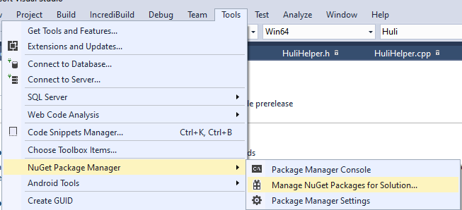

3. Click on the Browse tab and search for “*playfab*.” 

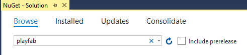

4. Find `com.playfab.cppgsdk.v140` and then select Games\Huli project from the list and make sure to pick the latest stable version, then click the **Install** button.  

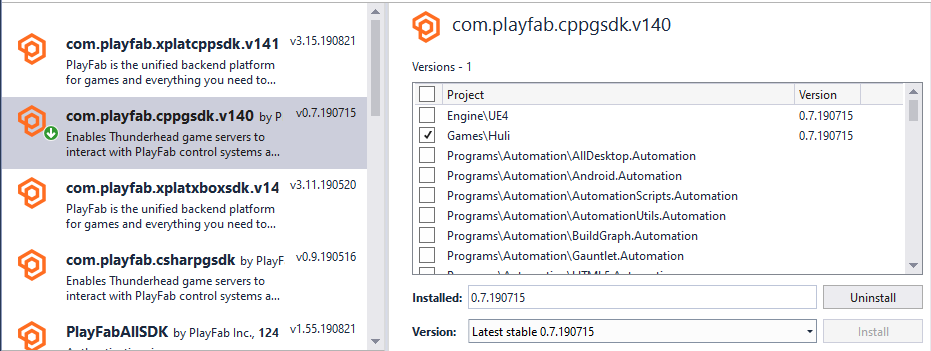

5. This will create a “packages” folder within the Huli project root folder and will contain the entire PlayFab C++ GSDK. We will link to this later.

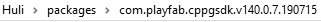

### Overriding the UE4 Startup/Shutdown Modules

The way we chose to integrate the PlayFab GSDK’s core functions was to override UE4’s startup and shutdown modules for Huli.

1. Open the Huli game module header file `Huli.h`, located under Games\Huli\Source\Huli.   

2. In this header file, we’ve defined our public overrides of the UE4: `StartupModule()`, `ShutdownModule()` and `IsGameModule()` as well as added a couple of private methods that made it easier to call PlayFab GSDK functions.

3.  Next, we implemented the methods we’ve defined in our header file, in our `Huli.cpp` file as well as include the `gsdk.h` file.

4. Override the default game modules in `Huli.cpp`.

5. Implement OnShutDown, HealthCheck and StartServer methods in `Huli.cpp`

6. Use custom logging methods for debugging in `Huli.cpp`

7. Add All Runtime Dependencies, .lib’s, .dll’s and include paths to `Huli.Build.cs`

> [!NOTE]
> Because they don’t get included automatically, we had to add all of our runtime dependencies modules that, for whatever reason, don’t get included when packaging our Huli dedicated server. Some of these are Windows-specific binaries that are required to run on the PlayFab Windows servers, but the others are required GSDK files.

1. Open the `Huli.Build.cs` file.  

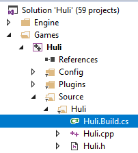

We’ve added the following dedicated server build rules to our `Huli.Build.cs` file when we package our HuliServer.exe. This file may have other, platform specific rules, we’ve only included the dedicated server rules.

Figure 6 Huli.Build.cs

### Pre-packaging Tip: Blacklisting or Removing UE4 Plugins

> [!IMPORTANT]
> Before packaging the Huli Server, it’s important to understand that since we are using Windows Server and docker containers from PlayFab, some UE4 plugins are not compatible with it. 

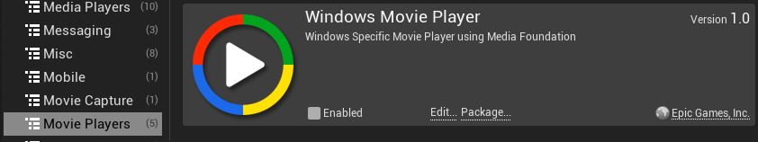

So far, the only one we found that prevents our PlayFab dedicated 2.0 server build from spinning up after deployment is the **Windows MoviePlayer** plugin. We simply *disabled/removed* it from our game outright, instead of blacklisting; however, UE4 does give you options to blacklist a plugin from running on a specific target if you’d like. For example, if your game client needs the **Windows MoviePlayer** plugin, but the server has no need to run it, you can set up blacklisting (or whitelisting if you prefer) within the `\*.uplugin` file itself.

More on whitelist/blacklisting:  
<https://answers.unrealengine.com/questions/345335/conditionally-compile-plugins-based-on-platform.html>

### Packaging `HuliServer.exe`

With these code changes, before you can package HuliServer, you need to compile the solution and target the Development Server or Shipping Server configuration within Visual Studio.

1. For a development server build, make sure to select **Development Server**, then **Win64** and finally make sure that the **Huli** project is selected from within Visual Studio.  

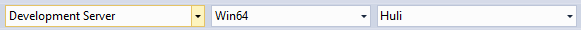

2. Then right-click on the Huli project in Solution Explorer and click **Build** from the context menu.  
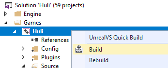

3. From here, the standard way we package our Server build is to use the Project Launcher.  

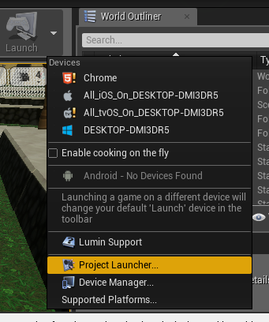

4. Add a new custom launch profile  

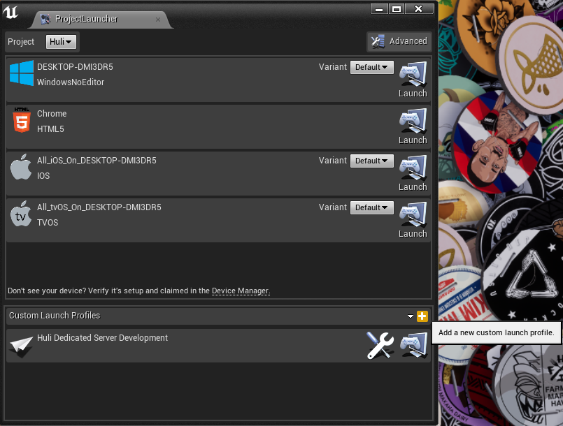

5. Then click on the

icon to edit the profile, which opens up a new dialog for you to customize it.

6. Give it a name such as “Huli Dedicated Server (Development)” or something similar, and make sure that you target the Huli project (navigate to the `Huli.uproject` file within the project drop-down on this editor).

7. Make sure to cook the content “By the book” and select **WindowsServer** from the platform options.  

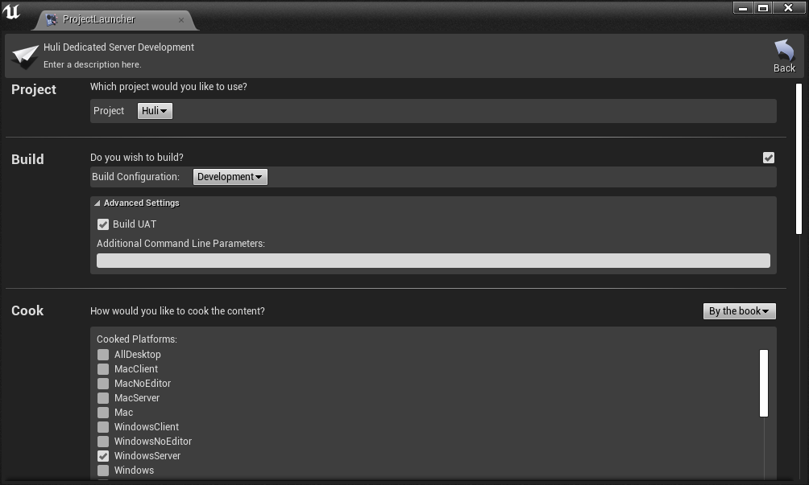

8. Target “en” for cooked cultures.

9. Include the following maps: “Main," “BattleCircle," and “Transition."

10. Under Package, select “Package & store locally," and then specify the directory you want to output to.

11. Click the

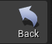

icon and then run your new launch profile by clicking the

icon.  

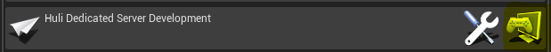

12. If everything worked correctly, you should see all green check marks across the board.  

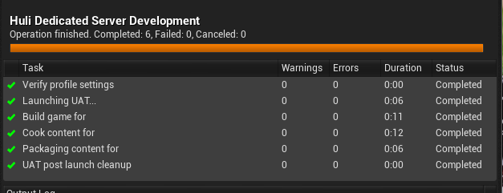

13. Navigate to the directory you set in your custom launch profile.

14. Delete the three manifest files.  

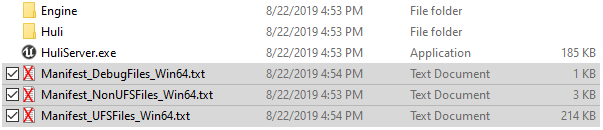

15. Now you can zip up your folder. If you’re on Windows 10, simply select all files at the root, right-click on `HuliServer.exe` and then select **Send to** > *Compressed (zipped) folder*. This is the folder you will upload to PlayFab.

### Optional steps

How you package your server executable is up to you, but these optional steps may be required by the PlayFab Thunderhead 2.0 Windows servers.

1. Navigate to the Win64 sub-folder of your packaged server.  

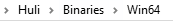

2. Copy all files, except for the HuliServer.exe file in this folder.  

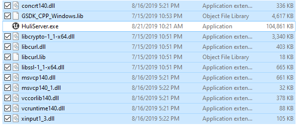

2. Then finally navigate back to the root of your packaged folder and paste these files in here. It should look like the following:  

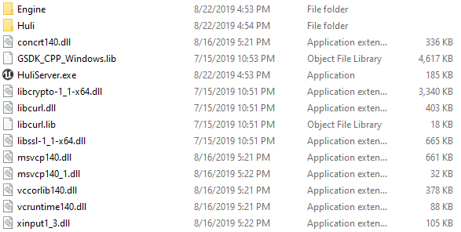

3. We do this as an added measure so that when PlayFab VM creates your docker
    container and runs the root HuliServer.exe, the proper files are linked
    within this executable. Even though the HuliServer.exe at root just calls
    the sub-exe in Huli \> Binaries \> Win64, the Windows server may require
    these at the root level as well.

### Deploying to PlayFab

Once you’re at this point, you’re at the homestretch. If everything compiles fine, you’ve followed the directions above and you’ve got your HuliServer.zip file ready to go, the last step is creating a new Server 2.0 Build.

1. Log into PlayFab with your developer account.

2. Click on the Huli project.

3. Click on the

menu option.

4. It should default you to the

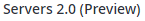

tab; if not, click it.

5. Click on

6. Provide a Build name, Virtual machine selection, and Servers per machine. 

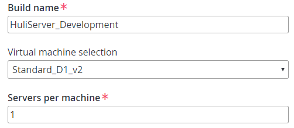

7. For the Network Section, all UE4 server builds run on **UDP** port **7777**.  

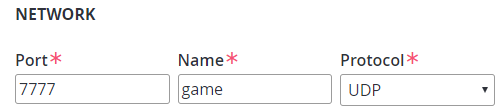

8. Set your start game command to `C:\\Assets\\HuliServer.exe` 

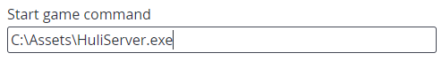

9. Click

and navigate to your HuliServer.zip file and click

and wait for it to finish uploading to PlayFab.

10. Asset package should now say “HuliServer.zip.” Leave **Mount path** as the default.  

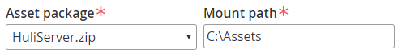

11. Click

  .

12. You’ll need to set up the Regions, how many standby servers, and maximum servers.  

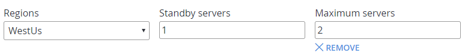

13. Once you’re all done, click

14. The Huli Dedicated Server will now start deploying to PlayFab. This screen will auto-refresh.  

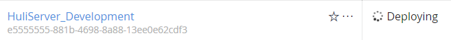

15. After about 20 minutes or so, the new server build should be up and running, and if there were no issues, you should get a successful deploy status.  

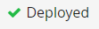

16. The number under the build name, is the build ID. This is a custom build ID that we can use within the PlayFabSDK blueprints to make a new multiplayer server request to start up a new server and connect our players to this new dedicated server.  

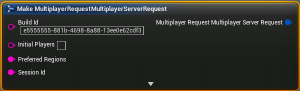
