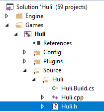

# Integrating the PlayFab GSDK into Unreal Engine 4


**Released 8/22/2019**  
**Copyright © 2019 HICON Games, LLC. All Rights Reserved.**

## What this document is not

This document should not be used as a best-practices document. Each project is vastly different from one another, and as such has different requirements. There may be much better ways to integrate the PlayFab GSDK (for *Servers 2.0* in particular) into your Unreal Engine 4 project; however, for our customer HICON Games this was the way they got it deployed.

Once official documentation for integrating PlayFab GSDK C++ into Unreal Engine 4 does come out, this documentation may become obsolete. In addition, this guide is not a how-to use PlayFab or Unreal Engine 4 guide.

## What this document is

This is an internal technical document created by HICON Games for project Huli, to record the process used in integrating the PlayFab GSDK.

Because this is being made a public release document after the fact, we have not changed the documentation to fit into a generic UE4 project template.

Your project will be named something completely different, and any occurrences of the name “Huli” should be replaced to reflect your own project name.

This document should be used as a starting point for the bare minimum integration requirements needed to get the PlayFab GSDK integrated into your Unreal Engine 4 project and to deploy a successful UE4 dedicated server to the Multiplayer Server 2.0 servers hosted by PlayFab. This document assumes you can compile a standalone dedicated server build with UE4 and you have the correct [Project]Server.Target.cs files in your solution.

## Products and versions used

### *PlayFab GSDK*

The PlayFab C++ GSDK v.140.0.7.190715 is the latest version as of the date on this document.

Download: <https://www.nuget.org/packages/com.playfab.cppgsdk.v140>

### *Unreal Engine 4*

Our game engine version is 4.22.3 and we use the source version from Unreal Engine’s official GitHub page.

Download: <https://github.com/EpicGames/UnrealEngine>

### *Visual Studio*

Our programmers use Visual Studio 2017.

### Helpful links

-------------

- Unreal Engine 4 documentation:
https://docs.unrealengine.com/index.html

- PlayFab documentation: https://docs.microsoft.com/gaming/playfab/

- PlayFab API reference: <https://docs.microsoft.com/gaming/playfab/api-references/>

- PlayFab local debugging (MockVM):
<https://docs.microsoft.com/gaming/playfab/features/multiplayer/servers/locally-debugging-game-servers-and-integration-with-playfab>

## Integrating the PlayFab GSDK into Huli

The easiest way to download the PlayFab GSDK is to use the Visual Studio NuGet Package Manager.

1. Open the Huli project solution file `Huli.sln` in Visual Studio. 

2. Navigate to **Tools** > **NuGet Package Manager** > **Manage NuGet Packages for Solution**.  
    
    

3. Select the Browse tab and search for “*playfab*.” 

    

4. Find `com.playfab.cppgsdk.v140` and then select Games\Huli project from the list. Make sure to pick the latest stable version, then select the **Install** button.  

    

5. This will create a “packages” folder within the Huli project root folder and will contain the entire PlayFab C++ GSDK. We will link to this later.

    

### Overriding the UE4 Startup/Shutdown Modules

The way we chose to integrate the PlayFab GSDK’s core functions was to override UE4’s startup and shutdown modules for Huli.

1. Open the Huli game module header file `Huli.h`, located under Games\Huli\Source\Huli.   

    

2. In this header file, we’ve defined our public overrides of the UE4: `StartupModule()`, `ShutdownModule()` and `IsGameModule()` and also defined a few private methods that made it easier for us to implement the PlayFab GSDK functions.

```c_cpp
// Copyright 2017-2019 HICON Games, LLC. All Rights Reserved.

#pragma once

#include "CoreMinimal.h"
//#include "Engine/GameEngine.h"

class FHuliGameModuleImpl : public IModuleInterface
{
public:
	// IModuleInterface Methods
	virtual void StartupModule() override;
	virtual void ShutdownModule() override;
	virtual bool IsGameModule() const override
	{
		return true;
	}
#if UE_SERVER
private:
	// Methods added to support GSDK
	void ConnectToPlayFabAgent();
	void LogInfo(FString message);
	void LogError(FString message);
#endif
};
```

3.  Implement the override of OnShutDown, HealthCheck and StartServer methods, as well as custom logging methods for debugging, in `Huli.cpp`.

```c_cpp
// Copyright 2017-2019 HICON Games, LLC. All Rights Reserved.

#include "Huli.h"
#include "Modules/ModuleManager.h"
#if UE_SERVER
#include "gsdk.h"
#include "string.h"
#endif

// Replace default game module with custom game module
// Found technique at https://forums.unrealengine.com/community/community-content-tools-and-tutorials/1547205-quick-c-tip-overriding-your-game-s-startupmodule-shutdownmodule-functions
//IMPLEMENT_PRIMARY_GAME_MODULE(FDefaultGameModuleImpl, Huli, "Huli" );
IMPLEMENT_PRIMARY_GAME_MODULE(FHuliGameModuleImpl, Huli, "Huli");

void FHuliGameModuleImpl::StartupModule()
{
#if UE_SERVER
	//UE_LOG(LogTemp, Display, TEXT("UE_SERVER StartupModule()"));
	bool _playFab = true;
	if (FParse::Param(FCommandLine::Get(), TEXT("NoPlayFab"))) 
	{
		_playFab = false;
	}
	if (_playFab) {
		ConnectToPlayFabAgent();
	}
#else
	//UE_LOG(LogTemp, Display, TEXT("Not UE_SERVER StartupModule()"))
#endif
}

void FHuliGameModuleImpl::ShutdownModule()
{
}

#if UE_SERVER

// Callback function for GSDK
void OnShutdown()
{
	/* Perform any necessary cleanup and end the program */
	// Ask UE4 server to shutdown without force
	FGenericPlatformMisc::RequestExit(false);
}

// Callback function for GSDK
bool HealthCheck()
{
	return true;
}

void FHuliGameModuleImpl::ConnectToPlayFabAgent()
{

	try {

		LogInfo("Connecting to PlayFab Agent.");

		// Call this while your game is initializing, it will start heartbeating to our agent and put the game server in an Initializing state
		Microsoft::Azure::Gaming::GSDK::start();
		Microsoft::Azure::Gaming::GSDK::registerHealthCallback(&HealthCheck);
		Microsoft::Azure::Gaming::GSDK::registerShutdownCallback(&OnShutdown);

		// Call this when your game is done initializing and players can connect
		// Note: This is a blocking call, and will return when this game server is either allocated or terminated
		if (Microsoft::Azure::Gaming::GSDK::readyForPlayers())
		{
			// readyForPlayers returns true when an allocation call has been done, a player is about to connect!
			LogInfo("Server is ready for players.");
		}
		else
		{
			// readyForPlayers returns false when the server is being terminated
			LogError("Server is getting terminated. Not ready for players.");
		}

	}
	catch (Microsoft::Azure::Gaming::GSDKInitializationException& e)
	{
		LogError("GSDK Initialization failed: " + FString(UTF8_TO_TCHAR(e.what())));
	}

}

void FHuliGameModuleImpl::LogInfo(FString message)
{
	UE_LOG(LogTemp, Display, TEXT("%s"), *message);
	Microsoft::Azure::Gaming::GSDK::logMessage(std::string(TCHAR_TO_UTF8(*message)));
}

void FHuliGameModuleImpl::LogError(FString message)
{
	UE_LOG(LogTemp, Error, TEXT("%s"), *message);
	Microsoft::Azure::Gaming::GSDK::logMessage(std::string(TCHAR_TO_UTF8(*message)));
}

#endif
```

4. Add All Runtime Dependencies, .libs, .dlls, and include paths to `Huli.Build.cs`
> [!NOTE]
> Because they don’t get included automatically, we had to add all of our runtime dependencies modules that, for whatever reason, don’t get included when packaging our Huli dedicated server. Some of these are Windows-specific binaries that are required to run on the PlayFab Windows servers, but the others are required GSDK files.

1. Open the `Huli.Build.cs` file.  


We’ve added the following dedicated server build rules to our `Huli.Build.cs` file when we package our HuliServer.exe. This file may have other, platform specific rules, we’ve only included the dedicated server rules.
> [!IMPORTANT]
> The location and name of these files is specific to the Unreal Engine and GSDK versions you are using. Be sure to check what versions you are using and update the following accordingly.

```c_cpp
// Copyright 2016-2019 HICON Games, LLC. All Rights Reserved.
using UnrealBuildTool;

public class Huli : ModuleRules
{
    public Huli(ReadOnlyTargetRules Target) : base(Target)
    {
        bUseRTTI = false;
        PCHUsage = PCHUsageMode.UseExplicitOrSharedPCHs;

        PublicDependencyModuleNames.AddRange(new string[] { "Core", "CoreUObject", "Engine", "InputCore", "Networking", "Sockets", "HTTP", "PlayFab", "PlayFabCpp" });

        DynamicallyLoadedModuleNames.Add("OnlineSubsystemNull");

        if (Target.Type == global::UnrealBuildTool.TargetType.Server)
        {
            bEnableExceptions = true;

            // Add dynamic dlls required by all dedicated servers
            RuntimeDependencies.Add("$(TargetOutputDir)/xinput1_3.dll", "$(EngineDir)/Binaries/ThirdParty/AppLocalDependencies/Win64/DirectX/xinput1_3.dll", StagedFileType.SystemNonUFS);
            RuntimeDependencies.Add("$(TargetOutputDir)/concrt140.dll", "$(EngineDir)/Binaries/ThirdParty/AppLocalDependencies/Win64/Microsoft.VC.CRT/concrt140.dll", StagedFileType.SystemNonUFS);
            RuntimeDependencies.Add("$(TargetOutputDir)/msvcp140.dll", "$(EngineDir)/Binaries/ThirdParty/AppLocalDependencies/Win64/Microsoft.VC.CRT/msvcp140.dll", StagedFileType.SystemNonUFS);
            RuntimeDependencies.Add("$(TargetOutputDir)/msvcp140_1.dll", "$(EngineDir)/Binaries/ThirdParty/AppLocalDependencies/Win64/Microsoft.VC.CRT/msvcp140_1.dll", StagedFileType.SystemNonUFS);
            RuntimeDependencies.Add("$(TargetOutputDir)/msvcp140_2.dll", "$(EngineDir)/Binaries/ThirdParty/AppLocalDependencies/Win64/Microsoft.VC.CRT/msvcp140_2.dll", StagedFileType.SystemNonUFS);
            RuntimeDependencies.Add("$(TargetOutputDir)/vccorlib140.dll", "$(EngineDir)/Binaries/ThirdParty/AppLocalDependencies/Win64/Microsoft.VC.CRT/vccorlib140.dll", StagedFileType.SystemNonUFS);
            RuntimeDependencies.Add("$(TargetOutputDir)/vcruntime140.dll", "$(EngineDir)/Binaries/ThirdParty/AppLocalDependencies/Win64/Microsoft.VC.CRT/vcruntime140.dll", StagedFileType.SystemNonUFS);

            // Add dynamic dlls required by GSDK
            RuntimeDependencies.Add("$(TargetOutputDir)/GSDK_CPP_Windows.lib", "$(ProjectDir)/packages/com.playfab.cppgsdk.v140.0.7.190715/build/native/lib/Windows/x64/Release/dynamic/GSDK_CPP_Windows.lib", StagedFileType.SystemNonUFS);
            RuntimeDependencies.Add("$(TargetOutputDir)/libcurl.lib", "$(ProjectDir)/packages/com.playfab.cppgsdk.v140.0.7.190715/build/native/lib/Windows/x64/Release/dynamic/libcurl.lib", StagedFileType.SystemNonUFS);
            RuntimeDependencies.Add("$(TargetOutputDir)/libcurl.dll", "$(ProjectDir)/packages/com.playfab.cppgsdk.v140.0.7.190715/build/native/lib/Windows/x64/Release/dynamic/libcurl.dll", StagedFileType.SystemNonUFS);
            RuntimeDependencies.Add("$(TargetOutputDir)/libssl-1_1-x64.dll", "$(ProjectDir)/packages/com.playfab.cppgsdk.v140.0.7.190715/build/native/lib/Windows/x64/Release/dynamic/libssl-1_1-x64.dll", StagedFileType.SystemNonUFS);
            RuntimeDependencies.Add("$(TargetOutputDir)/libcrypto-1_1-x64.dll", "$(ProjectDir)/packages/com.playfab.cppgsdk.v140.0.7.190715/build/native/lib/Windows/x64/Release/dynamic/libcrypto-1_1-x64.dll", StagedFileType.SystemNonUFS);

            // Add libraries required by GSDK
            PublicAdditionalLibraries.Add("$(ProjectDir)/packages/com.playfab.cppgsdk.v140.0.7.190715/build/native/lib/Windows/x64/Release/dynamic/GSDK_CPP_Windows.lib");
            PublicAdditionalLibraries.Add("$(ProjectDir)/packages/com.playfab.cppgsdk.v140.0.7.190715/build/native/lib/Windows/x64/Release/dynamic/libcurl.lib");
            PublicIncludePaths.Add("../packages/com.playfab.cppgsdk.v140.0.7.190715/build/native/include");
        }
    }
}
```

### Pre-packaging Tip: denylisting or Removing UE4 Plugins

> [!IMPORTANT]
> Before packaging the Huli Server, it’s important to understand that since we are using Windows Server and docker containers from PlayFab, some UE4 plugins are not compatible with it. 


So far, the only one we found that prevents our PlayFab dedicated 2.0 server build from spinning up after deployment is the **Windows MoviePlayer** plugin. We simply *disabled/removed* it from our game outright, instead of denylisting; however, UE4 does give you options to denylist a plugin from running on a specific target if you’d like. For example, if your game client needs the **Windows MoviePlayer** plugin, but the server has no need to run it, you can set up denylisting (or allowlisting if you prefer) within the `\*.uplugin` file itself.

For more information about allowlisting/denylisting, see the UE4 forums page about conditionally compiling plugins based on platform [here](https://answers.unrealengine.com/questions/345335/conditionally-compile-plugins-based-on-platform.html).   

### Packaging `HuliServer.exe`

With these code changes, before you can package HuliServer, you need to compile the solution and target the Development Server or Shipping Server configuration within Visual Studio.

1. For a development server build, make sure to select **Development Server**, then **Win64** and finally make sure that the **Huli** project is selected from within Visual Studio.  

    

2. Then right-click on the Huli project in Solution Explorer and select **Build** from the context menu. 

    

3. From here, the standard way we package our Server build is to use the Project Launcher.  

    

4. Add a new custom launch profile  

    

5. Click on the Settings icon, shown below, to edit the profile. This opens up a new dialog for you to start customizing.

    

6. Give it a name such as “Huli Dedicated Server (Development)” or something similar. Make sure to target the Huli project (navigate to the `Huli.uproject` file within the project drop-down on this editor).

7. Cook the content “By the book” and select **WindowsServer** from the platform options.  

    

8. Target “en” for cooked cultures.

9. Include the following maps: “Main," “BattleCircle," and “Transition."

10. Under Package, select “Package & store locally," and then specify the directory you want to output to.

11. Select the __Back__ icon. Then select __Run__ to run your new launch profile. Refer to the images below to help identify these icons.

    Image below shows the Back icon.

    

    Image below shows the Run icon

    

    Image below shows the profile running.

    

12. If everything worked correctly, it would be all green check marks across the board.  

    

13. Navigate to the directory you set in your custom launch profile.

14. Delete the three manifest files&mdash;Manifest_DebugFiles_Win64.txt, Manifest_NonUFSFiles_Win64.txt, and Manifest_UFSFiles_Win64.txt.  

    

15. Now you can zip up your folder. If you’re on Windows 10, simply select all files at the root, right-click on `HuliServer.exe` and then select **Send to** > *Compressed (zipped) folder*. This is the folder you will upload to PlayFab.

### Optional steps

How you package your server executable is up to you, but these optional steps may be required by the PlayFab Thunderhead 2.0 Windows servers.

1. Navigate to the Win64 sub-folder of your packaged server by selecting __Huli__ > __Binaries__ > __Win64__.

    

2. Copy all files, except for the HuliServer.exe file in this folder.  

    

2. Then finally navigate back to the root of your packaged folder and paste these files in here. It should look like the following:  

    

3. We do this as an added measure so that when PlayFab VM creates your docker
    container and runs the root HuliServer.exe, the proper files are linked
    within this executable. Even though the HuliServer.exe at root just calls
    the sub-exe in Huli \> Binaries \> Win64, the Windows server may require
    these at the root level as well.

### Deploying to PlayFab

Once you’re at this point, you’re at the homestretch. If everything compiles fine, you’ve followed the directions above and you’ve got your HuliServer.zip file ready to go, the last step is creating a new Server 2.0 Build.

1. Log into PlayFab with your developer account.

2. Select the Huli project.

3. Select __Multiplayer__ from the menu on the left, as shown below.

    

4. This would automatically display the __Servers__ tab for you. If not, select the tab.

5. On the __Builds__ page, select the __New build__ button, as shown below.

    

6. Provide a __Build name__, __Virtual machine selection__, and __Servers per machine__. Screenshow below shows an example selection using Standard_D1_v2 virtual machine (VM) and 1 server per machine.

    

7. Select __Windows__ platform and __Windows Server Core__ container image.

8. Under __ASSETS__, select __Upload__. Navigate to the HuliServer.zip file, and select to upload. Wait for the file to finish uploading. Asset package should now say “HuliServer.zip”. Leave **Mount path** as the default C:\\Assets as shown below. 

    

9. Set your start game command to `C:\\Assets\\HuliServer.exe` 

    

10. For network, set port to **7777** and use **UDP**. All UE4 server builds run on **UDP** port **7777**.  

    

11. Select regions, how many standby servers, and maximum servers. Screenshot below shows an example set up. 

    

12. Once you’re all done, select __Save__ to start deployment.

13. The Huli Dedicated Server will now start deploying to PlayFab. This screen will auto-refresh.   

    

14. After about 20 minutes or so, the new server build should be up and running. If there are no issues, you would get a successful deploy status, as shown below.  

    

15. The number under the build name, is the Build ID. This is a custom build ID that you can use within the PlayFabSDK blueprints to make a new multiplayer server request to start up a new server and connect your players to this new dedicated server.  

    
