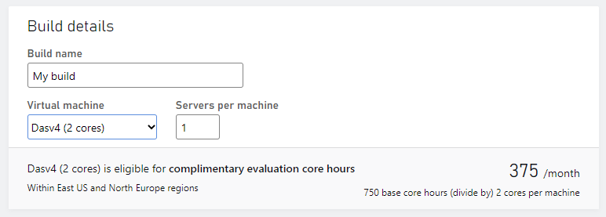
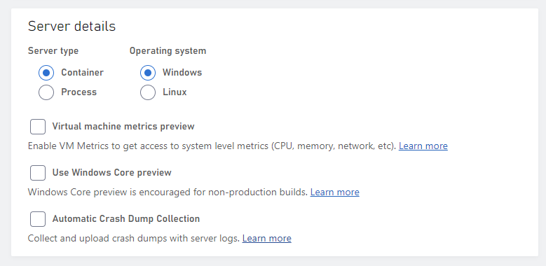
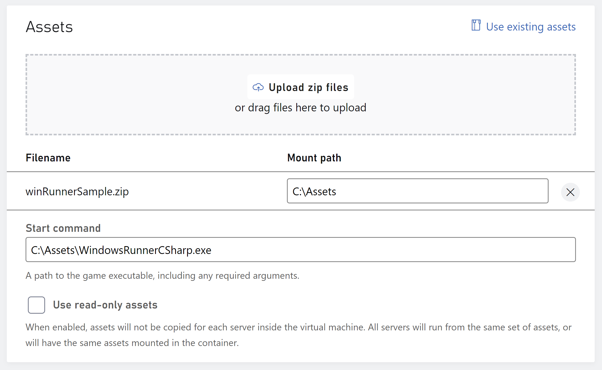
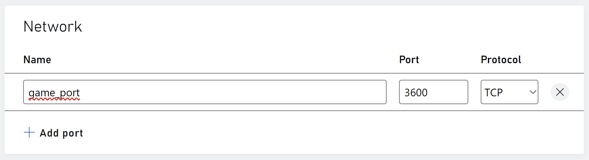
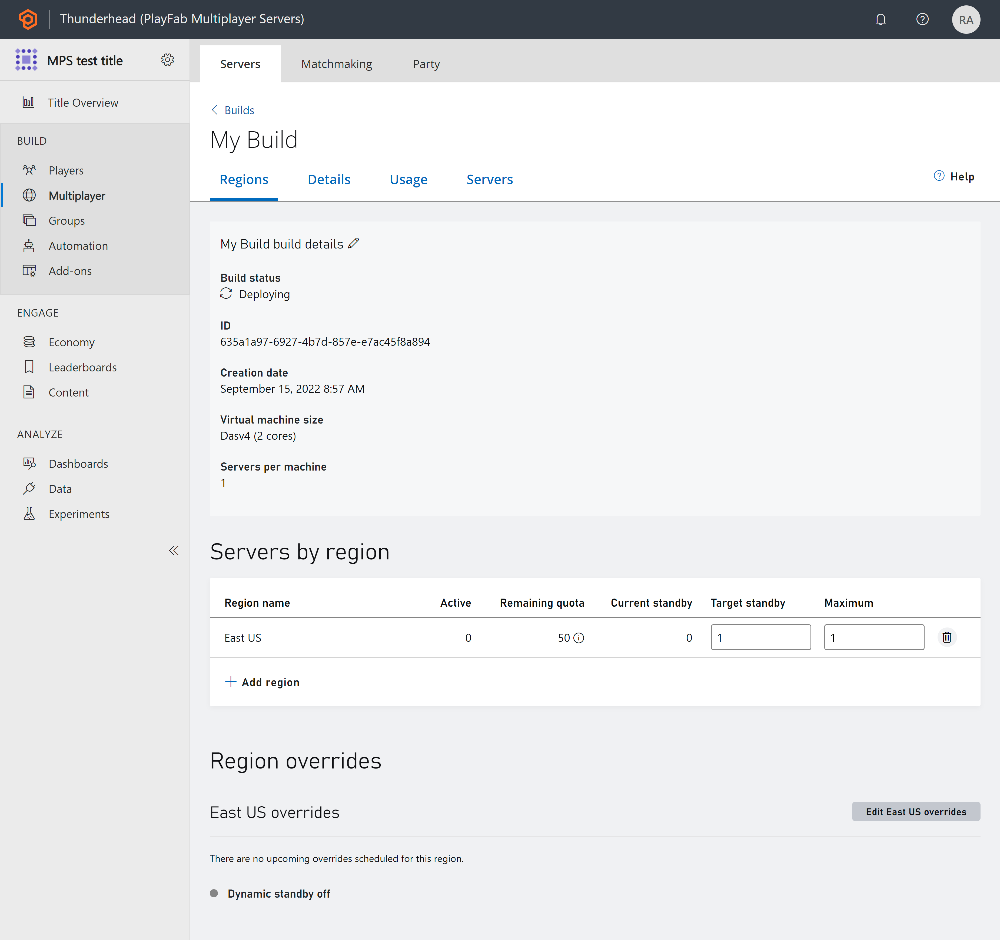

# Walkthrough: Deploy builds using Game Manager

This article describes how to deploy builds for VMs using Windows OS in Game Manager based on the Windows Runner C# sample.

> [!Note]
> In order to use and view the PlayFab Multiplayer Servers, you need to enable the feature from Game Manager. For instructions, see [Enable the PlayFab Server feature](enable-playfab-multiplayer-servers.md).

Deploying a build is one of the processes in creating a game server using the [Windows Runner C# sample](windows-runner-sample.md). 

## Prerequisites

Make sure you've completed the following steps.

* [Configure API feature option](windows-runner-sample.md#configure-api-feature-option)
* [Server set up](windows-runner-sample.md#server-set-up).

## Steps

1. Log into your developer account on [PlayFab.com](https://playfab.com)
2. Go to **My Studios and Titles** page and select your game title to display the dashboard
3. Go to **Multiplayer** > **Servers** page, select **New Build** at the top right to create a new build
4. Use "My build" as the Build Name
5. Select a server with limited free usage, such as **Dasv4** 
6. Set **1** for Servers per machine

Image below shows values used in the info section.

7. Under Virtual Machine OS, select **Windows** as the platform, **Windows Server Core** as the Container image

Image below shows values used in the OS section.

8. Under Assets, select **Upload** then navigate to folder with the compiled PlayFab Multiplayer Server Build for the WindowsRunnerSample.  To get the Build, see [Server side set up](windows-runner-sample.md#server-set-up).

For Windows Container, C:\Assets is the default mounting path where your asset zip will be unzipped. Start Game command should include C:\Asset such as C:\Asset\{YourGameServer.exe}. For Linux container, you can optionally specify the assets and where they should be mounted within the container's file system.

Image below shows values used in the assets section.

9. Set  __C:\Assets\WindowsRunnerCSharp.exe__ as the Start Command.

10. Under Regions, select "East US", one standby server and one maximum server.

11. For network, use port **3600** using **game_port** as the name. Use **TCP** as the protocol as shown in the image below. For the port name, ensure you're using the name defined in your game sample. 

12. Select **Add build** to start the deployment process. You'll be taken to the build details page. The build will display the **Deploying** status as show in the image below. In 10 to 20 minutes, your build should be in the **Deployed** state. You can confirm this by going back to the home page and looking at the status of the build.

* After servers are deployed, [set up the client and connect to the servers](windows-runner-sample.md#client-set-up).

## See also

* [Walkthrough: Deploying builds using PowerShell/API](quickstart-for-multiplayer-servers-api-powershell.md)
* [Windows Runner C# sample](windows-runner-sample.md)
* [Samples and resources](server-samples-resources.md)