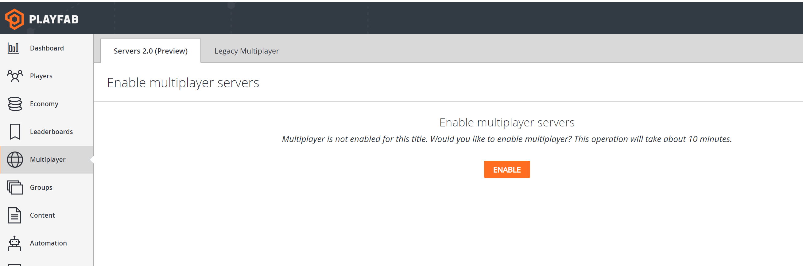
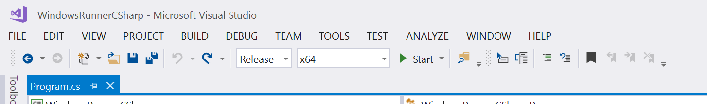
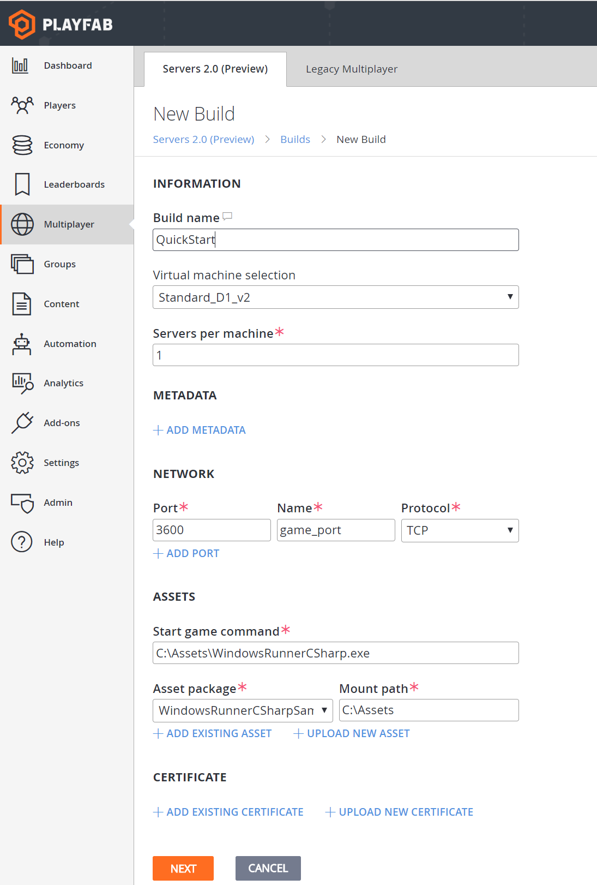

# Quickstart for multiplayer servers (Game Manager)

This tutorial shows you how to upload a sample multiplayer server and configure a server build.

## Enable Multiplayer Servers 2.0

**Multiplayer Servers 2.0** is available to all PlayFab customers. Make sure to review the [information on server hosting](https://docs.microsoft.com/gaming/playfab/features/multiplayer/servers/billing-for-thunderhead) before enabling this feature, as all usage of servers beyond the limited free hours will be charged at the normal rates. Free usage hours are for specific server models and regions.

Enable the feature by selecting the **Multiplayer** tab in **Game Manager**:

## Download and build the GSDK sample

Multiplayer servers work through a special state machine, by integrating with the PlayFab Game Server SDK (GSDK) (see [Basics of a PlayFab game server](basics-of-a-playfab-game-server.md)).

GSDK samples show this integration through a very simple HTTP server sample app.

> [!NOTE]
> You can download a compiled version of the sample app directly from [github](https://github.com/PlayFab/gsdkSamples/releases/download/v1.0/winrunnerSample.zip).

If you want to build the app yourself, download the [GSDK samples from github](https://github.com/PlayFab/gsdkSamples), using standard git methods or downloading as a zip file.

Opening the Visual Studio project should automatically trigger dependencies like the [Game Server SDK nuget package](https://www.nuget.org/packages/com.playfab.csharpgsdk) to be downloaded.

Build the project in an x64 RELEASE flavor, as shown below.

ZIP up the produced x64 release binaries. There should be no internal folder structure, the zip file should be a simple flat collection of files, as shown in the following example.

You can compare your build output with the compiled release on [github](https://github.com/PlayFab/gsdkSamples/releases/download/v1.0/winrunnerSample.zip).

## Upload assets and create a multiplayer server build

On the **Multiplayer Servers 2.0** page, select **New Build** at the top right. Configure a new build as found in the example shown below.

1. **Build Name.** This is a string used to refer to the build.
2. **Virtual machine selection**. The Azure virtual machine type used to host this multiplayer server build. Standards **D1_v2** is a suggested choice, and available to customers by default. Learn about other virtual machine selections at [Multiplayer Servers detailed price sheet](multiplayer-servers-detailed-price-sheet.md).
3. **Servers per machine.** How many multiplayer servers will be hosted on each virtual machine. For testing, start with a value of **one.**
4. **Network.** The GSDK sample operates a simple web server on **Port 3600**. It is important we specify this port name as **game_port**, because the game server inspects the port name through the GSDK API. See [Connecting clients to game servers](connecting-clients-to-game-servers.md) for more networking information.
5. **Assets.** Upload the GSDK sample zip file. PlayFab will unzip this folder and mount it in the container file-system as a folder you specify in the **C**  drive. `C:\Assets` is a good example, and that would result in a start game command of `C:\Assets\WindowsRunnerCSharp.exe`.

### Configure regions

After selecting the **Next** button at the bottom of your screen, you will need to configure standing-by levels and regional maximums. For testing purposes, let's configure a single standing-by server in East US.

### Wait for the build to initialize

After selecting the **Deploy** button, you will be taken to the build home page. You can monitor the deployment of your build from here. In 10 to 20 minutes your build should be in the **Deployed** state.

