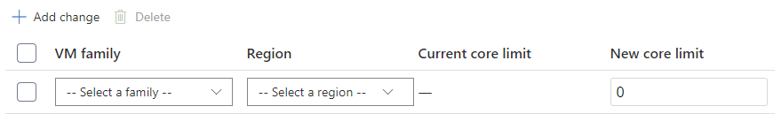
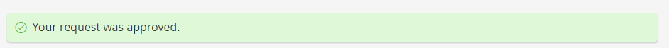

# Managing Server Cores Quota

Multiplayer Servers includes a free and limited capacity of simultaneous cores to evaluate the building of multiplayer server games.  Game developers enrolled in paid pricing plans, however, may request additional server cores for their game title(s).  Requesting additional quota increases the maximum number of cores that your multiplayer service has access to if the request is approved.  The **Multiplayer Servers | Quota Summary** page presents a self-serve mechanism in Game Manager for game developers to:

- **Request additional quota**
- **Review a history of quota requests provisioned or under review**

## Requesting additional quota

To request additional quota, access the **Change Quota** button on the **Multiplayer Servers | Quota Summary** page as shown in the screenshot below to request for additional quota.  Changing your quota limit won't increase your costs. Increased player activity results in more active servers. Active server usage and costs will be reflected in your bill.  Most requests will be immediately approved and provisioned.  But some core limit changes are subject to review and may require more information if your request exceeds what can be provided at the time of the request.

### How to request quota changes

1. Briefly describe the change requests.  Examples include the name of your launch, event name or title game mode.
2. Select the **+ Add change** button to request a quota change as shown in the screenshot below.  Quota changes may include one or more changes to a VM family and region combination.  Only VM family SKUs and regions permitted in your pricing plan will surface in the options to choose from.
3. Apply a new core limit to adjust the quota to a VM family and region combination.  The new core limit can be any number between zero (0) and the desired quota for your title.  A value of 0 indicates you are removing all quota for the VM family SKU & region combination.
4. Select the **+Add change** button to specify a specific SKU and region combination of quota change requests
5. To delete a quota change before it's submitted, select the checkbox for that row and then **Delete**
6. After adding all SKU/region quota changes, select **Submit** to submit your quota change request.

7. After processing your request, if it's approved a notification will surface at the top of the Game Manager indicating your request was approved.  You may verify your changes were made by accessing the View Quota page by selecting the **View Quota** button at the top of the **Multiplayer Servers | Quota Summary** page.

8. If your request is too large to approve immediately, you'll be prompted to provide additional details of your quota change request as in (a) start date desired and (b) notes to help assess the change.  Examples include forecast title metrics (for example, daily active users, concurrent game players per second, etc.).  This information is manually reviewed by PlayFab and we'll contact you regarding the status of your quota change request.

## Reviewing quota requests

To review a history of quota requests submitted for a title, access the Multiplayer Servers | Quota Summary page and scroll to the Change History section on the page.  This section tabularizes a history of requests submitted and their current status.  

- There are only two statuses: **Approved** or **In Review**.  
- **Change description** provides a link to the quota change detail page. This page describes inputs submitted at the time of the change request and a summary of the SKU & region selections associated with the quota change
- An image of the quota change detail is embedded below.

