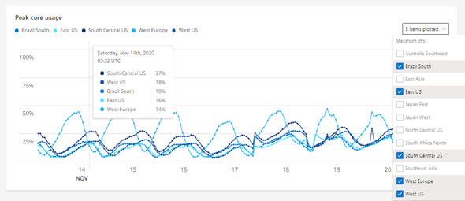
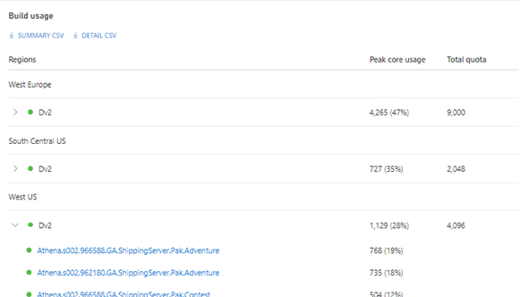
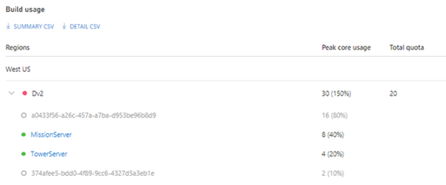

# Managing server capacity

A game servers' ability to scale in response to player demand is dependent on the number of simultaneous virtual machine cores consumed by a multiplayer server game.  If a game server runs out of VM cores, subsequent requests to allocate VMs will fail.  Monitoring server capacity is essential to prevent capacity errors or diagnosing scaling problems due to player demand.  This article describes the Quota Usage page and how to manage your game server for capacity issues.

To access the quota usage page, navigate to the Multiplayer | Servers | Quota menu.   The Quota Usage page surfaces peak core usage both in visualized charts and a tabulated format. The data powering these metrics is sampled every 60 minutes.

## Monitoring peak core usage per region

At the top of the quota usage page is a chart that visualizes peak core usage across the selected regions.  Each plot  represents the peak usage of the cores quota allocated to a region.  The image below demonstrates the peak percentage of cores quota consumed on November 14, 2020 at 3:32 UTC.  The South Central US region, for example consumed 27% of its quota at that specific date & time.  This further detail of regional quota usage is surfaced in a tooltip when hovering over the plot lines. Users can select the regions plotted on the graph using the dropdown menu located on the top right corner. By default, the regions with the highest percentage of usage are selected.

## Monitoring peak core usage per build

The quota usage page also tabulates peak core usage for every build within a region.  Like the visualization chart described above, the peak core usage table reports the percentage of peak quota core usage per VM SKU family per region.  This level of detail can enhance the ability to anticipate or diagnose scaling issues quickly, efficiently, and easily.  For example, the image below illustrates core usage across three regions: West Europe, South Central US, and West US.  Each table row surfaces the peak core usage and total core quota allocated per region.  West Europe is operating at a higher usage (47%) than South Central US (35%) or West US (28%).  Expanding a VM family using the chevron button next to the family lists the builds of that region/family that includes their peak usage.

It's important to note that the peak core usage reported in the table is dependent on the time series selected at the top of the quota summary page.  The peak core usage metrics reported in the image above can change if the time series selection is changed.  For example, while West Europe may experience the highest peak core usage within the last hour, it may experience lower peak core usage than East US or West US if the time series selection is changed to the last seven days or last 30 days.

**Interpreting Peak core usage readings**

The peak core usage reported at the VM family level is the sum of peak core usage of game server builds within that VM family at a given point in time.  In the image above, Dv2 in West US has a peak usage of 1,129 cores. This is the  highest number of cores utilized at one time for Dv2/West US across builds within the selected time period.  

## Exporting peak core usage

The peak core usage table supports the ability to export a CSV containing peak usage per build per region.  The two export options are:

* Summary CSV
* Detail CSV

CSV exports serve as a human readable file of peak core quota usage that can aid capacity planning, on-demand forecasting or troubleshooting scaling issues specific to a build, region or both.  

__Summary CSV__

The summary CSV contains the exact data that produces the peak core usage table.  Table below shows the schema used in the CSV:

CSV Fields | Description | Example
------------ | ------------- | -------------
Region | Geo location of build deployment | West Europe, East US
Virtual machine family | VM SKU family| Dv2, Fsv2
Build ID | GUID of build asset| 0850a980-b45a-40d5-96a9-8bd1a7dfaa23
Build Name | Friendly name of build asset | General-Availability-Dec2020
Peak core usage | Core quota peak utilized | 400
Quota in use | Percentage of peak core usage to total quota | 0.25
Total quota | Core quota allocated to region/family pair | 45,000 Dv2 cores

__Detail CSV__

The detail CSV contains the data that also produces the peak core usage table but with additional data sampled at 1-minute intervals.  Therefore a detailed export of a peak core usage table filtered for the last hour containing a single build deployed in one region produces approximately 60 rows. For example, one build and region row per minute.  The schema of the CSV is:

CSV Fields | Description | Example
------------ | ------------- | -------------
Region | Geo location of build deployment | West Europe, East US
Virtual machine family | VM SKU family| Dv2, Fsv2
Build ID | GUID of build asset| 0850a980-b45a-40d5-96a9-8bd1a7dfaa23
Build Name | Friendly name of build asset | General-Availability-Dec2020
Core usage | Core quota utilized at that time | 400
Quota in use | Percentage of core usage to total quota | 0.25
Timestamp| GMT timestamp of core reading | Fri Nov 20 2020 05:23:32 GMT+0000

***NOTE***:  *Like the core usage table, export data is also dependent on the time series selected at the top of the quota summary page.*  

## Detecting core quota problems 

The Quota Summary page is a powerful resource to help detect core quota problems that impact a game server’s ability to scale.  The following tips can be exercised to mitigate scaling problems in advance.

**Status indicators**

The build usage table exposes a status indicator next to the region name and the builds within the region.  The indicators include:

 Healthy: Usage is 80% below quota limits 
 Deleted: The build was deleted after its usage was recorded 
 Warning: Usage is above 80% quota limits 
 Error: Usage is at 100% or exceeding quota limits 

If core usage is approaching quota limits, additional quota can be independently achieved by submitting a quota change request.  Follow the steps in the [**cores quota change**](quota-changes.md) page for next steps.

