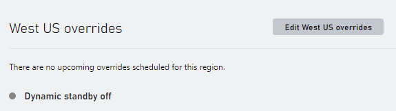
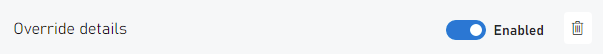
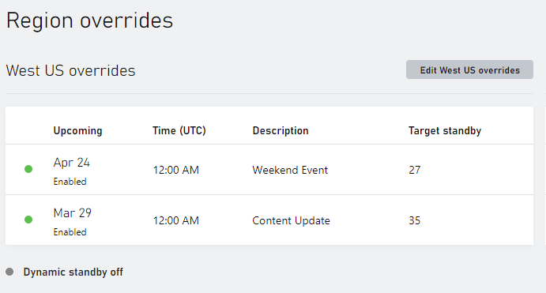

# Scheduled Standby

Scheduled Standby is an auto scaling enhancement that adjusts standby server levels at a single or recurring scheduled date & time.  Scheduled standby enables server scaling based on a schedule.  It allows you to scale your game server ahead of predicted load changes.  For example, every weekend, traffic to your game server increases on Friday 2 PM PST and starts to decrease by Sunday 11 PM PST.  You can plan your scaling activities based on the known player demand patterns of your game.

## How it works

Game developers specify a target standby floor value for the minimum number of standby servers. If player demand is predicted to grow during a specific date & time window where active servers grows rapidly, the actual standby servers may hit zero triggering standby pool starvation. If Scheduled Standby is enabled, standby pools can auto scale and adjust the target standby value used by the platform at a specific date and time.

## Scheduled Standby User Interface

The Scheduled Standby feature can be enabled from the developer portal by navigating to the Multiplayer | Servers | Build Regions page. Scheduled Standby settings are uniquely applied to each region of a build. When enabled, the Build Servers by Region table presents a clock (  ) next to the region name

To enable Scheduled Standby, create a region overrides by selecting Edit overrides to configure scaling settings for a specific region.

Configuring a regions override will surface options to enable server scaling settings for both dynamic standby and scheduled standby.  Scheduled standby is disabled by default.  To enable scheduled standby, select New override in the Scheduled overrides page section.

When the scheduled new override is selected, , the scheduled overrides dialog expands to surface options that control how Scheduled Standby behaves when it ramps up to support player demand or when it ramps down when players disconnect from active servers.  Each dialog input is described below:

| Dialog Input | Description |
|---|---|
| Target standby | The target number of servers to have waiting for an allocation before applying dynamic standby |
| Description | Description of the scheduled override |
| Day of the week | Scheduled day of the week to scale standby settings |
| Duration | Scheduled length of time to maintain the scale of standby settings |
| Begin schedule | Scheduled date to activate the scheduled overrides |
| Repeat weekly | Flag determining if scheduled standby settings will repeat on the day of the week specified |

Scheduled standby supports multiple scheduled overrides providing the schedules don't overlap each other.  Simply select New override to add another scheduled override.  A scheduled override can also be disabled in the override details page section.

After making changes to the scheduled overrides of a region, select Save and close to save the changes made and return to the build regions summary page.  The builds region summary page indicate that Scheduled standby is enabled and tabulates the scheduled settings.

