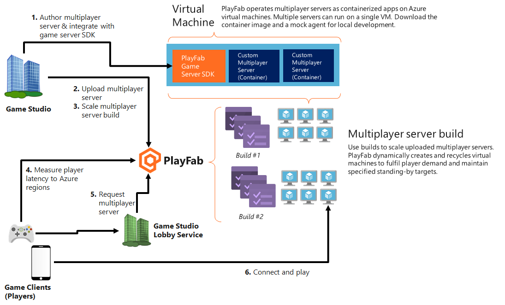

# Using PlayFab Multiplayer Servers to host multiplayer games

This topic explains how to use PlayFab Multiplayer Servers to host multiplayer game sessions&mdash;from creating game servers that are ready to connect players for a game session to scaling them dynamically to meet demands.

Using our service, you configure VMs to be automatically spun up globally as game servers according to your budget and demand. In order to do so, you do not explicitly create VMs but define parameters that determines how they get created on your behalf. This process is called deploying or creating a build.

As part of configuration process, you would upload a game server build that would run as a containerized application on the VMs.

## What you need

* Developer account on [PlayFab.com](https://playfab.com)
* [Enable PlayFab Multiplayer Servers feature](enable-playfab-multiplayer-servers.md)
* Your server-client game source code

If you don't have a server-client game yet, use our samples to see how it works instead. One of the samples is a wrapper application that enables you to wrap an existing game server so that it would work on PlayFab Multiplayer Servers. To learn more, see [Create your first server](create-your-first-server.md).

If you're unsure of the terms used here, see [Server terms](server-terms.md).

## 1. Author a game server build

A game server build typically contains game assets and an executable you want running on the servers/virtual machines (VMs). 

When using PlayFab Multiplayer Servers, you have to integrate the PlayFab Game Server SDK (GSDK) into your usual game server build. This integrated game server build is known as the PlayFab Multiplayer Game Server Build.

For detailed integration steps, see [Author a game server build](author-a-game-server-build.md). To learn more about the internal structure, see [Server terminology](server-terms.md) and [Game server basics](basics-of-a-playFab-game-server.md).

## 2. Deploy a build

Once you have a game server build that can run on PlayFab Multiplayer Game Servers as described in the step above, you can move into configuring how you want the servers/virtual machines (VMs) to be created for you. This step is known as creating or deploying builds.

You can specify the type of servers you want, regions they are in, what is on the server, and how they scale.

For details, see [Deploy a build](deploying-playfab-multiplayer-server-builds.md).

## 3. Scale game servers

After creating builds, the service is able to dynamically spin up new virtual machines and recycle used ones. This would ensure that your title is able to fulfill player demand and maintain standby levels that you've specified. To learn more about configuring this scaling behavior, see [Scaling Standby](scaling-standby.md), [Scheduled Standby](scheduled-standby.md), and [Dynamic Standby](dynamic-standby.md). 

Now, you can also manage scaling using APIs. To learn more, see [Scaling Programatically](scaling-programmatically.md).

## 4. Measure player latency to Azure regions

When players initiate a multiplayer experience, you should send User Datagram Protocol (UDP) messages to our Quality of Service (QoS) beacons. Based on the time between sending the UDP message and receiving a response, you can measure the network latency. The latency measurements can be used to determine the datacenters in which to request a game server for the best experience. 

To learn more and see sample code, see [Using QoS beacons to measure Player latency to Azure](using-qos-beacons-to-measure-player-latency-to-azure.md).

## 5. Request game servers

When a player needs multiplayer servers, it can be allocated from the build's standby pool. This request can come from many sources, including PlayFab Matchmaking, a lobby or matchmaking service you operate, directly from a client calling PlayFab, and more.

PlayFab Matchmaking service is a cross-platform matchmaking service that is able to automatically allocate PlayFab Multiplayer Servers. For more information how to activate server allocation, see [Integrating matchmaking with PlayFab Multiplayer Servers](../matchmaking/multiplayer-servers.md).

## 6. Connect and play

PlayFab will fulfill a server request within one second if standby servers are available. Once a server has been put into the active state, clients can connect to the server and play.

Image below illustrates how PlayFab Multiplayer Servers hosting works, incorporating the steps above.

 
## See also

* [Create your first server](create-your-first-server.md)
* [Scaling game servers](scaling-standby.md)
* [Pricing](multiplayer-servers-detailed-price-sheet.md)
* [Terminology](server-terms.md)
* [Resources and samples](server-samples-resources.md)
