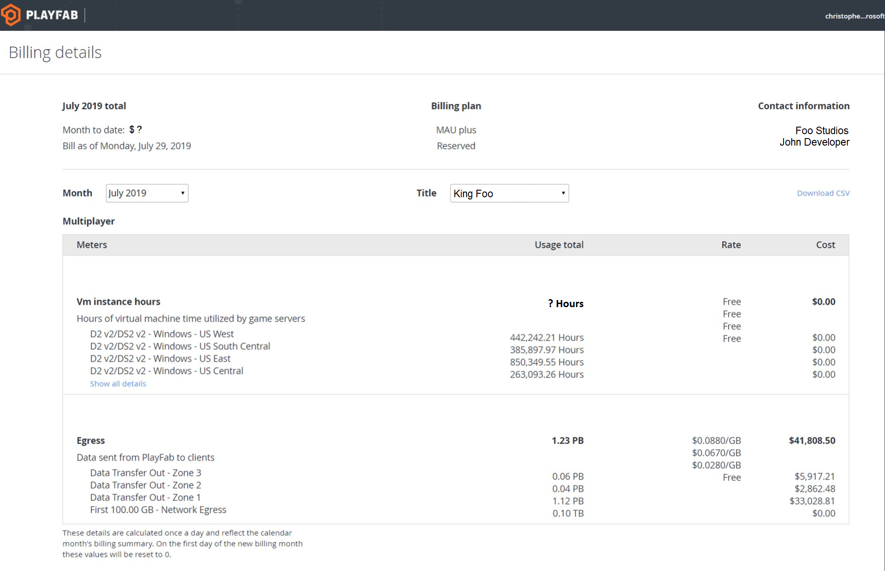

# Viewing billing details

## Navigating to the page

To navigate to the page, head to [developer.playfab.com](https://developer.playfab.com) and login to the appropriate studio account. From the ellipsis dropdown next to the tier button, select *Billing details*.

**Note: This feature is currently rolling out, so if you can't access this page, it might be because your studio doesn't have access yet. Furthermore, page access is being restricted to certain roles within the studio.**

## Toggles & at-a-glance 

Once on the page, billing details can be toggled between an overall studio view or by individual titles (using the **Title** dropdown). There is also an adjacent **Month** toggle.

At the top of the page, at-a-glance info is available, listing your monthly bill (it will be up-to-date if the **Month** toggle is set to the current month).

## Meters

Below these upper two sections, there are meters for each of the three multiplayer billing criteria [(VM instance hours, network egress, and storage)](billing-for-thunderhead.md#consumption-pricing). Each meter displays usage, rate, and cost information for each of the individual SKUs that contribute to its subtotal, then sums that info.

When the current month is selected in the **Month** dropdown, the billing values on the page are recalculated once a day to reflect the last day's usage. Furthermore, the values are reset on the first of each billing month. For example, if a customer who has set the **Month** as September is viewing the page early in the day on September 2 (for example), they will only see values that reflect usage from September 1.
