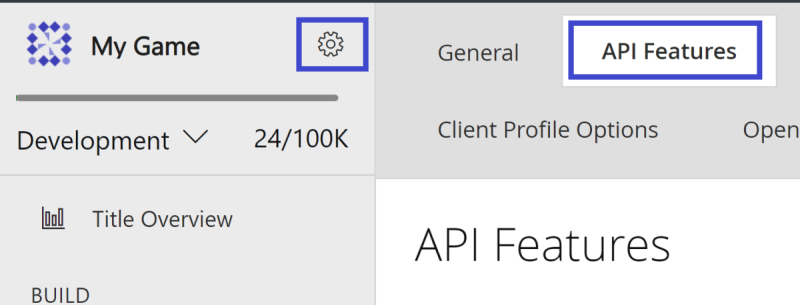
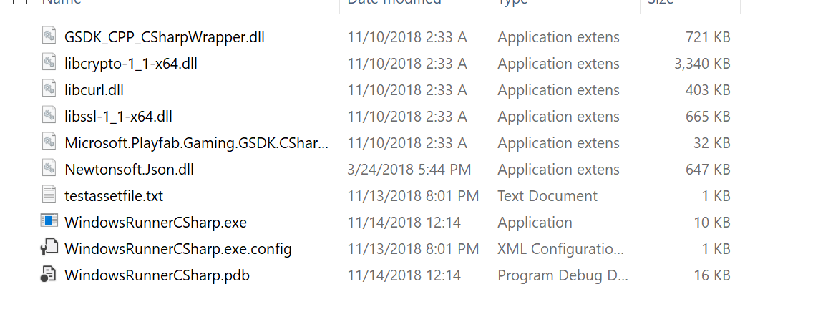

# Windows Runner C# sample

This tutorial lists the steps to get the sample set up ready for use with the PlayFab Multiplayer Servers.

> [!Note]
> In order to use and view the PlayFab Multiplayer Servers, you need to enable the feature from Game Manager. For instructions, see [Enable the PlayFab Server feature](enable-playfab-multiplayer-servers.md).

1. [Configure API feature option](#configure-api-feature-option)
2. Create a PlayFab Multiplayer Game Server Build: [Server set up](#server-set-up)
3. [Create servers by deploying a build](#create-servers-by-deploying-a-build)
4. Request multiplayer servers: [Client set up](#client-set-up). This is needed so you can start a client that connects to the servers

## Configure API feature option

 > [!Note]
> This step is needed only for running this sample. You do not need to allow clients to start games unless your title requires this set up. 

* Log into your developer account on [PlayFab.com](https://playfab.com) to use the Game Manager portal
* Select your game title
* Select the settings icon > __API features__ as shown in the image below.



* Under __Options__, select __Allow client to start games__ as shown in the image below.


## Server set up

Describes how to get the PlayFab Multiplayer Game Server Build.

* [PlayFab Game Server SDK](https://github.com/PlayFab/gsdk) of the PlayFab Multiplayer Server Build for the Windows Runner sample. 
* If you prefer to build this on your own:
    * Get the [Windows Runner C# sample](https://github.com/PlayFab/MpsSamples/tree/master/WindowsRunnerCSharp) using standard Git methods or downloading this as a zip file.
    * Open the project using Visual Studio 2017 or later. This should automatically trigger dependencies like the latest [PlayFab Game Server SDK (GSDK) nuget package](https://www.nuget.org/packages/com.playfab.csharpgsdk) to be downloaded.
    * Compile and build the WindowsRunnerCSharp.csproj in release x64 configuration. You would get a game server build that is integrated with the GSDK, making this a valid PlayFab Multiplayer Game Server Build.
    * Go to the bin folder and zip up all the x64 release binaries. There should be no internal folder structure, the zip file should be a simple flat collection of files, as shown in the image below.

    

> [!Tip]
> To cross-check, you can compare your build output with the compiled version provided in the link above.

When you have the zip file, you are ready to start [deploying a build](#create-servers-by-deploying-a-build).

## Create servers by deploying a build

You can deploy a build using one of the following methods.

* [Use Game Manager to deploy and configure servers](quickstart-for-multiplayer-servers-game-manager.md)
* [Use PowerShell to deploy and configure servers](quickstart-for-multiplayer-servers-api-powershell.md)

For some settings, it may be easier to configure using the web interface&mdash;Game Manager.

Next, [set up and run the client](#client-set-up) to connect to the deployed servers.

## Client set up

Describes how to get the Windows Runner client application to connect to the game servers you've created using PlayFab Multiplayer Servers. This can only be set up after you have servers in standby.

* After [deploying a build](#create-servers-by-deploying-a-build), wait for standby servers to be available

* Get the __titleId__ and __buildId__ of the build

    * Using Game Manager:
        * Go to **My Studios and Titles** page and look for your game title. Copy the ID value listed there and paste it somewhere convenient that you can access later. This is the __titleId__
        * Select the game title to view the dashboard
        * Go to **Multiplayer** > **Servers** > **Builds**
        * Copy the ID for the build you want to use and paste it somewhere convenient. This is the __buildId__

    
    * Using PowerShell, this information is in the output after the build is deployed successfully.
        * Copy the __titleId__ and __buildId__ and paste it somewhere convenient

* Get the [Windows Runner C# sample](https://github.com/PlayFab/MpsSamples/tree/master/WindowsRunnerCSharp) using standard Git methods or downloading this as a zip file. Skip if you have done this earlier.
* Open the project using Visual Studio 2017 or later. This should automatically trigger dependencies like the latest [Game Server SDK nuget package](https://www.nuget.org/packages/com.playfab.csharpgsdk) to be downloaded.
* Compile and build the __WindowsRunnerCSharpClient.csproj__ in release x64 configuration
* Open Command Prompt and navigate to the output folder of this project
* Run the WindowsRunnerCSharpClient using this command line, replacing \<TitleId> and \<BuildID> with the values above: __dotnet WindowsRunnerCSharpClient.dll --titleId \<TitleId> --buildId \<BuildId>__

Example:
```sample code
cd C:\Users\UserName\Documents\GitHub\MpsSamples\WindowsRunnerCSharp\WindowsRunnerCSharpClient\bin\Release\netcoreapp3.1

dotnet WindowsRunnerCSharpClient.dll --titleId CBE66 --buildId 36083326-3bd5-4b8f-a97d-7e82f066aa40 --verbose
```

When the client successfully connects to the server, the Command Prompt would display a log message informing you that a server is allocated with an IP address.

## See also

* [Create your first server](create-your-first-server.md)
* [Resources and samples](server-samples-resources.md)
* [PlayFab Multiplayer Server SDKs](server-sdks.md)
* [API Reference](xref:titleid.playfabapi.com.multiplayer.multiplayerserver)